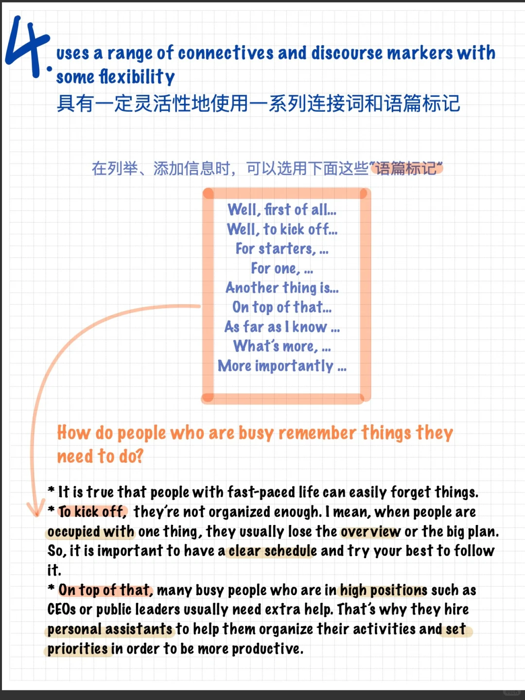
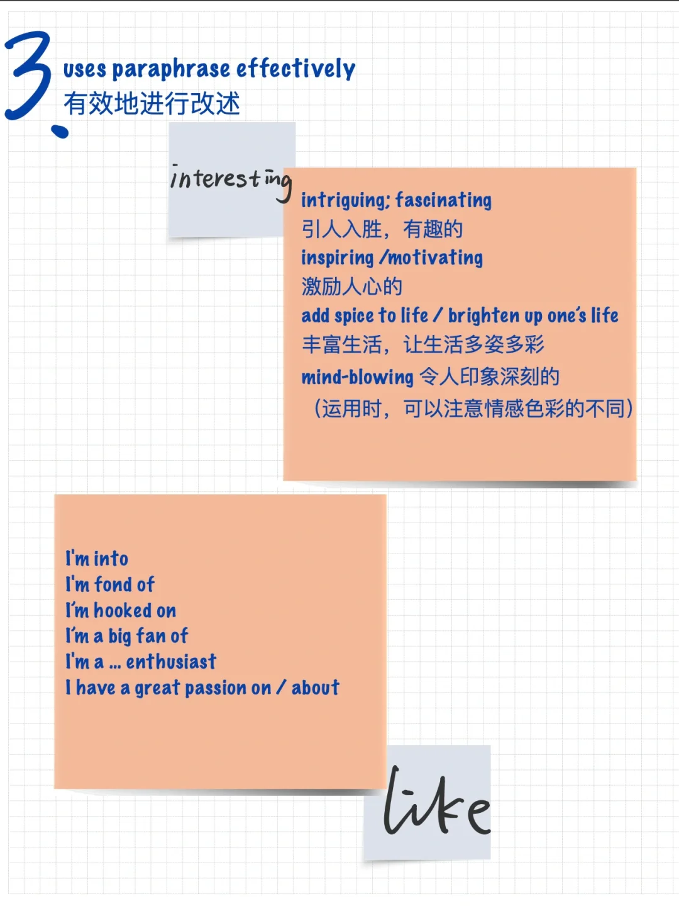

# 雅思口语干货｜什么样的词汇表现能得7分

考场上运用怎样的词汇才能让考官感觉眼前一亮，拿到7以上的评分呢?
我们来看一下官方评分标准给出的bullet points：
Lexical resource(词汇) ：
- uses vocabulary resource flexibly to discuss a variety of topics
- uses some less common and idiomatic vocabulary
- uses paraphrase effectively
也不要忘记Fluency and coherence(流利度与连贯性)中的词汇要求：
- uses a range of connectives and discourse markers with some flexibility
备考时，要根据评分标准，有针对性地积累词汇，才会事半功倍!
在这里给大家帮大家分析一下评分标准，同时分享一些词汇干货，助力备考路上的小伙伴～
#雅思口语 #雅思词汇 #雅思攻略 #雅思备考

## 图片
| 图1 | 图2 | 图3 | 图4 |
| --- | --- | --- | --- |
|  |  |   |   |

生成时间：2025-11-15 02:57:32