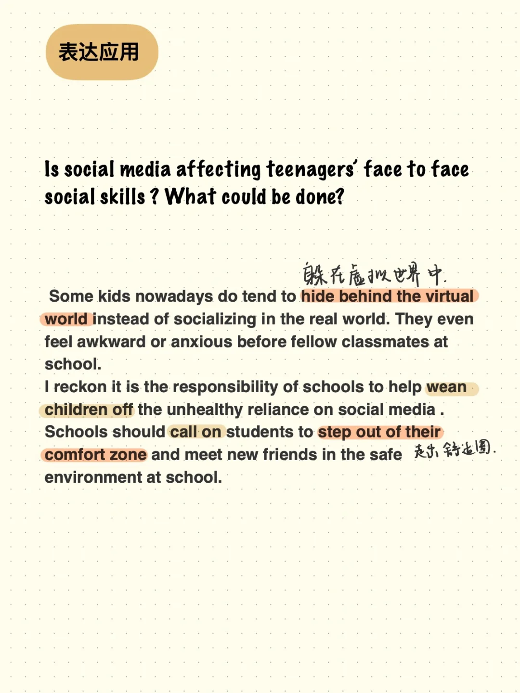
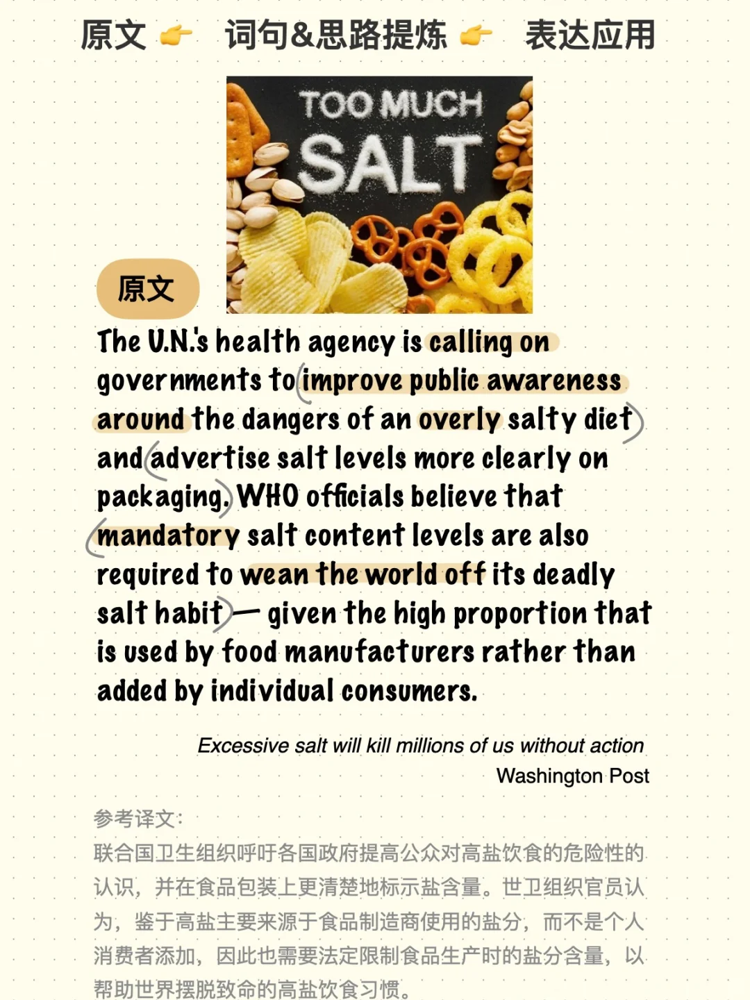
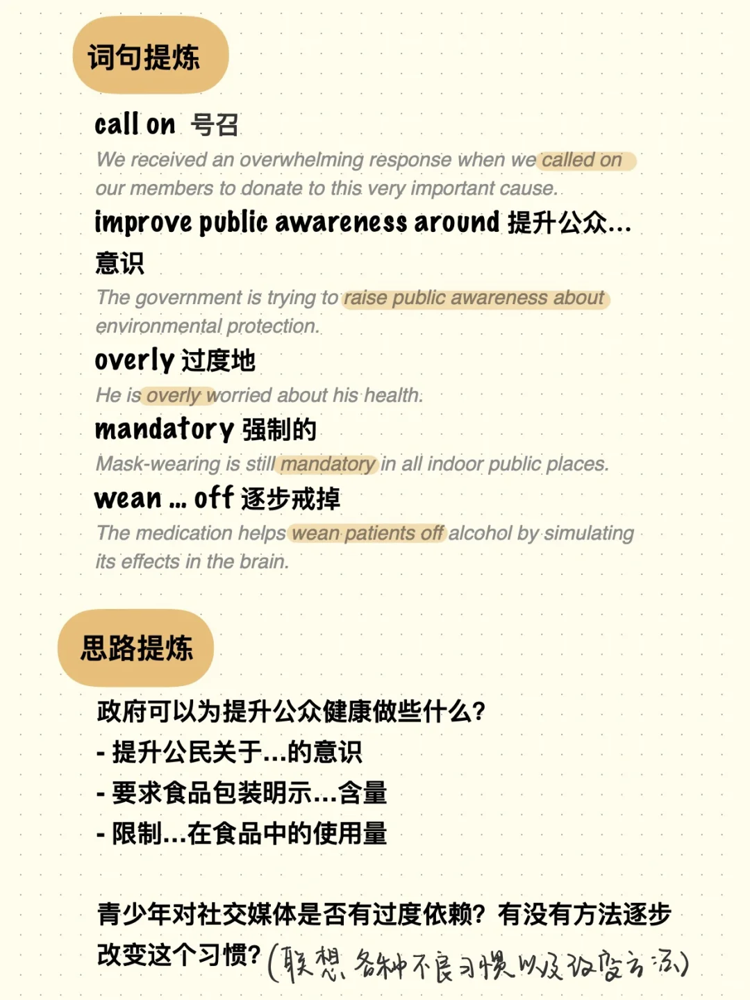
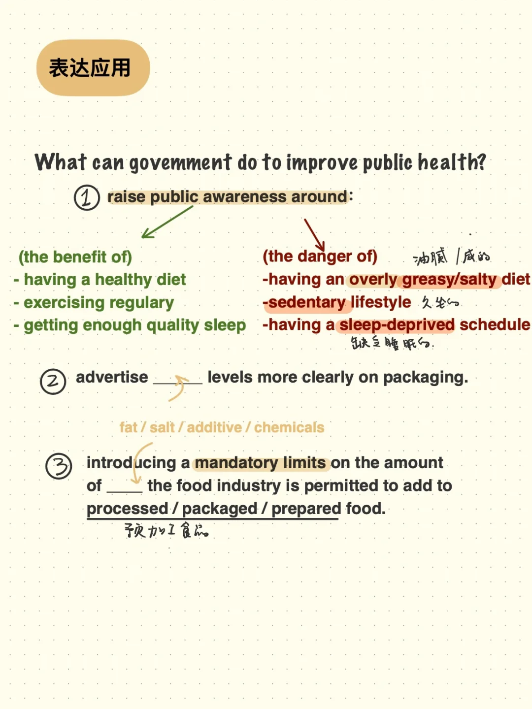

# 外刊阅读 ｜ 如何利用外刊丰富写作口语表达

今天分享的段落来自于Washington Post，段落主旨在于呼吁各国政府帮助公众摆脱高盐饮食习惯。
	
根据段落的词句表达和思路，可以延伸思考：
	
政府对公众的健康是否有责任，应该有何作为？
	
生活中不同的人群有哪些不良习惯，可以怎样逐步改善？
#外刊阅读 #阅读 #写作 #英语外刊

## 图片
| 图1 | 图2 | 图3 | 图4 |
| --- | --- | --- | --- |
|  |  |  |  |

生成时间：2025-11-15 02:56:27