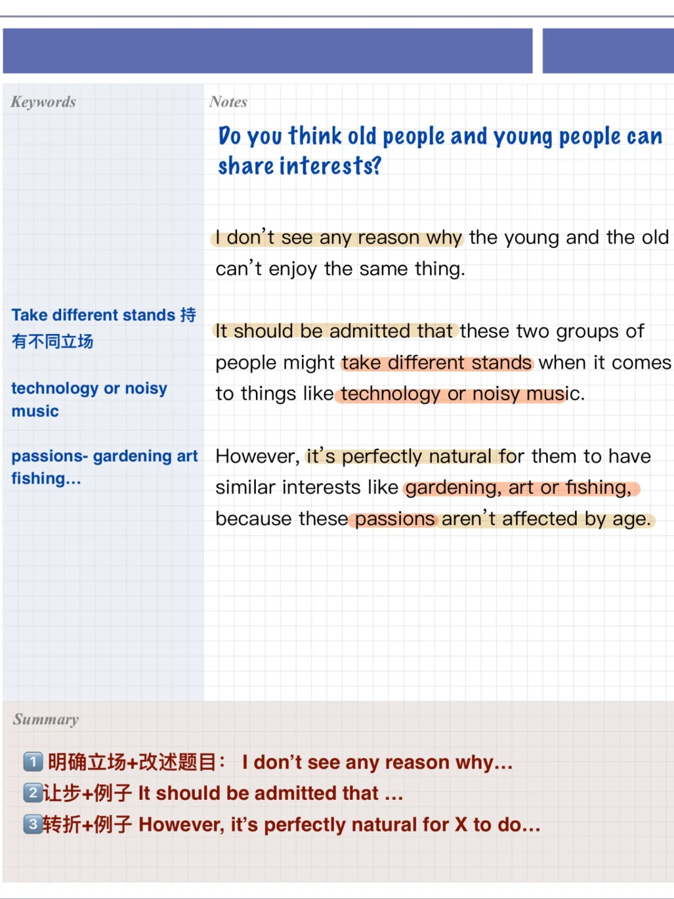
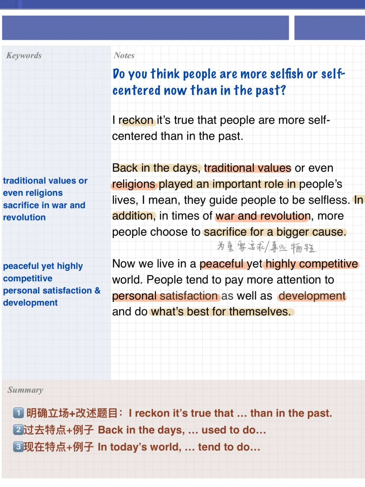
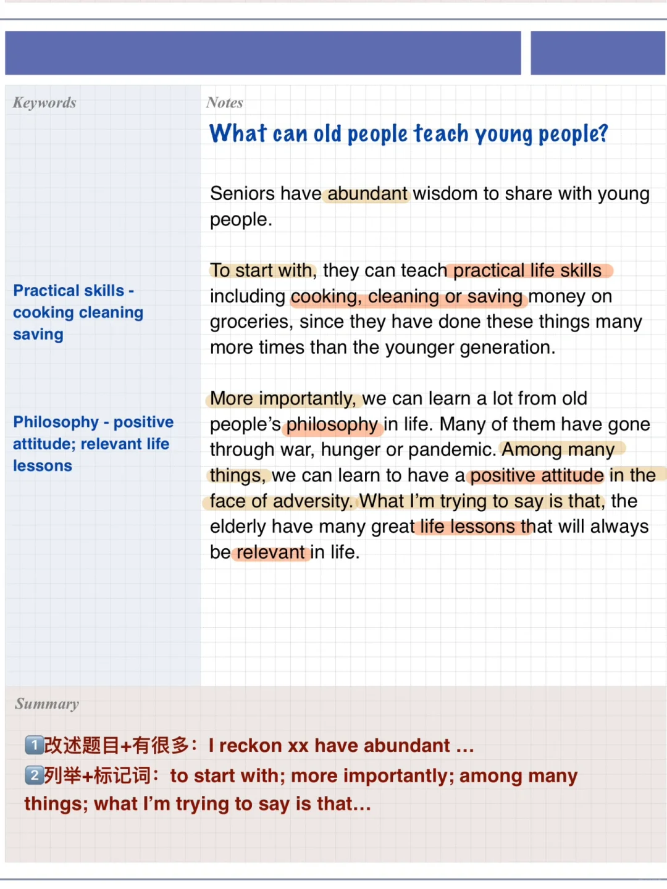
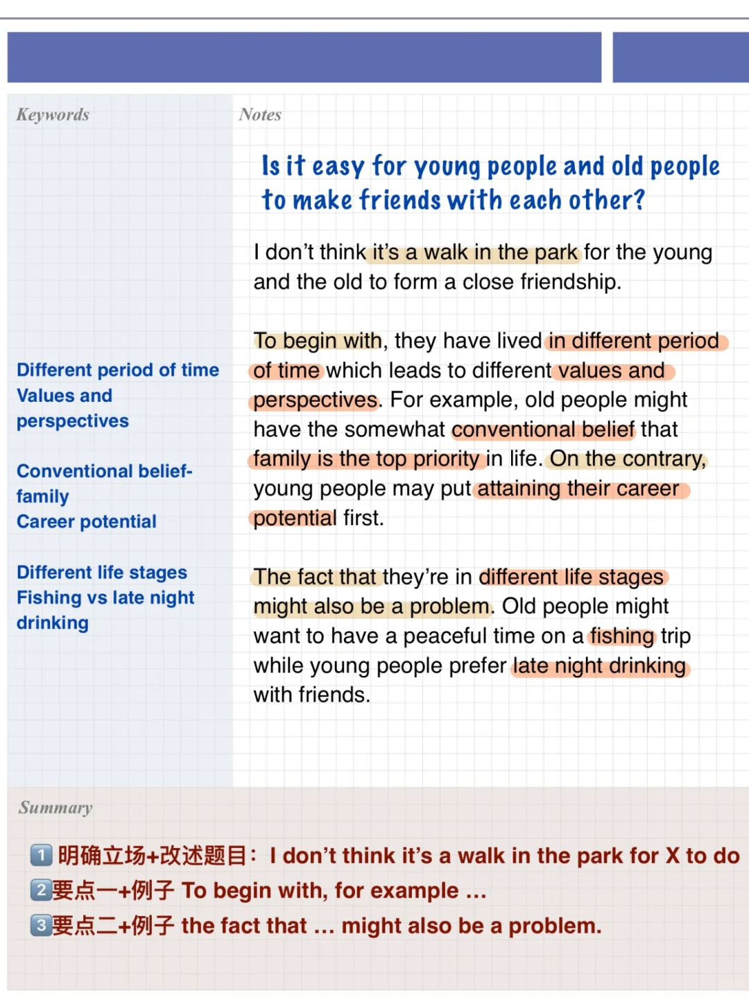

# 雅思口语Part 3 ｜高分答案-有趣老年人

雅思口语考试中Part3是比较有挑战的环节，然而想获得高分，答案需要有一些亮点表达和思路。
	
老年人与年轻人特点、他们之间的区别，是Part3高频话题。
	
今天分享的参考答案包括以下题目：（关联Part2 ：有趣的老年人）
❓ Do you think people are more selfish or self-centered now than in the past?
	
❓ What can old people teach young people?
	
❓ Is it easy for young people and old people to make friends with each other?
	
❓ Do you think old people and young people can share interests?
#雅思口语 #雅思考试 #雅思攻略 #雅思备考 #屠雅思带7分雅思口语速成 #雅思口语part3

## 图片
| 图1 | 图2 | 图3 | 图4 |
| --- | --- | --- | --- |
|  |  |  |  |

生成时间：2025-11-15 02:55:22