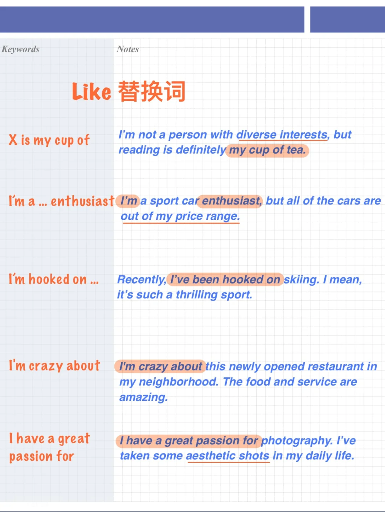
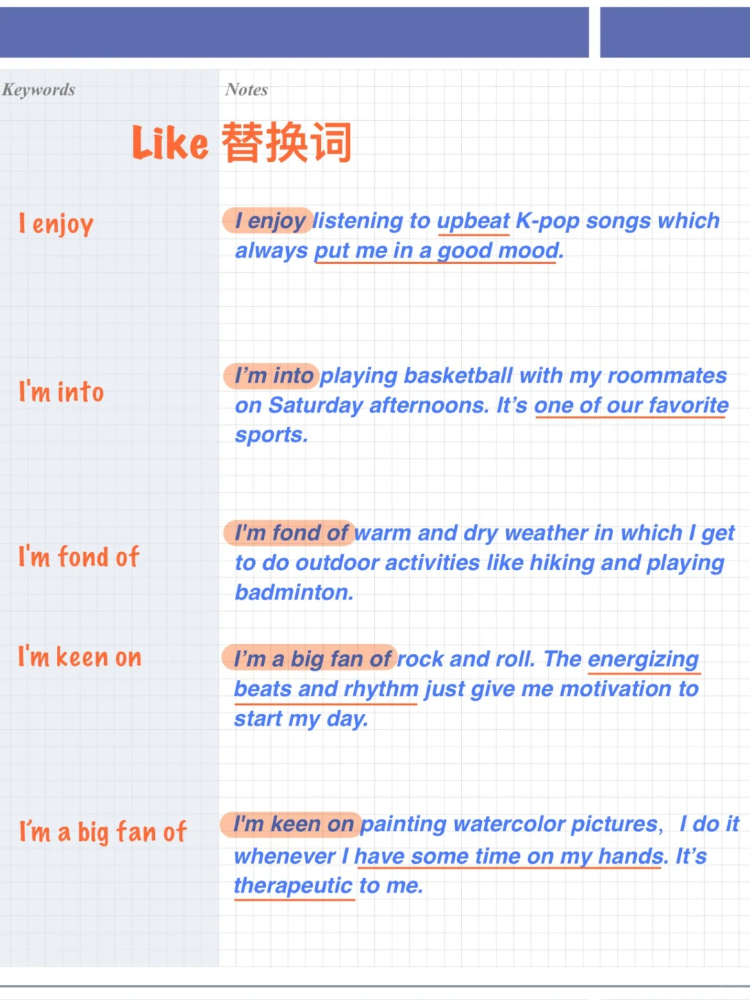

# 雅思口语替换词 ｜ 还只会用I LIKE …？

替换意识 Paraphrasing 是雅思口语评分标准中要点之一，今天来看10个词/词组表达 喜欢、热爱：
	
I enjoy
I’m into
I’m fond of
I’m keen on
I’m a big fan of
X is my cup of tea
I’m a…enthusiast
I’m hooked on
I’m crazy about
I have a great passion for
	
你还知道更多表达“喜欢”的方式吗？
	
#雅思口语 #雅思攻略 #雅思备考 #英语口语 #屠雅思带7分雅思口语速成

## 图片
| 图1 | 图2 | 图3 | 图4 |
| --- | --- | --- | --- |
|  |  |   |   |

生成时间：2025-11-15 02:54:17