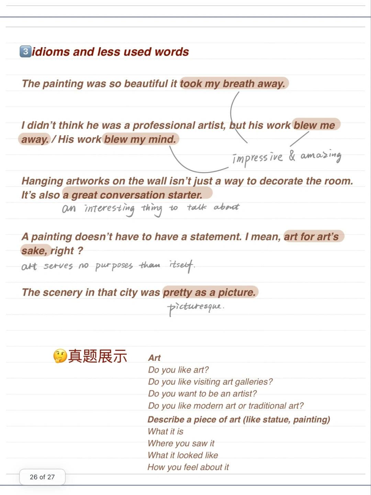
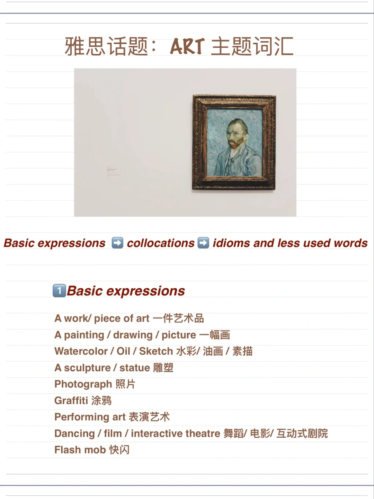
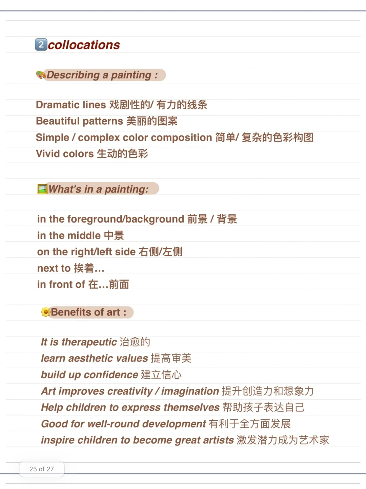

# 雅思口语话题词汇 ｜如何讨论艺术Art

在准备雅思口语话题的词汇时，可以从 基础词汇、词组、替换词、习语和少见词汇 几个角度来准备。
	
今天分享讨论艺术 ART 话题时的一些实用表达。
	
#雅思口语 #屠雅思带7分雅思口语速成 #雅思 #雅思攻略 #英语口语

## 图片
| 图1 | 图2 | 图3 | 图4 |
| --- | --- | --- | --- |
|  |  |  |   |

生成时间：2025-11-15 02:53:11