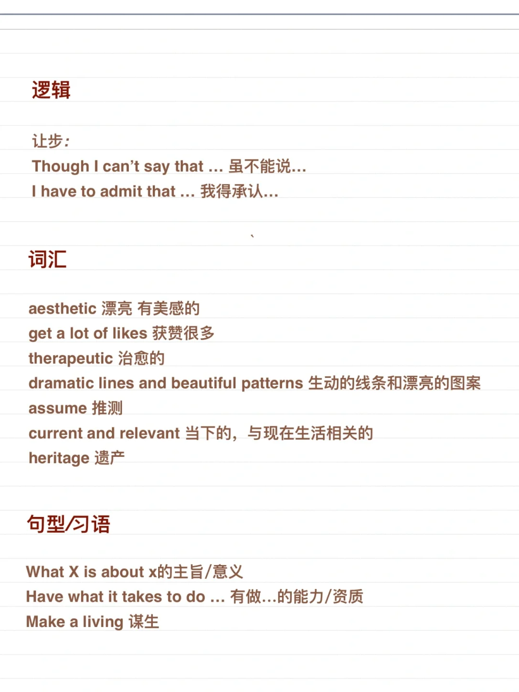
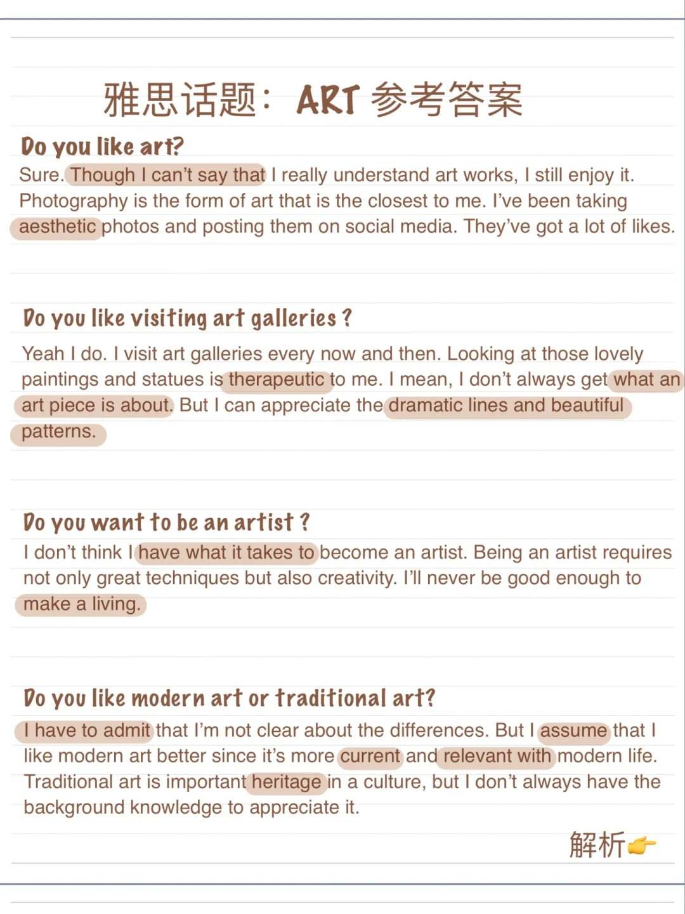

# 雅思口语高分参考答案｜Art 艺术

上一篇文章分享了Art相关词汇，今天来看一下参考答案的运用，解析在第二页～
	
Part 1 应答可以不用太长，平均约3-4个句子，说出问题重点即可。
少见词汇和习语的运用会帮你加分哦
	
#雅思口语 #屠雅思带7分雅思口语速成 #雅思攻略 #雅思备考 #雅思考试 #雅思口语答案

## 图片
| 图1 | 图2 | 图3 | 图4 |
| --- | --- | --- | --- |
|  |  |   |   |

生成时间：2025-11-15 02:52:06