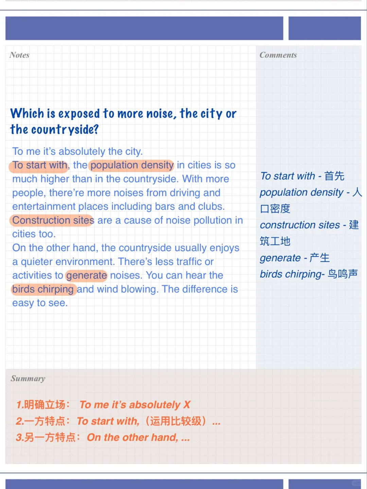
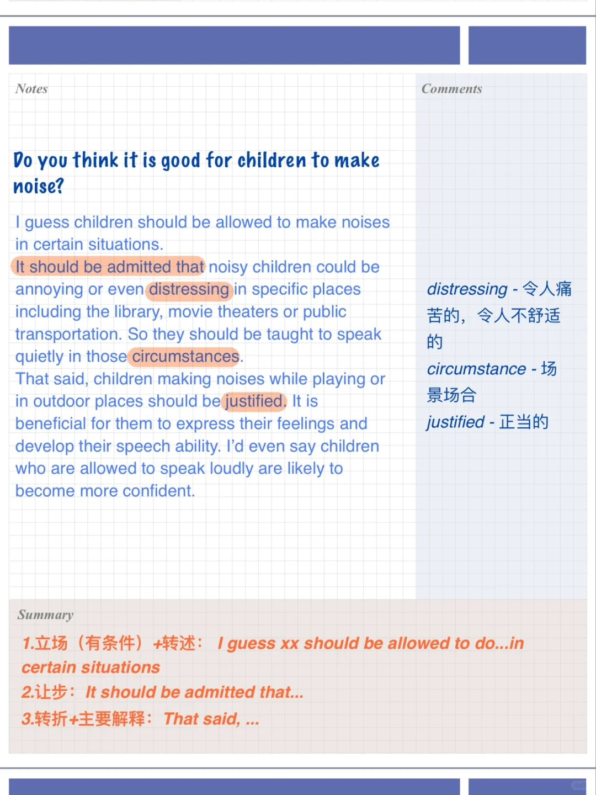
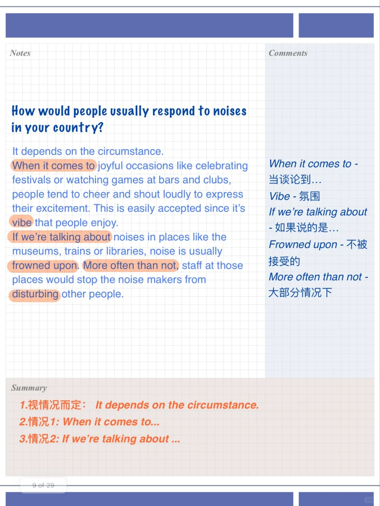

# 雅思口语高分答案｜吵闹地方Part3

考场上Part3环节中，考官会根据考生答案进行追问，并不是完全按照题库照读，所以准备题库中题库的同时，也要多思考总结思路、逻辑和用词
	
🤔今天分享的题目包括：
Do you think it is good for children to make noise?
How would people usually respond to noises in your country?
How can people consider others' feelings when chatting in public?
Which is exposed to more noise, the city or the countryside?
快思考运用起来吧💪
	
#雅思口语 #屠雅思带7分雅思口语速成 #雅思攻略 #雅思备考 #英语口语

## 图片
| 图1 | 图2 | 图3 | 图4 |
| --- | --- | --- | --- |
|  |  |  |  |

生成时间：2025-11-15 02:51:01