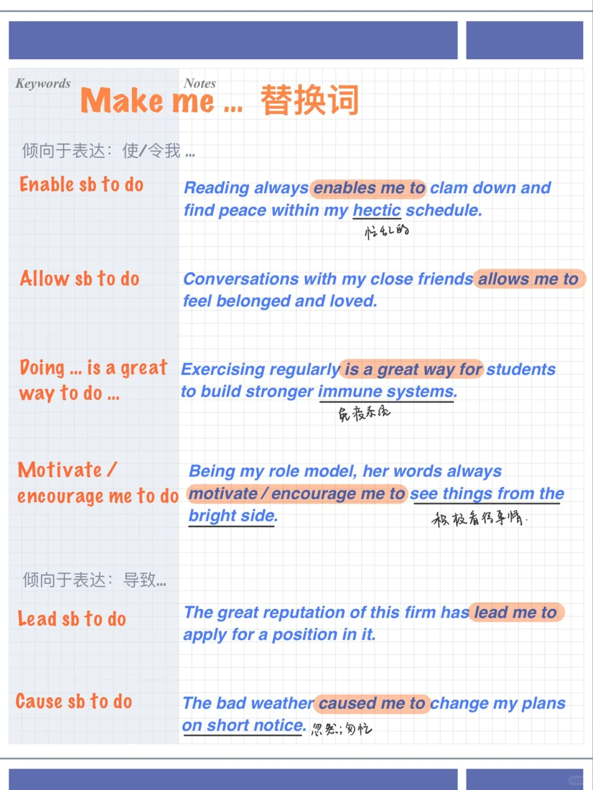

# 雅思口语替换词 ｜ 让/使我…make me…

make me 在大部分语境下会有强迫含义
而许多考生倾向于表达的是 1⃣️使/令我 … 或者 2⃣️导致…结果的逻辑
可以参考一下今天分享的替换表达：
	
1⃣️ 强调使/令我 …
🌟Enable sb to do
Reading always enables me to clam down and find peace within my hectic schedule.
🌟Allow sb to do
Conversations with my close friends allows me to feel belonged and loved.
🌟Doing … is a great way to do …
Exercising regularly is a great way for students to build stronger immune systems.
🌟Motivate / encourage me to do
Being my role model, her words always motivate / encourage me to see things from the bright side.
	
2⃣️强调导致：
🌟Lead sb to do
The great reputation of this firm has lead me to apply for a position in it.
🌟Cause sb to do
The bad weather caused me to change my plans on short notice.
	
#雅思口语 #雅思 #雅思攻略 #雅思备考 #英语口语

## 图片
| 图1 | 图2 | 图3 | 图4 |
| --- | --- | --- | --- |
|  |   |   |   |

生成时间：2025-11-15 02:49:56