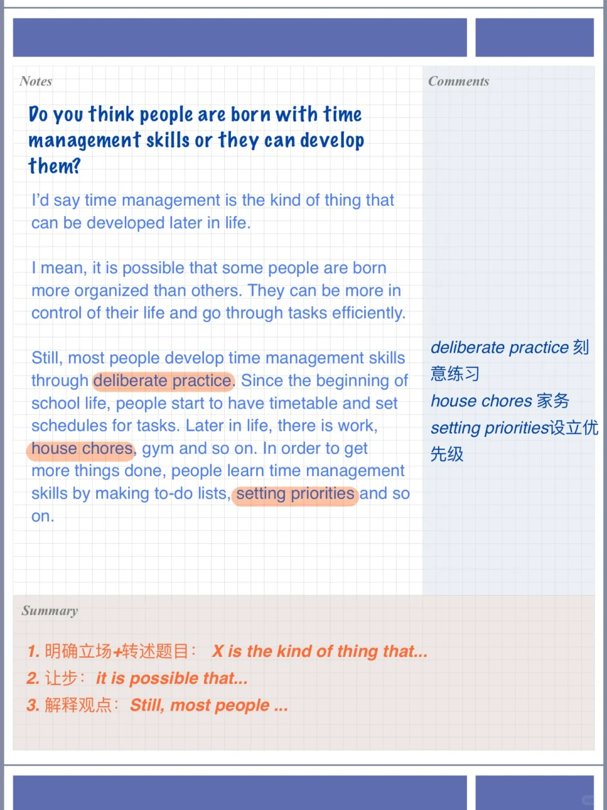
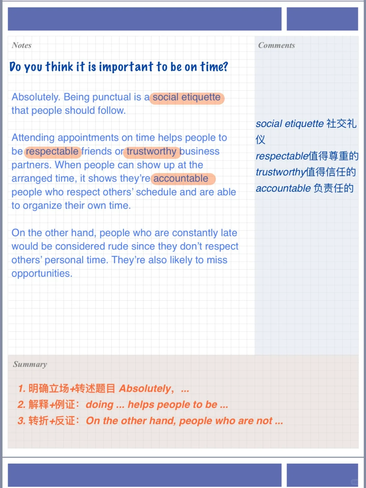
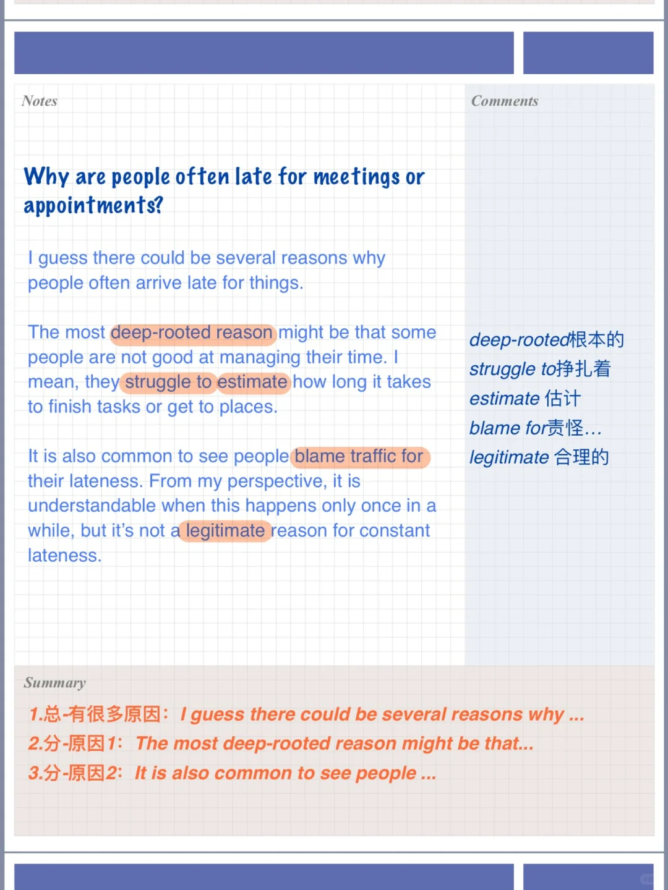
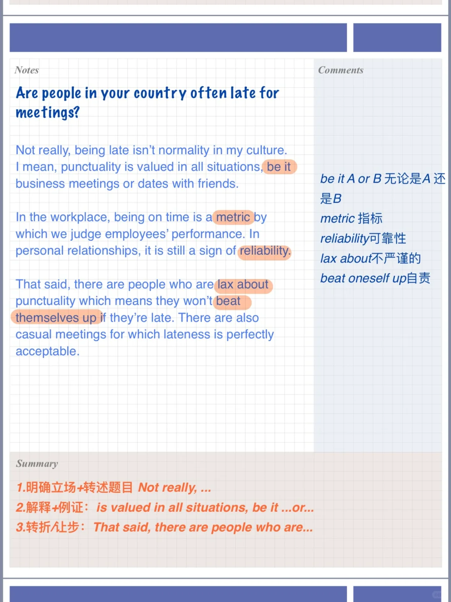

# 雅思口语高分参考答案｜迟到经历PART3

继续分享part3参考答案
注意加入自己的思考哦～
🌟Do you think it is important to be on time?
🌟Why are people often late for meetings or appointments?
🌟Are people in your country often late for meetings?
🌟Do you think people are born with time management skills or they can develop them?
	
#雅思口语 #屠雅思带7分雅思口语速成 #雅思备考 #雅思考试 #英语口语

## 图片
| 图1 | 图2 | 图3 | 图4 |
| --- | --- | --- | --- |
|  |  |  |  |

生成时间：2025-11-15 02:48:52