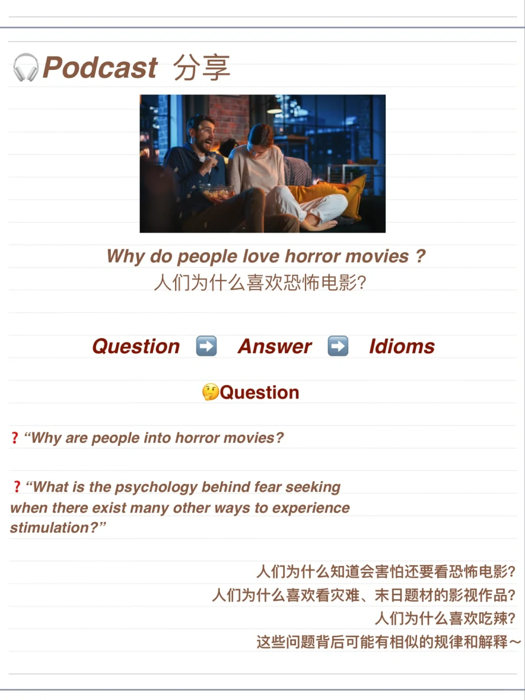
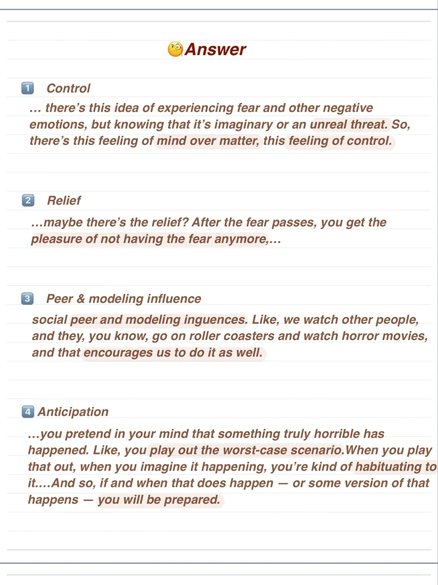
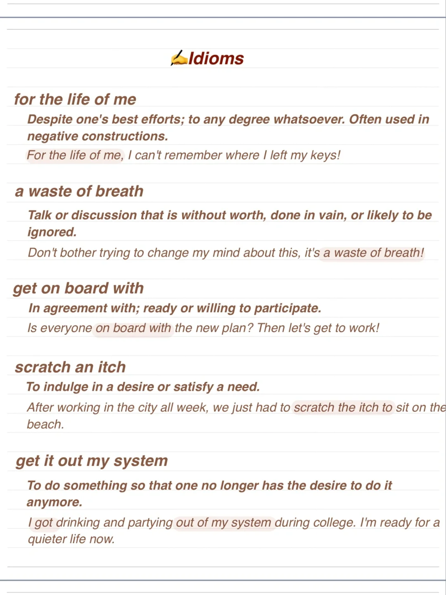

# 英文Podcast 分享｜🫣人们为何喜欢恐怖片？

🎧昨天听到一集有趣的podcast，谈到人们喜欢恐怖、刺激、猎奇等心理，分析了背后可能存在的原因。
还提到了“Benign Masochism” “良性自虐”😯的概念。
整理了一下回答主题的内容和一些习语表达分享～
	
▶️节目名称：No stupid questions
🎵episode 126 : Why do people love horror movies ?
#英语播客 #英语口语 #英语听力#英语泛听

## 图片
| 图1 | 图2 | 图3 | 图4 |
| --- | --- | --- | --- |
|  |  |  |  |

生成时间：2025-11-15 02:47:47