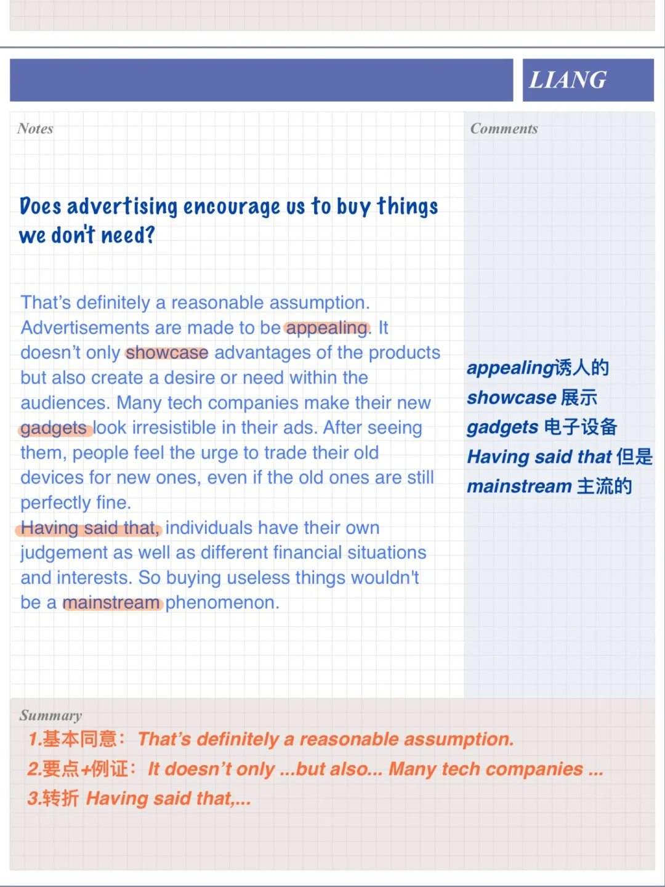
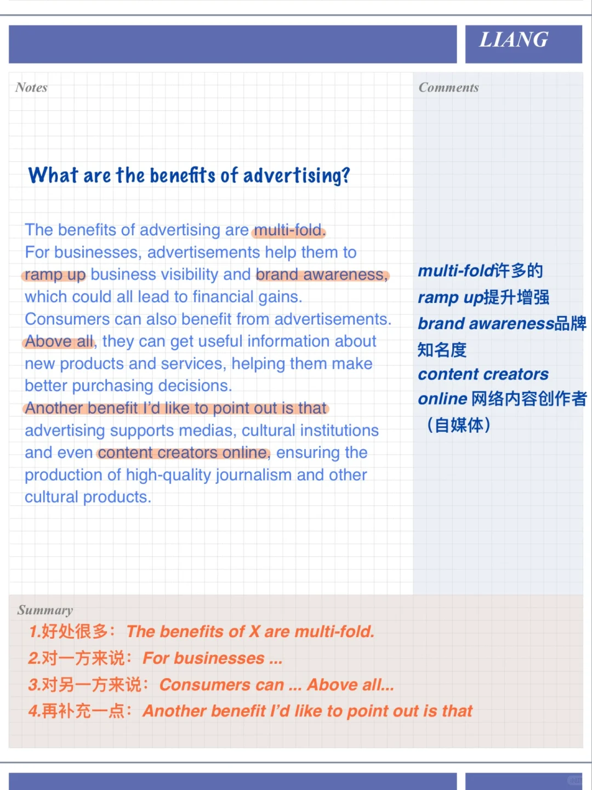
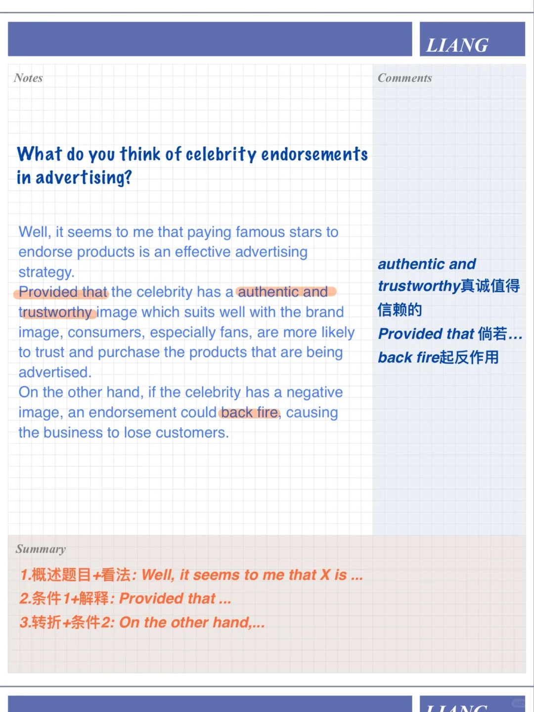

# 雅思口语PART3高分答案｜广告主题

今天分享本季题库“不喜欢的广告”对应PART3的问题参考答案，运用时注意思考替换，提炼句型等，也要坚持思考💪
题目包括：
🌟Which one is more effective, newspaper advertising or online advertising?
🌟What are the benefits of advertising?
🌟What do you think of celebrity endorsements in advertising?
🌟Does advertising encourage us to buy things we don't need?
	
#雅思口语 #屠雅思带7分雅思口语速成 #雅思攻略 #雅思备考 #英语口语

## 图片
| 图1 | 图2 | 图3 | 图4 |
| --- | --- | --- | --- |
|  |  |  |  |

生成时间：2025-11-15 02:45:33