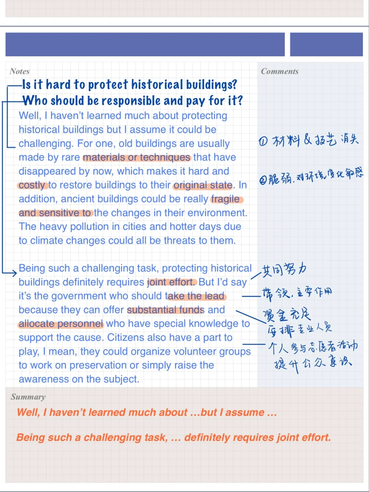
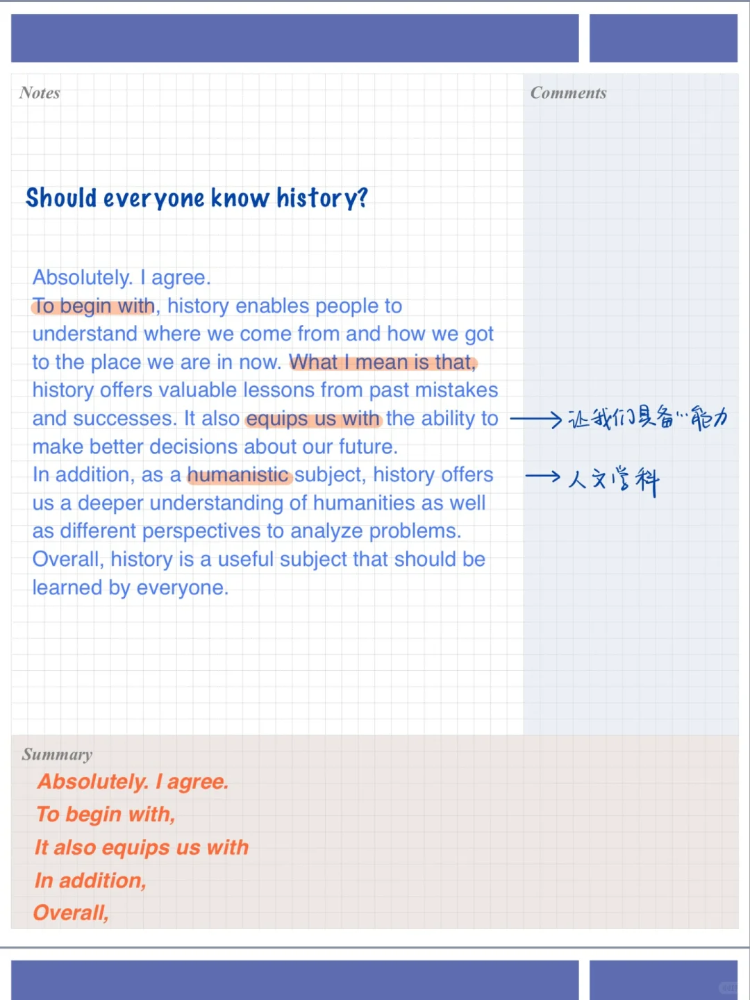
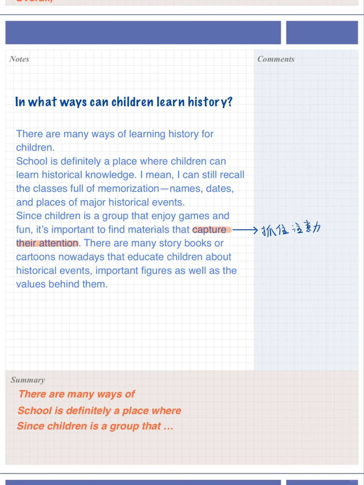
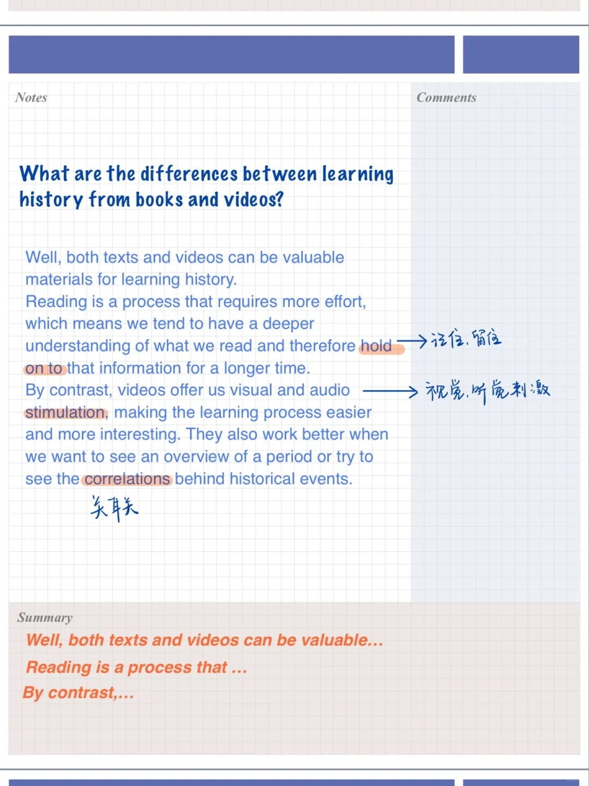

# 雅思口语高分答案｜感兴趣的历史时期Part3

“感兴趣的历史时期”是本季度题库中难度稍高的题目之一，描述时可以尝试将重点放在你对这个时期感兴趣的某个人物、事件或者趋势。具体化让答案更充实。
今天分享的四个题目该题对应的part3:
🌟Should everyone know history?
🌟In what ways can children learn history?
🌟What are the differences between learning history from books and videos?、
🌟Is it hard to protect historical buildings? Who should be responsible and pay for it?
#雅思口语 #雅思备考 #雅思攻略 #屠雅思带7分雅思口语速成 #雅思考试 #雅思

## 图片
| 图1 | 图2 | 图3 | 图4 |
| --- | --- | --- | --- |
|  |  |  |  |

生成时间：2025-11-15 02:44:28