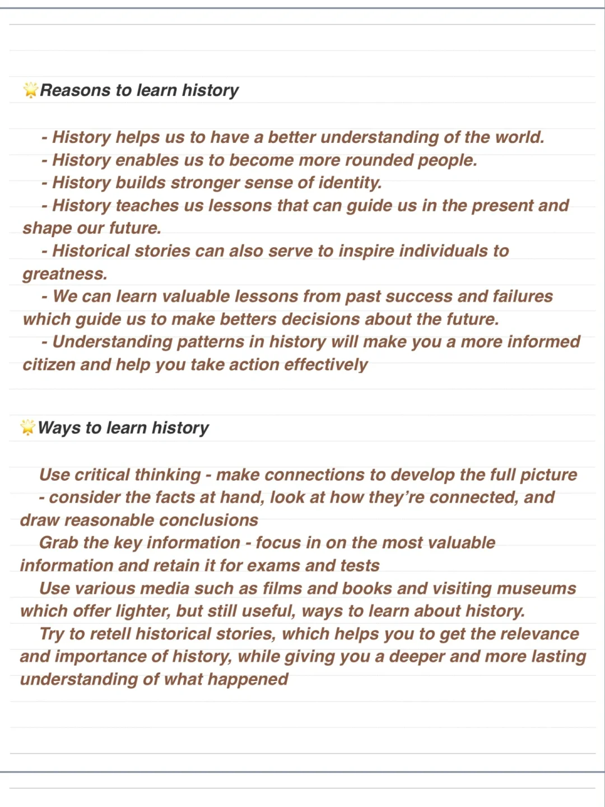
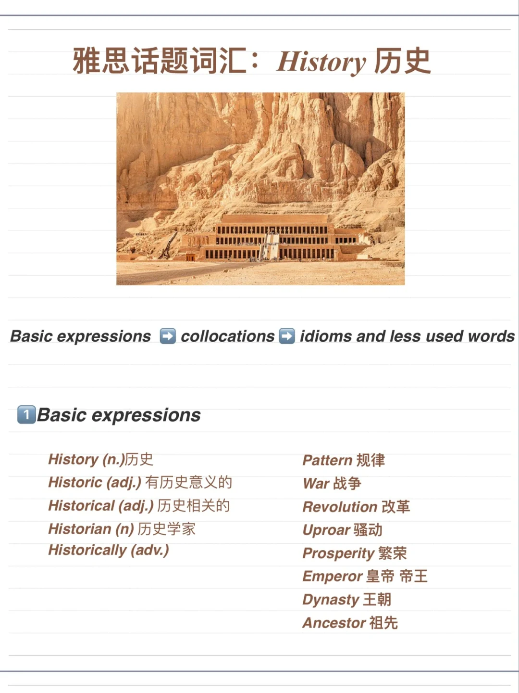
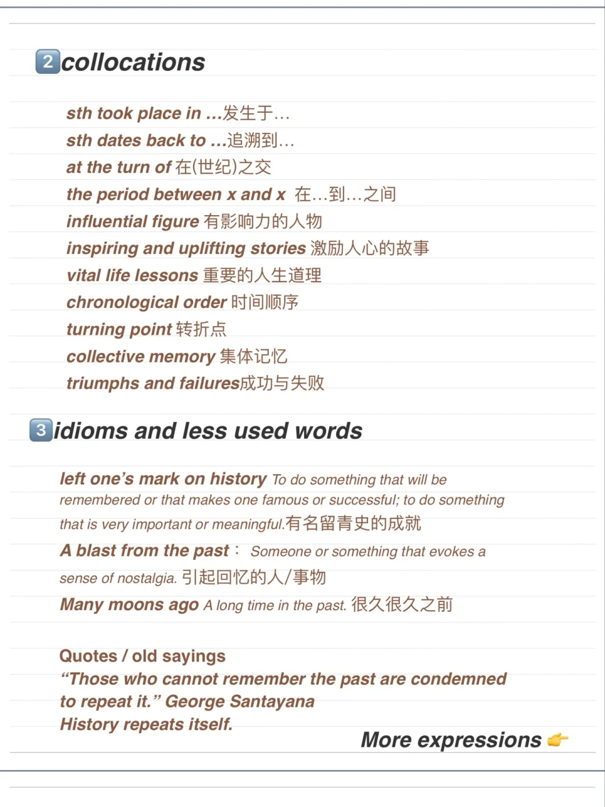

# 雅思口语话题词汇 |如何讨论历史History

在准备雅思口语话题的词汇时，可以从 基础词汇、词组、替换词、习语和少见词汇 几个角度来
准备。
	
昨天分享了历史相关part3问题的参考答案，今天分享讨论历史History 话题时的一些实用表达。
#雅思备考 #屠雅攻略  #屠雅思带7分雅思口语速成
#雅思攻略  #英语口语

## 图片
| 图1 | 图2 | 图3 | 图4 |
| --- | --- | --- | --- |
|  |  |  |   |

生成时间：2025-11-15 02:43:23