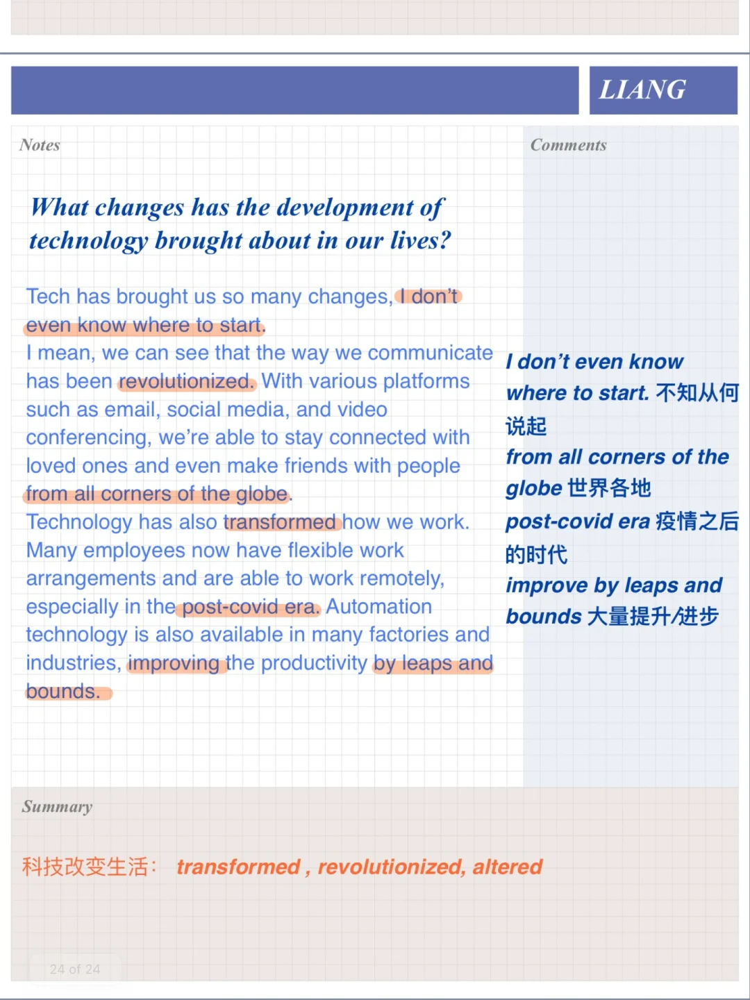
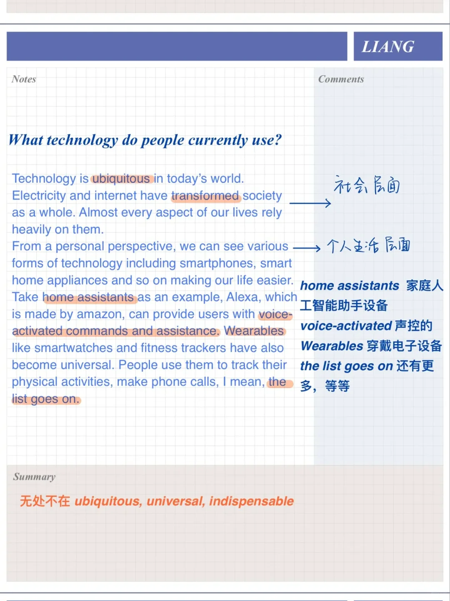
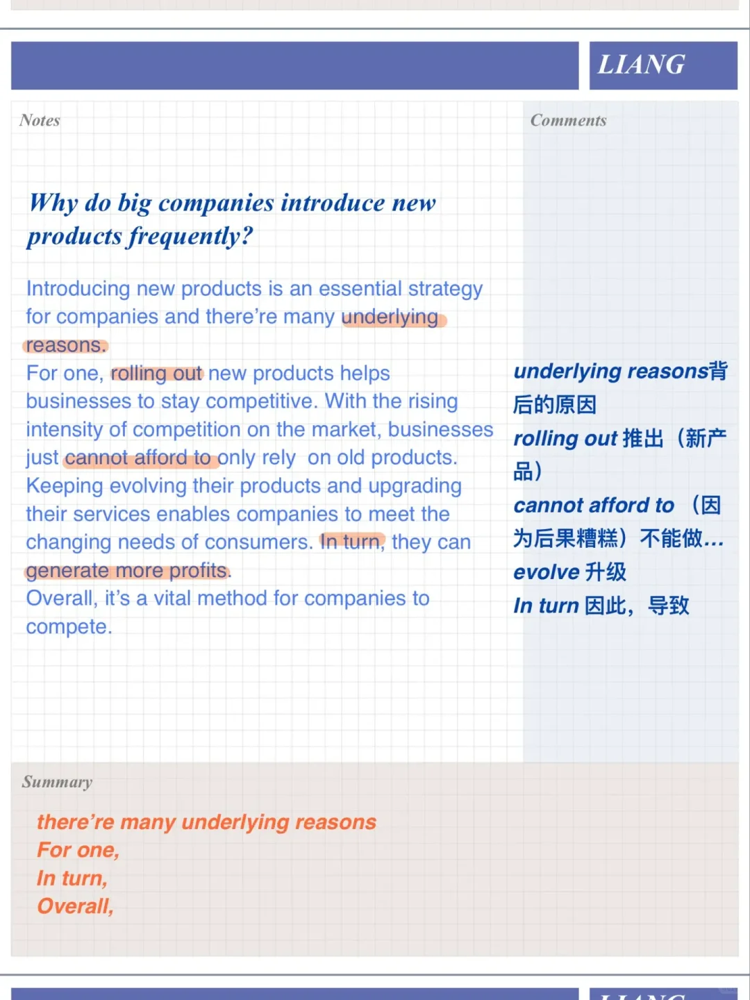
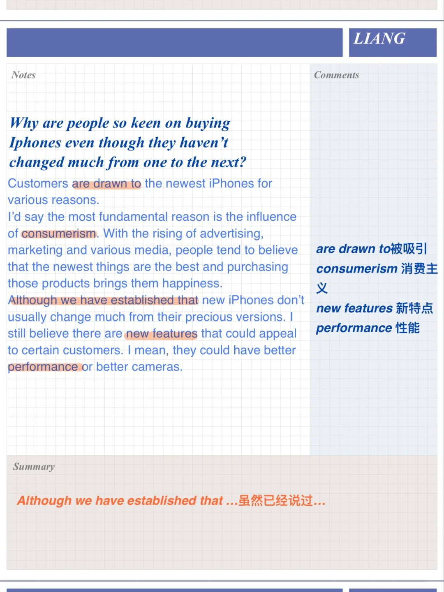

# 雅思口语高分参考答案｜难用的科技PART3

科技话题一只是雅思题库中的常客，看参考答案的同时也要注意积累主题词汇，丰富表达#雅思口语 #雅思攻略 #雅思备考 #屠雅思带7分雅思口语速成 #雅思考试 #英语口语

## 图片
| 图1 | 图2 | 图3 | 图4 |
| --- | --- | --- | --- |
|  |  |  |  |

生成时间：2025-11-15 02:42:18