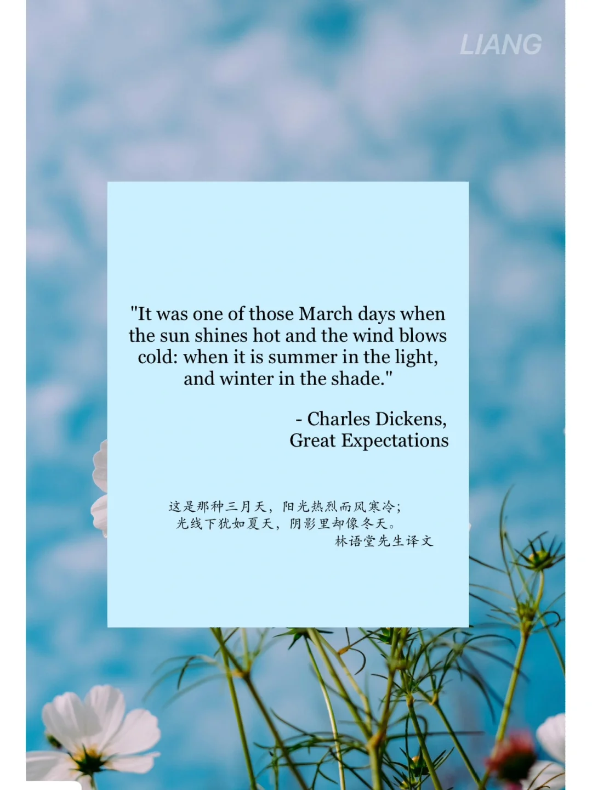
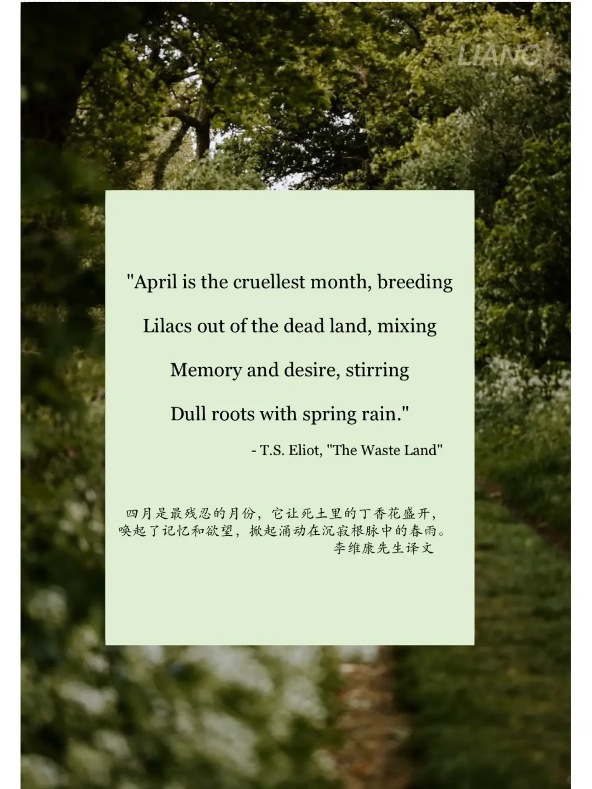
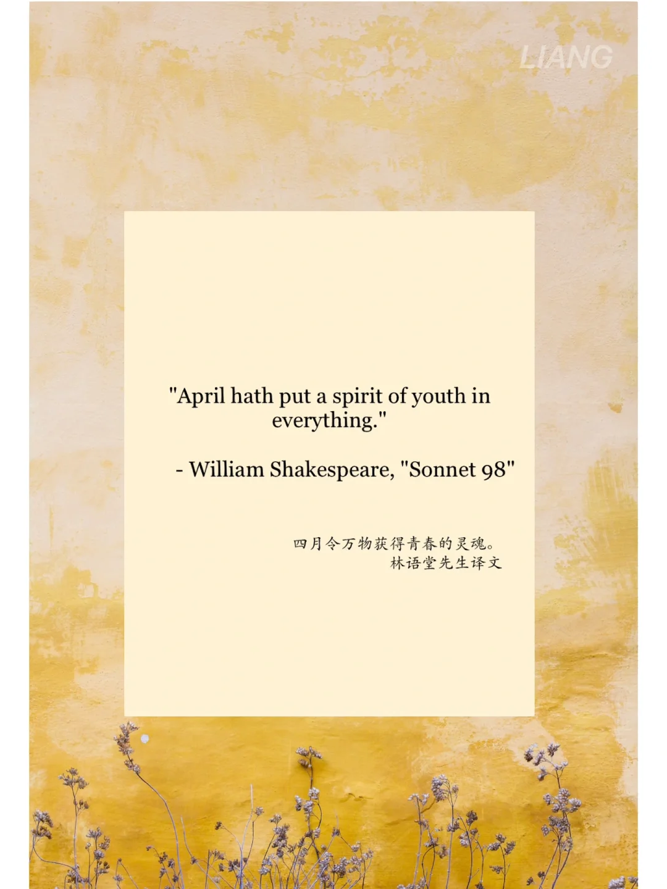
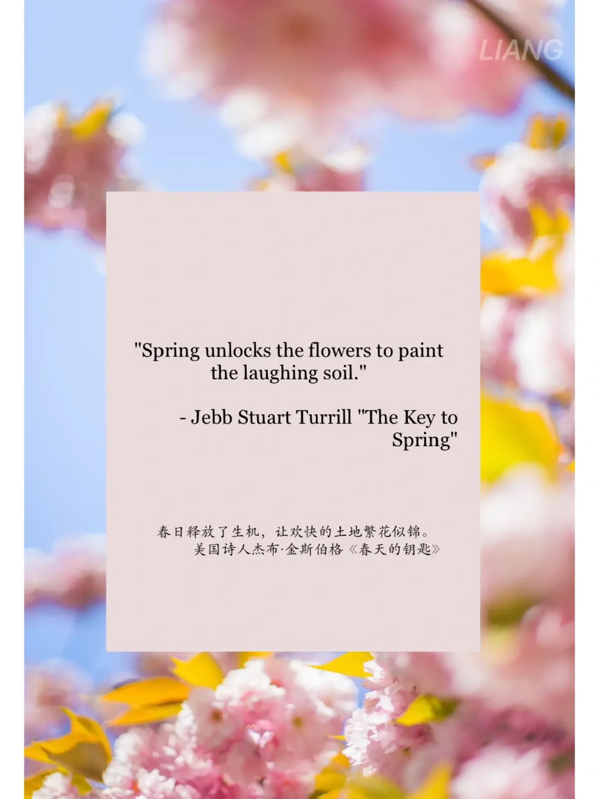

# 英语文学中的春天与四月🌱🌸

四月第一天，跟文学家学习对春的描述🌼
	
"April is the cruellest month, breeding
Lilacs out of the dead land, mixing
Memory and desire, stirring
Dull roots with spring rain."
- T.S. Eliot, "The Waste Land"
四月是最残忍的月份，它让死土里的丁香花盛开，
唤起了记忆和欲望，掀起涌动在沉寂根脉中的春雨。
李维康先生译文
	
🌸"It was one of those March days when the sun shines hot and the wind blows cold: when it is summer in the light, and winter in the shade."
- Charles Dickens, Great Expectations
这是那种三月天，阳光热烈而风寒冷；
光线下犹如夏天，阴影里却像冬天。
林语堂先生译文
	
💐"Spring unlocks the flowers to paint the laughing soil." - Jebb Stuart Turrill "The Key to Spring"
春日释放了生机，让欢快的土地繁花似锦。
美国诗人杰布·金斯伯格《春天的钥匙》
"April hath put a spirit of youth in everything." - William Shakespeare, "Sonnet 98"
四月令万物获得青春的灵魂。林语堂先生译文
	
#英语文学 #羡入四月 #诗歌 #春

## 图片
| 图1 | 图2 | 图3 | 图4 |
| --- | --- | --- | --- |
|  |  |  |  |

生成时间：2025-11-15 02:40:08