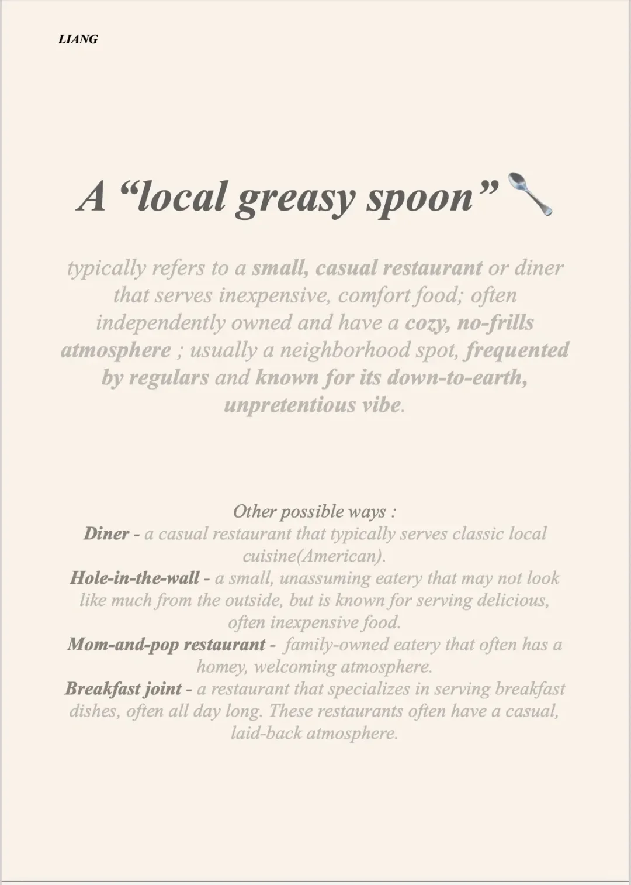

# 地道英文表达积累｜苍蝇馆子🍜

家乡苍蝇馆子可以这样用英文表达：
A “local greasy spoon” 🥄
typically refers to a small, casual restaurant or diner that serves inexpensive, comfort food; often independently owned and have a cozy, no-frills atmosphere ; usually a neighborhood spot, frequented by regulars and known for its down-to-earth, unpretentious vibe.
其他的方式：
Other possible ways :
🥣Diner - a casual restaurant that typically serves classic local cuisine(American).
🍴Hole-in-the-wall - a small, unassuming eatery that may not look like much from the outside, but is known for serving delicious, often inexpensive food.
🍕Mom-and-pop restaurant -  family-owned eatery that often has a homey, welcoming atmosphere.
🥪Breakfast joint - a restaurant that specializes in serving breakfast dishes, often all day long. These restaurants often have a casual, laid-back atmosphere.
#英语 #英语地道表达 #地道口语 #每日英语

## 图片
| 图1 | 图2 | 图3 | 图4 |
| --- | --- | --- | --- |
|  |  |   |   |

生成时间：2025-11-15 02:39:02