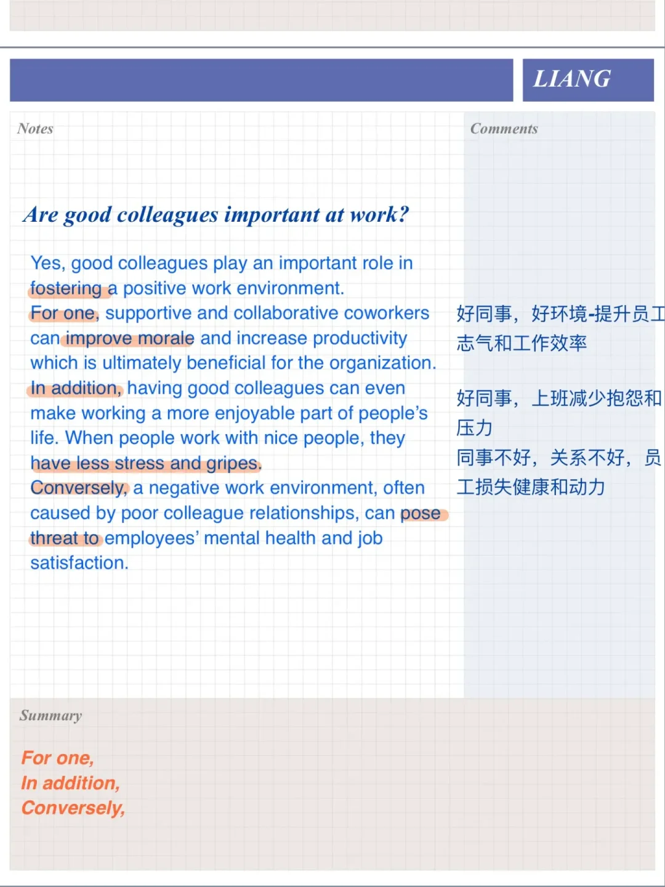
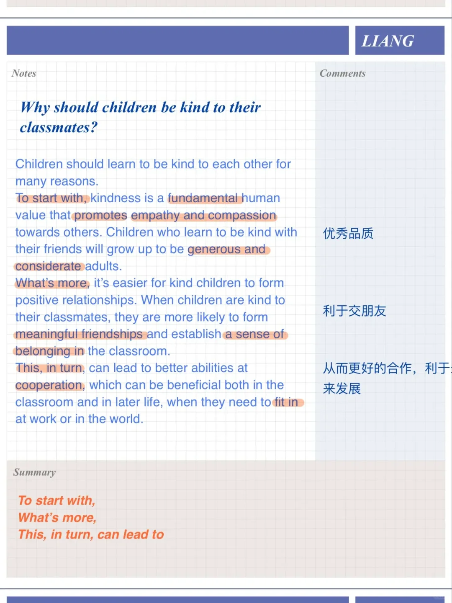
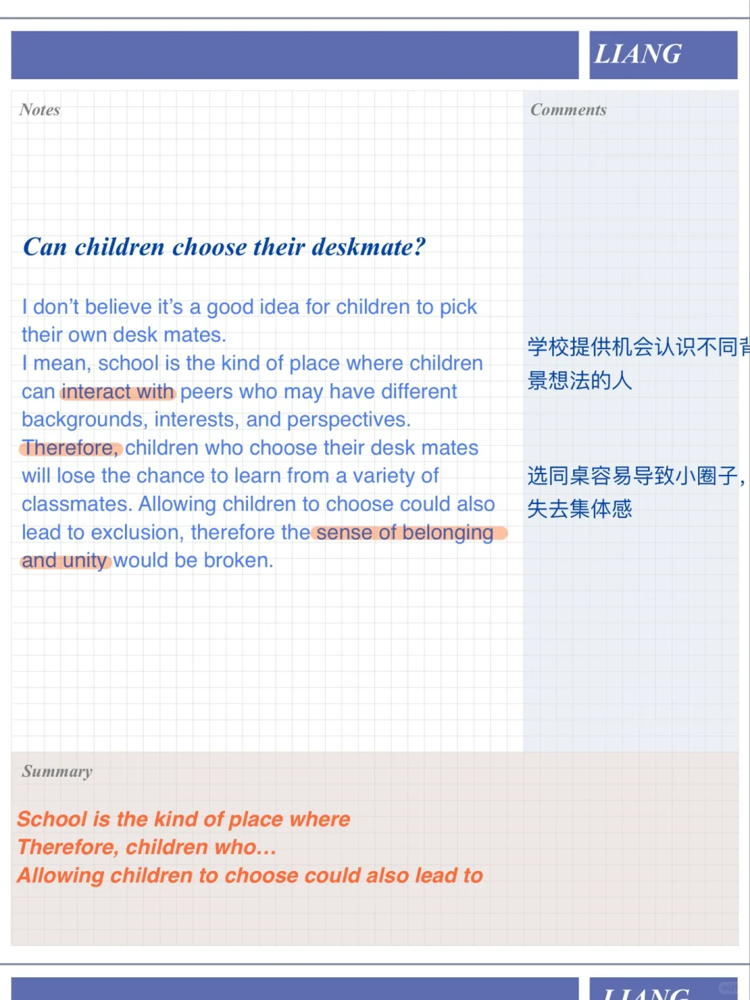
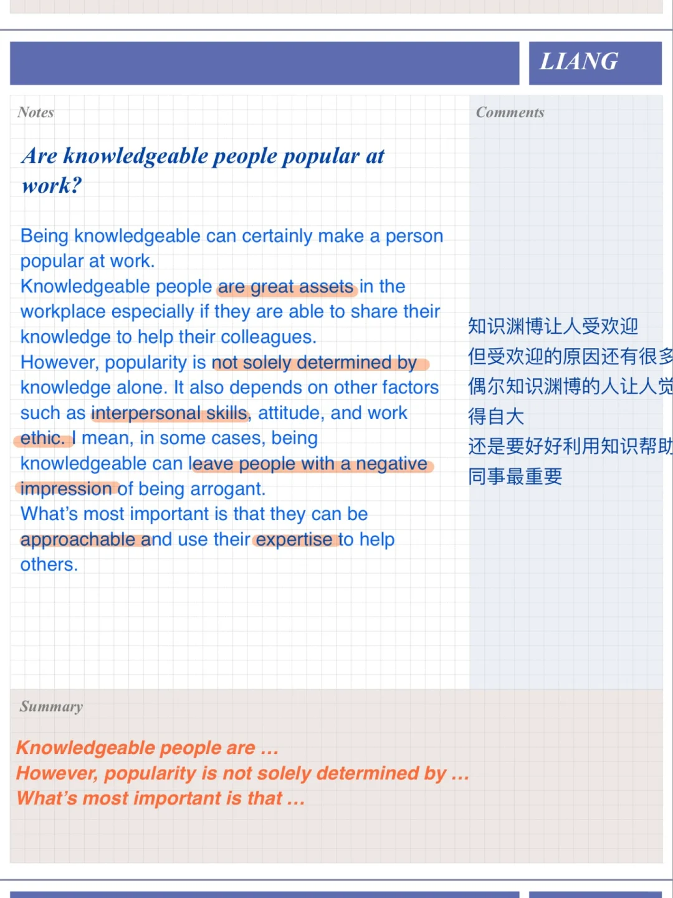

# 雅思口语P3高分参考答案｜一起工作学习的人

对应PART2: A person you want to work with.
#雅思口语 #雅思攻略 #雅思备考 #屠雅思带7分雅思口语速成 #雅思

## 图片
| 图1 | 图2 | 图3 | 图4 |
| --- | --- | --- | --- |
|  |  |  |  |

生成时间：2025-11-15 02:37:58