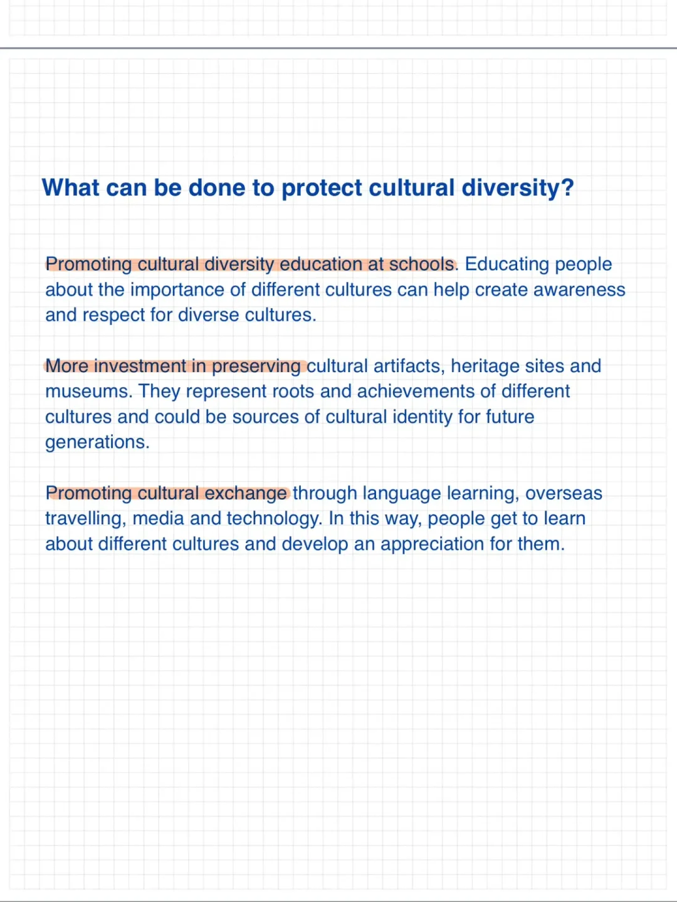
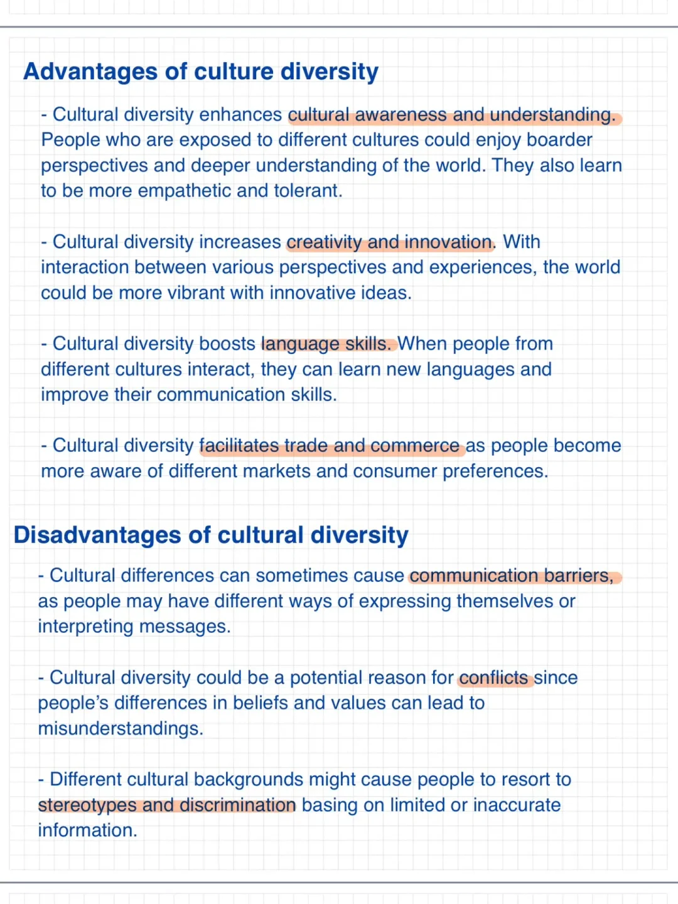

# 雅思语料｜文化多样性 cultural diversity

雅思口语题库中常有相关文化多样的话题
如语言学习，认识的不同文化的人
一起来储备一些预料表达吧
	
#雅思口语 #雅思攻略 #雅思备考 #雅思 #雅思考试

## 图片
| 图1 | 图2 | 图3 | 图4 |
| --- | --- | --- | --- |
|  |  |  |  |

生成时间：2025-11-15 02:36:53