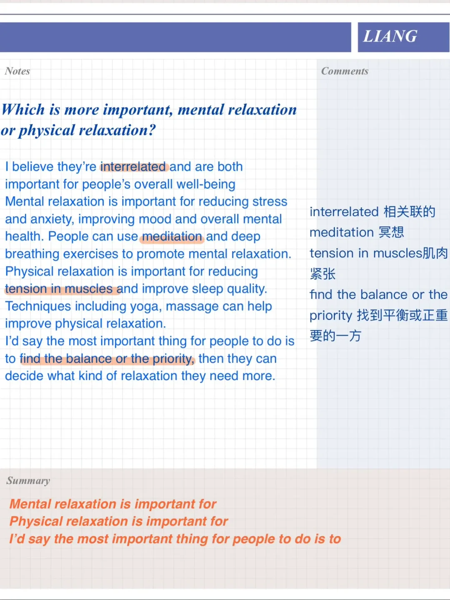
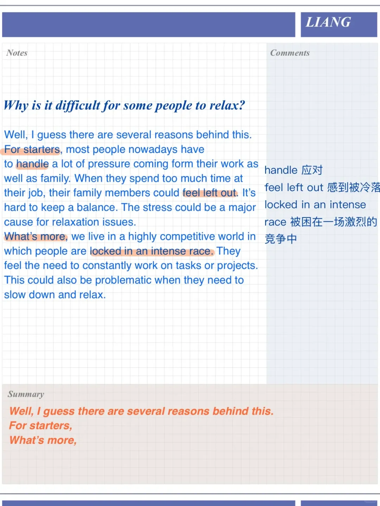
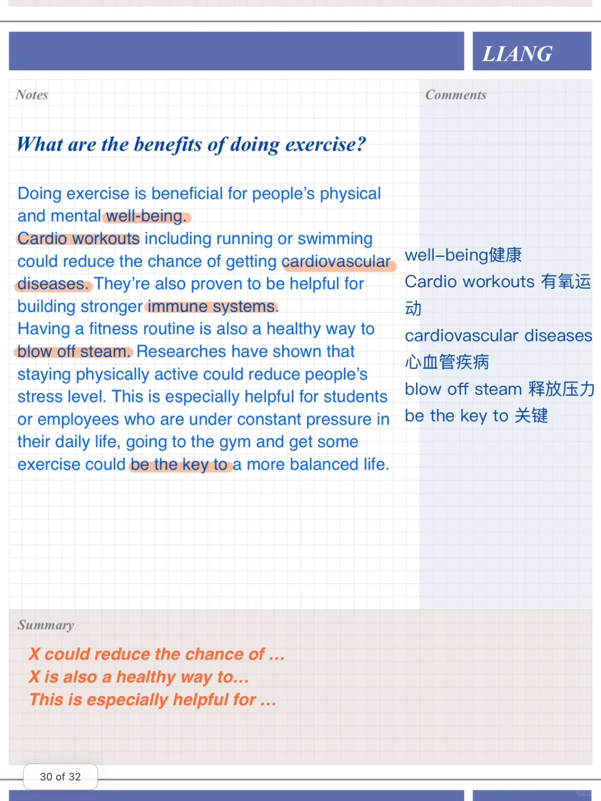
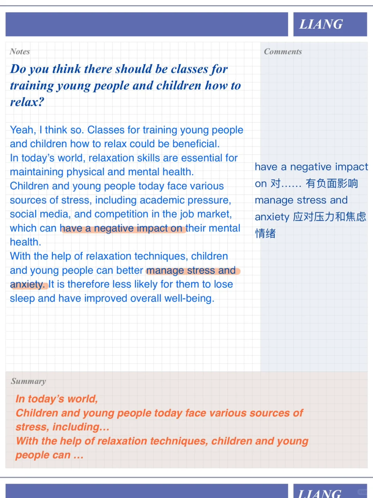

# 雅思口语高分参考答案 | PART 3 放松

今天分享的part3题目主题是放松，相关part2话题: Describe your favorite place in your house where you can relax 家里放松的地方
	
🌟Why is it difficult for some people to relax?
🌟 What are the benefits of doing exercise?
🌟 Do you think there should be classes for training young people and children how to relax?
🌟 Which is more important, mental relaxation or physical relaxation?
#雅思口语 #雅思攻略 #雅思备考 #屠雅思带7分雅思口语速成 #英语口语 #雅思口语part3

## 图片
| 图1 | 图2 | 图3 | 图4 |
| --- | --- | --- | --- |
|  |  |  |  |

生成时间：2025-11-15 02:35:47