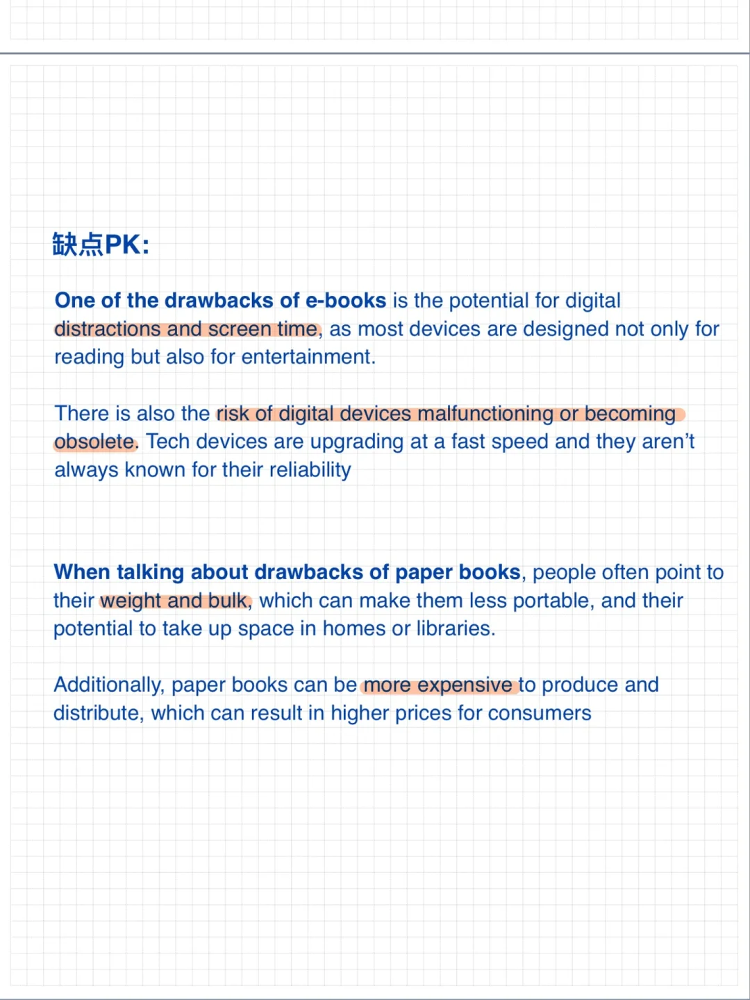
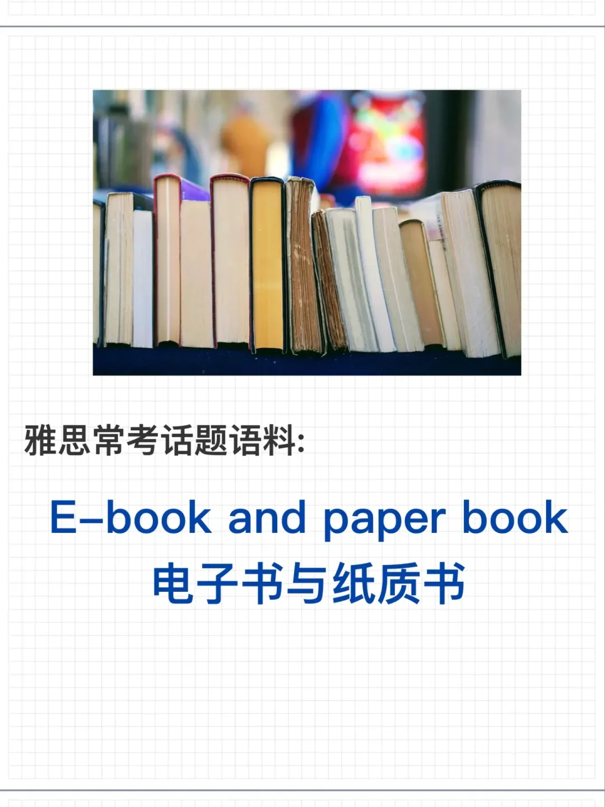
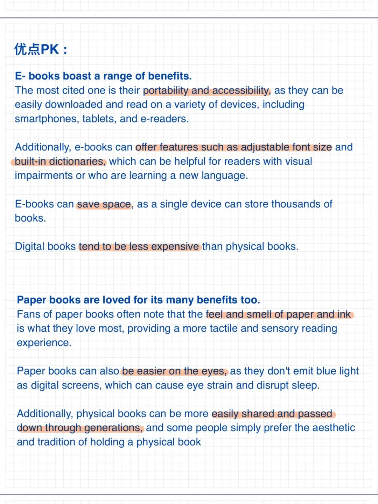

# 雅思话题语料｜电子书与纸质书阅读

电子书和纸质书之间的选择对比一直是雅思口语话题中常客，本季题库中“有趣的故事”Part2相对的应的Part3就有问到: Do you prefer ebooks or paper books?
一起来储备一些实用语料表达吧🌹
	
#雅思口语 #雅思攻略 #雅思备考 #电子书 #纸质书 #英语口语 #雅思观点库

## 图片
| 图1 | 图2 | 图3 | 图4 |
| --- | --- | --- | --- |
|  |  |  |   |

生成时间：2025-11-15 02:34:42