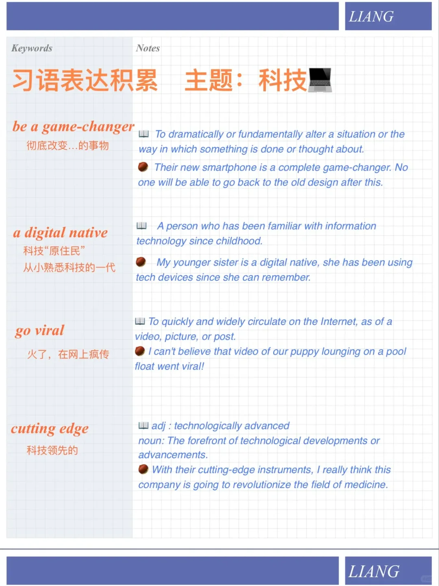

# 英语习语积累｜讨论科技 technology

今天分享一些讨论科技话题时常用到的地道习语表达，在回答雅思口语话题时会有帮助
#雅思口语 #雅思攻略 #雅思备考 #英语 #英语口语 #科技 #英语口语攻略 #英语笔记 #英语单词 #学英语

## 图片
| 图1 | 图2 | 图3 | 图4 |
| --- | --- | --- | --- |
|  |  |   |   |

生成时间：2025-11-15 02:33:37