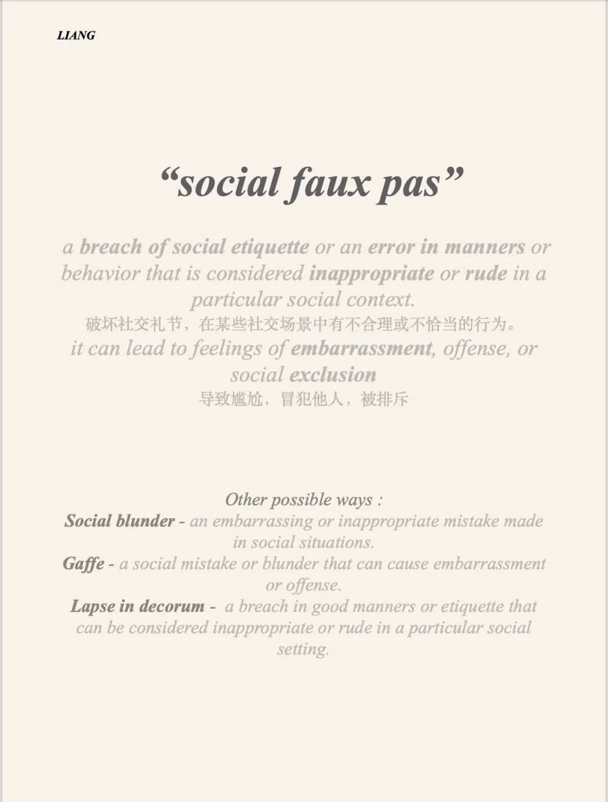
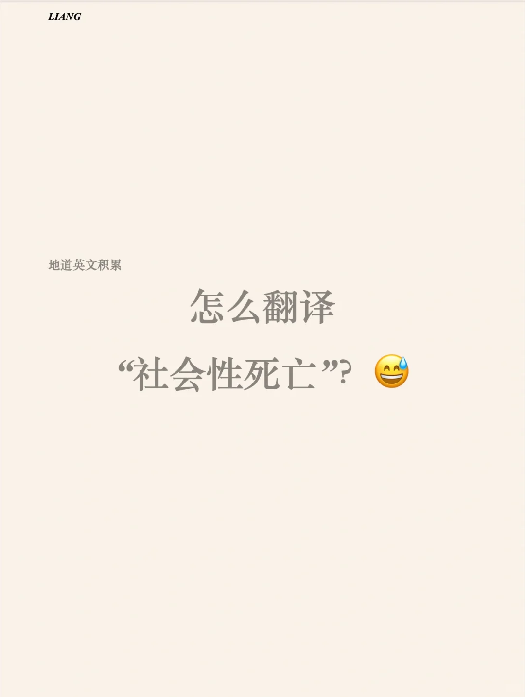

# 地道表达积累｜如何翻译“社死”

“social faux pas”
a breach of social etiquette or an error in manners or behavior that is considered inappropriate or rude in a particular social context.
破坏社交礼节，在某些社交场景中有不合理或不恰当的行为。
it can lead to feelings of embarrassment, offense, or social exclusion
导致尴尬，冒犯他人，被排斥
	
Other possible ways :
Social blunder - an embarrassing or inappropriate mistake made in social situations.
Gaffe - a social mistake or blunder that can cause embarrassment or offense.
Lapse in decorum -  a breach in good manners or etiquette that can be considered inappropriate or rude in a particular social setting.
#翻译 #英语地道表达

## 图片
| 图1 | 图2 | 图3 | 图4 |
| --- | --- | --- | --- |
|  |  |   |   |

生成时间：2025-11-15 02:32:31