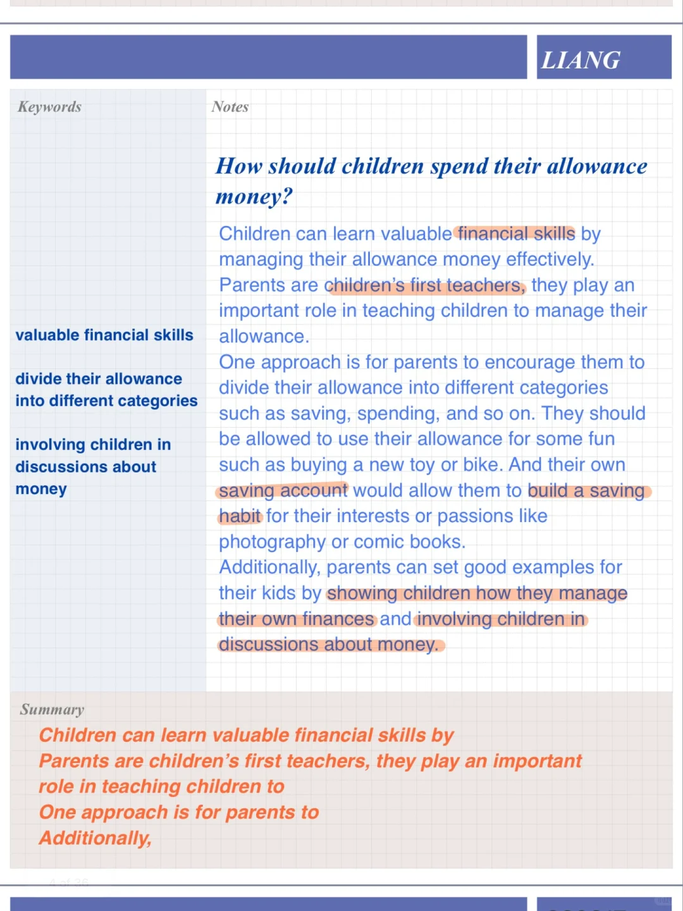
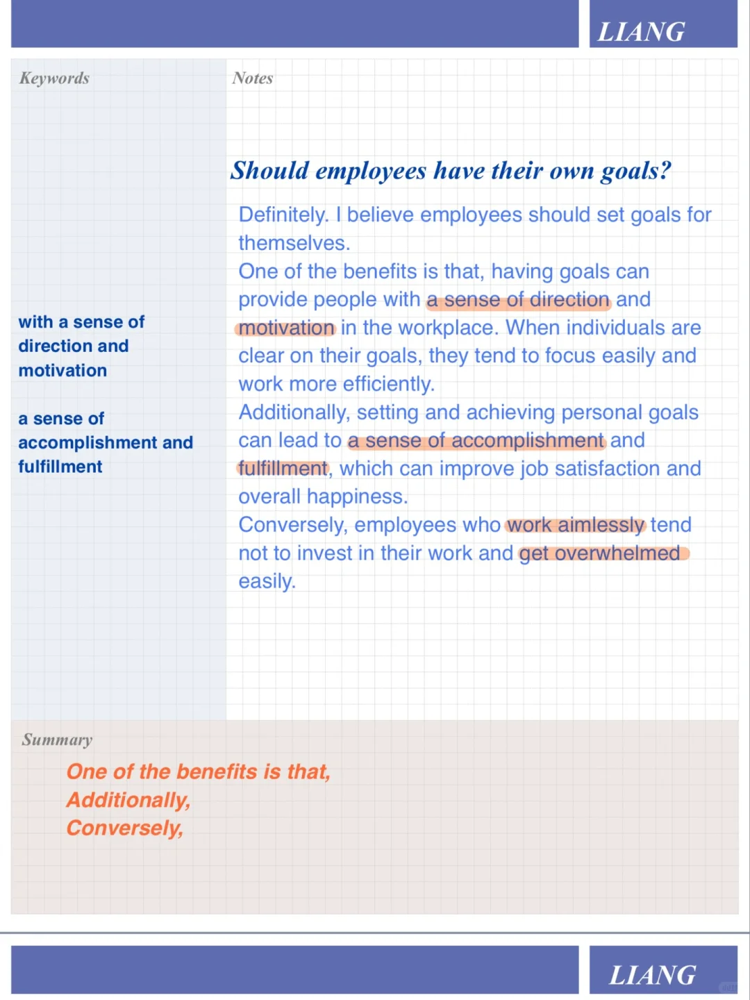
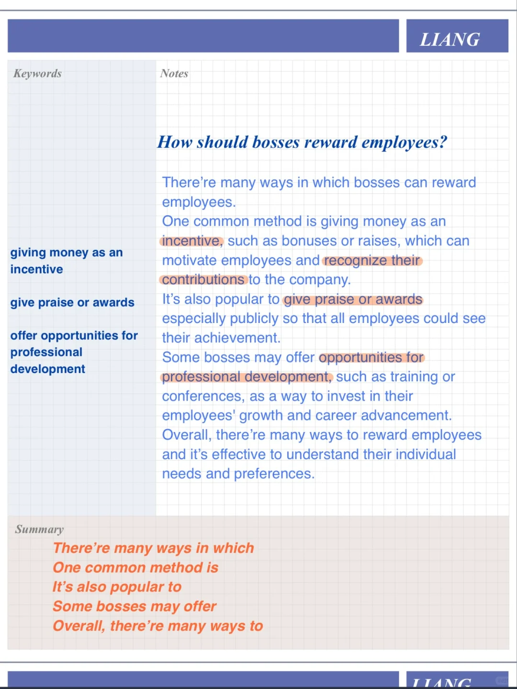
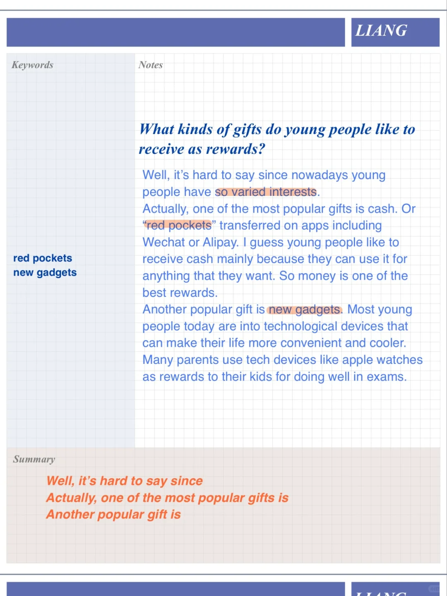

# 雅思口语高分参考答案｜收到想要东西Part3

今天的part3内容主题关于“目标、奖励”
相对应part2题目: a time you received sth that you wanted
#雅思口语 #雅思攻略 #雅思备考 #屠雅思带7分雅思口语速成 #雅思考试 #雅思口语part3

## 图片
| 图1 | 图2 | 图3 | 图4 |
| --- | --- | --- | --- |
|  |  |  |  |

生成时间：2025-11-15 02:31:26