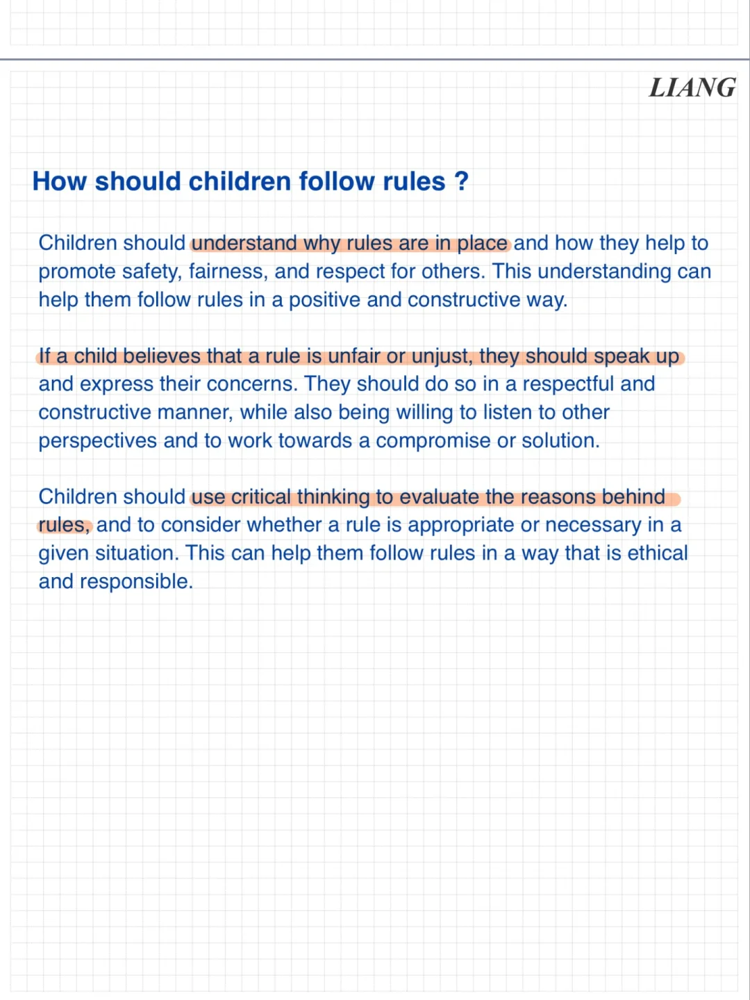
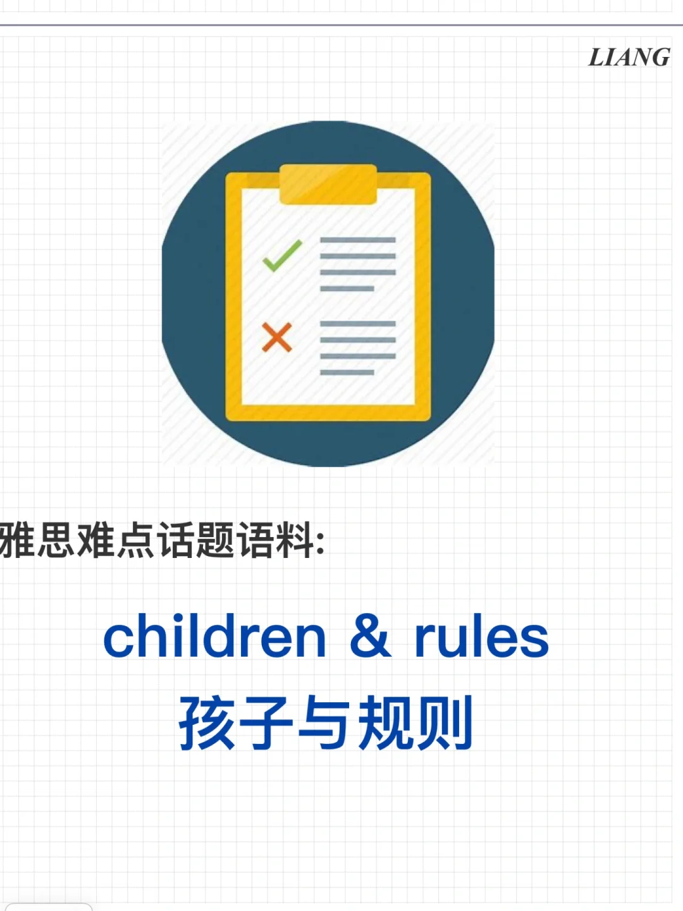
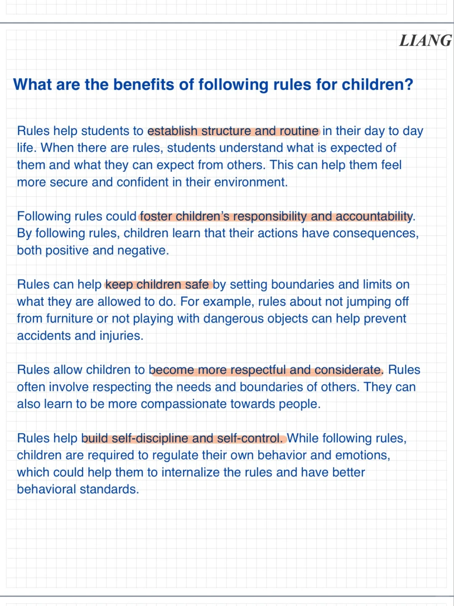
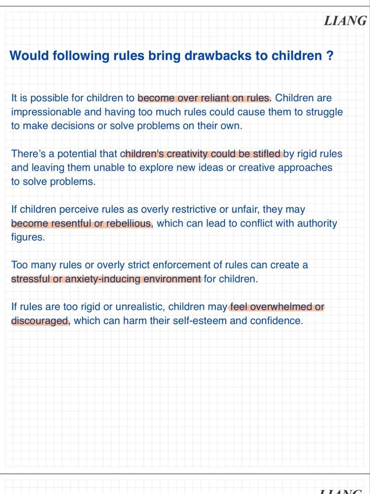
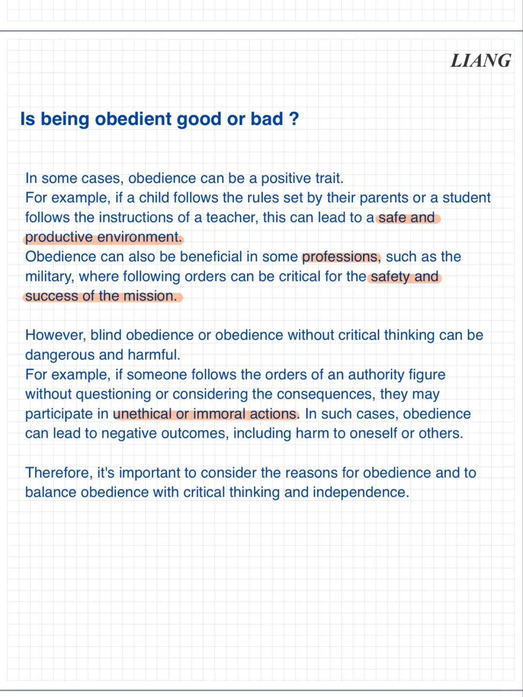
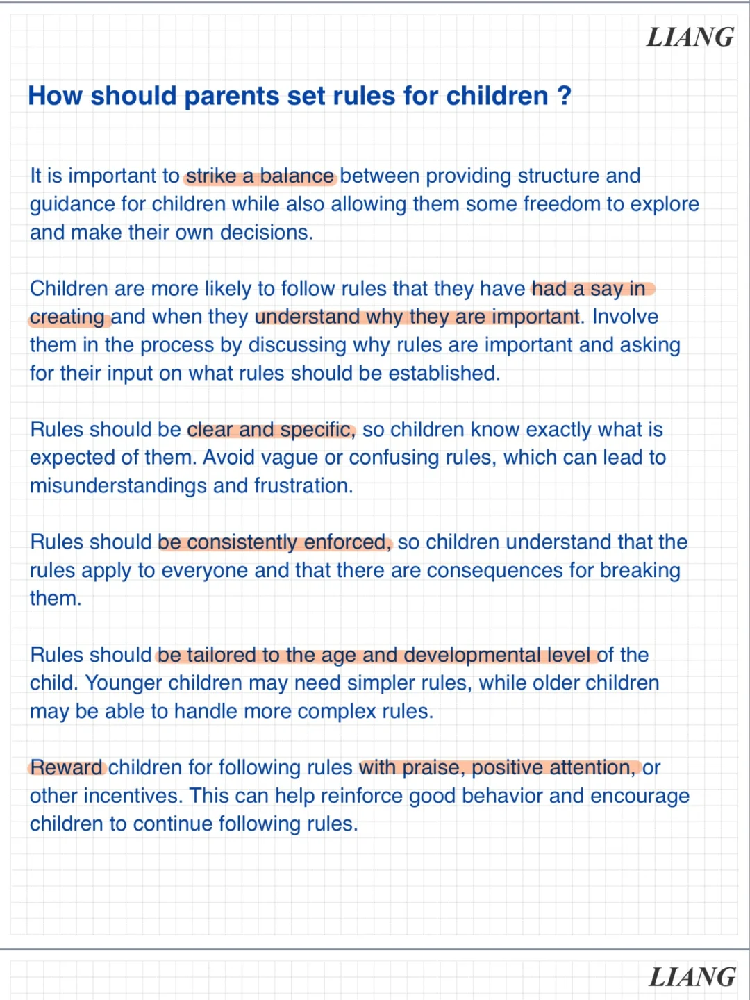

# 雅思话题语料｜孩子与规则

雅思口语part3 以及雅思写作Task2部分，时常会讨论到关于小孩子是否该严格遵守规则的问题，今天一期来储备相关表达～
#雅思口语 #雅思攻略 #雅思备考 #雅思写作 #雅思考试 #屠雅攻略 #雅思观点库

## 图片
| 图1 | 图2 | 图3 | 图4 |
| --- | --- | --- | --- |
|  |  |  |  |
|  |  |   |   |

生成时间：2025-11-15 02:30:21