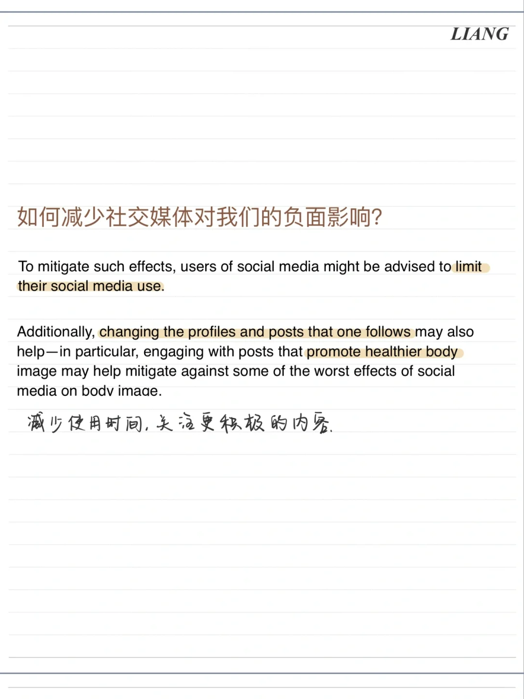
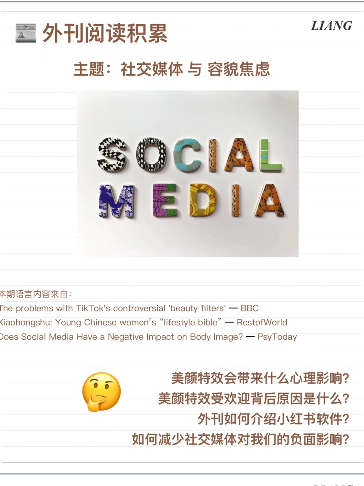
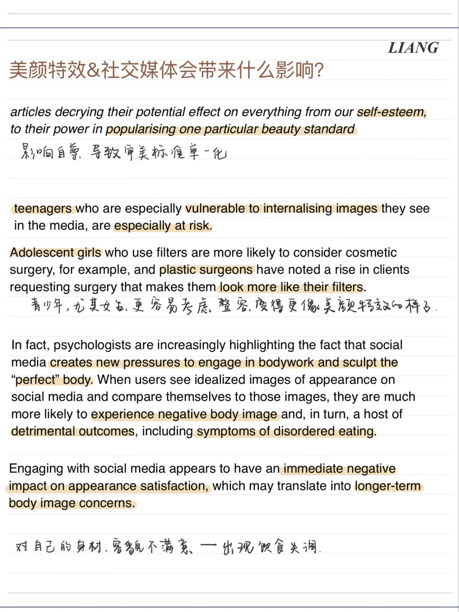
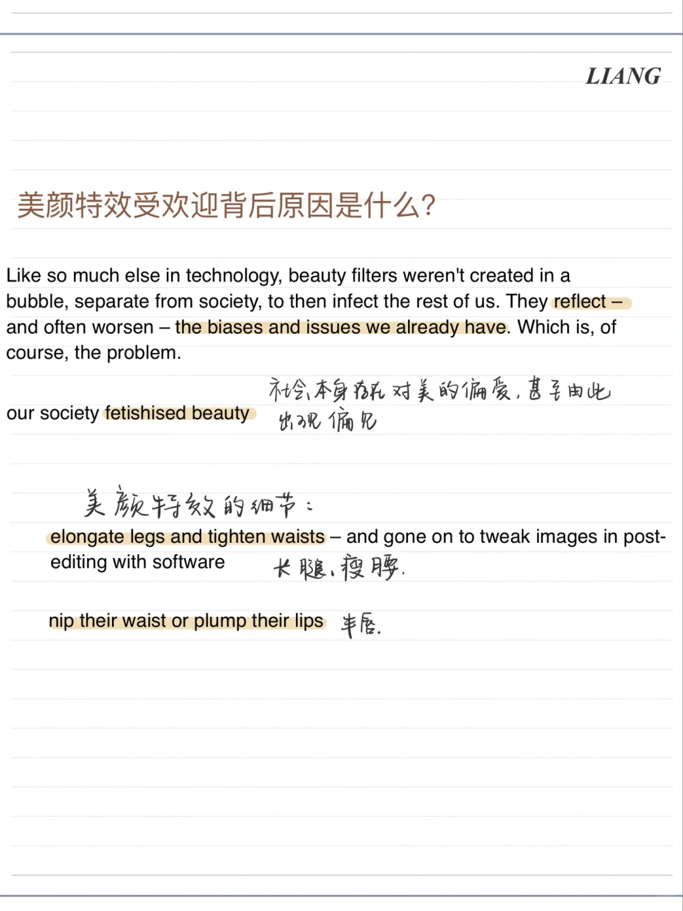
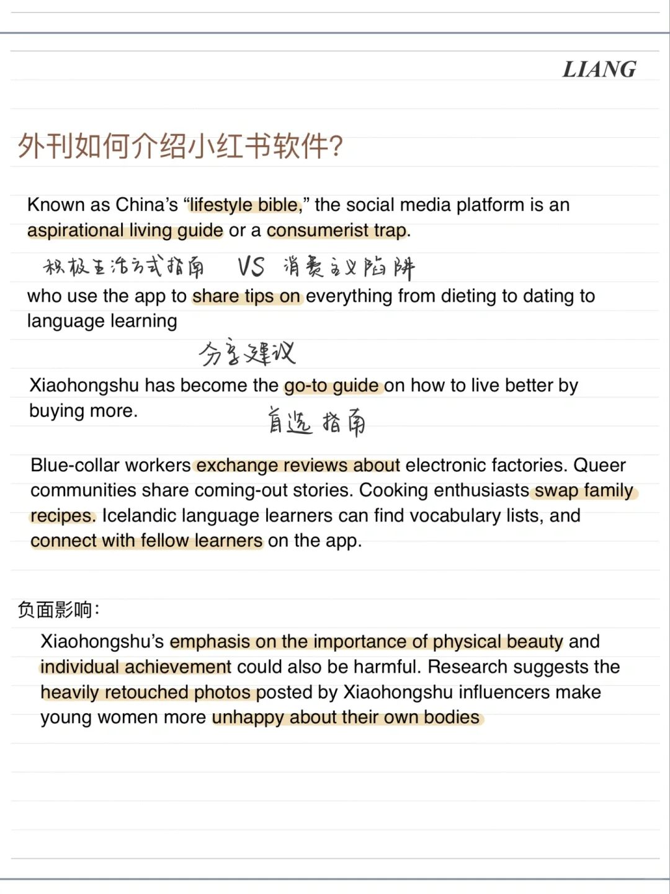

# 外刊阅读积累｜社交媒体，美颜与容貌焦虑

最近读了几篇讨论社交媒体的外刊文章都提及了社交媒体对人们的心理影响，尤其在对自己的外貌看法上的影响。
一起积累一些相关表达吧～
#外刊阅读 #外刊阅读笔记 #社交媒体 #容貌焦虑
#外刊 #阅读 #英语泛读

## 图片
| 图1 | 图2 | 图3 | 图4 |
| --- | --- | --- | --- |
|  |  |  |  |
|  |   |   |   |

生成时间：2025-11-15 02:28:10