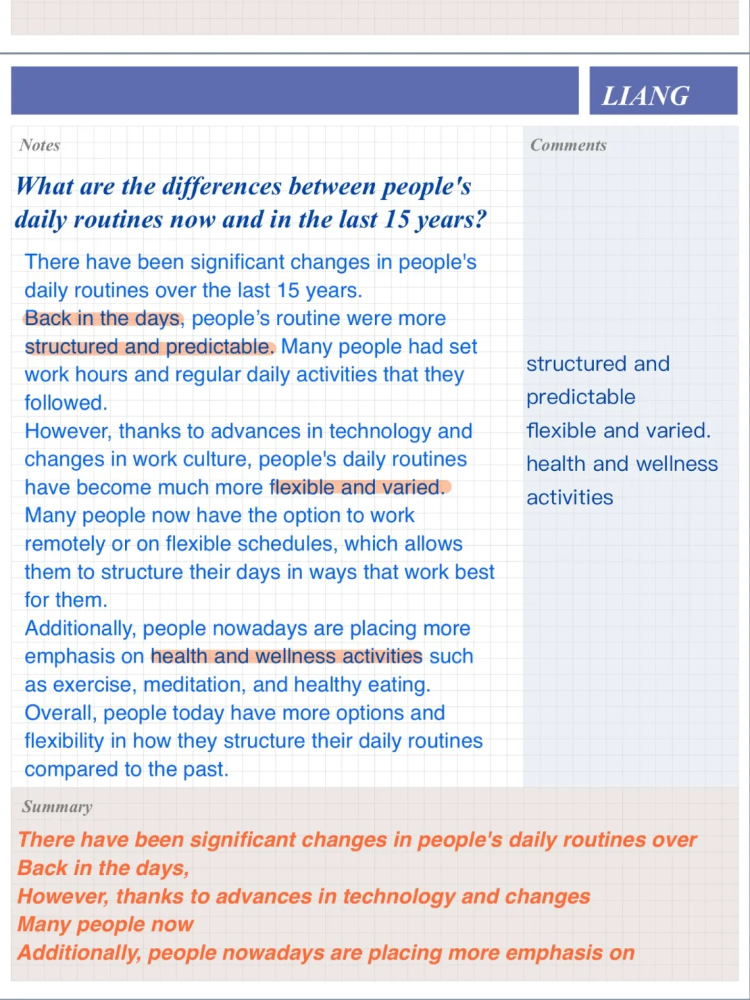
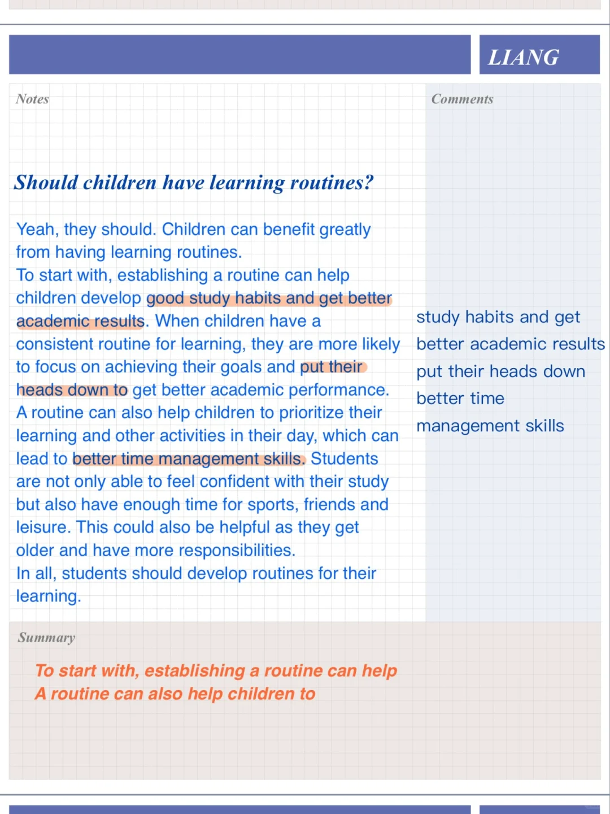
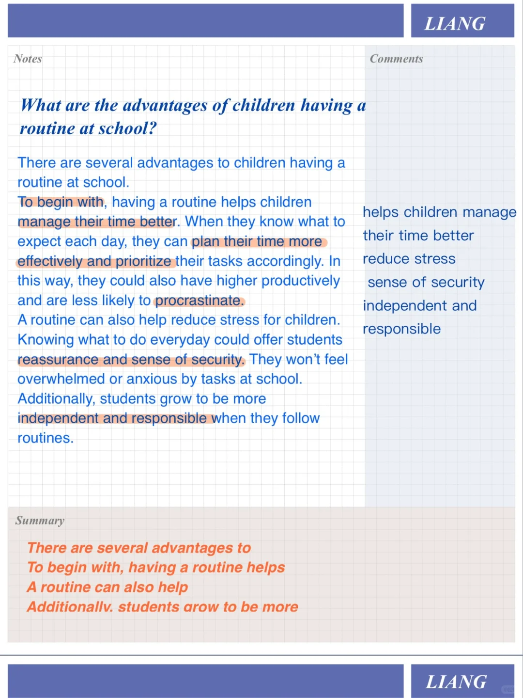
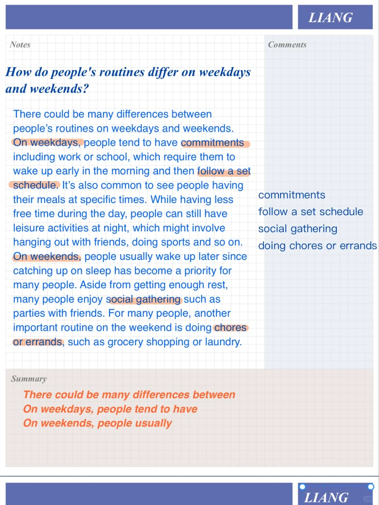

# 雅思口语Part3高分答案｜喜欢的日常

雅思口语part2“描述喜欢的日常”相对应part3问题。
常问到的孩子相关话题和过去现在变化问题注意总结规律。
#雅思口语 #雅思攻略 #屠雅思带7分雅思口语速成 #雅思备考 #英语口语 #雅思口语part3

## 图片
| 图1 | 图2 | 图3 | 图4 |
| --- | --- | --- | --- |
|  |  |  |  |

生成时间：2025-11-15 02:27:03