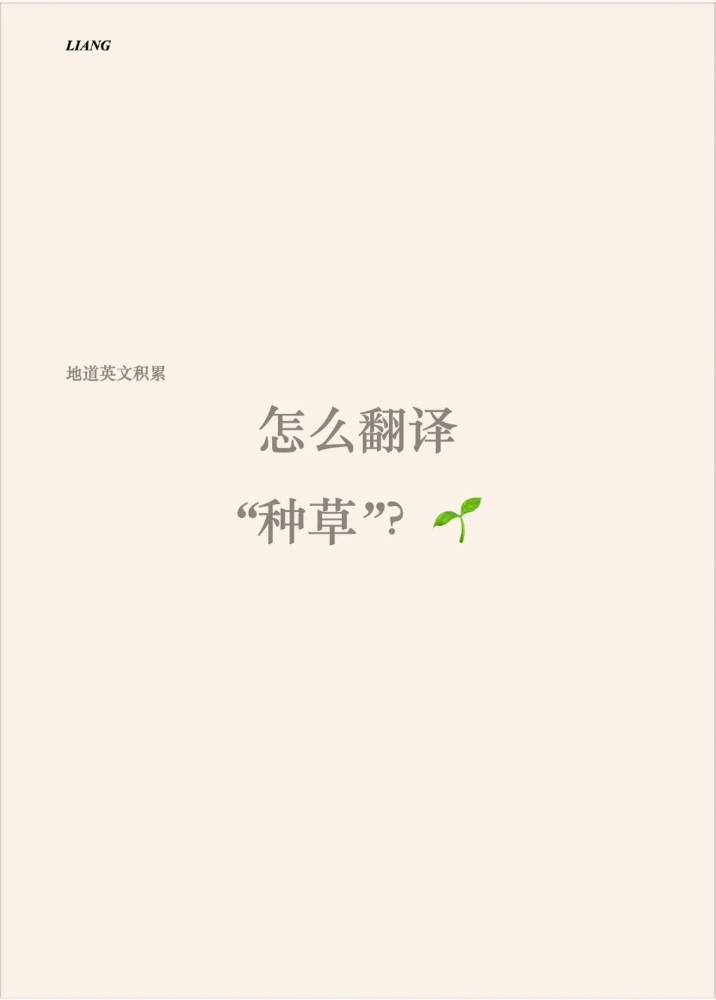

# 地道表达积累｜“种草”

种草可以表达为：social proof
一种因为其他人的宣传代言等而购买东西的现象
也可以尝试用拼音“zhongcao”表达，再来解释该现象的意思。
#翻译 #英文地道表达 #英语口语

## 图片
| 图1 | 图2 | 图3 | 图4 |
| --- | --- | --- | --- |
|  |  |   |   |

生成时间：2025-11-15 02:24:52