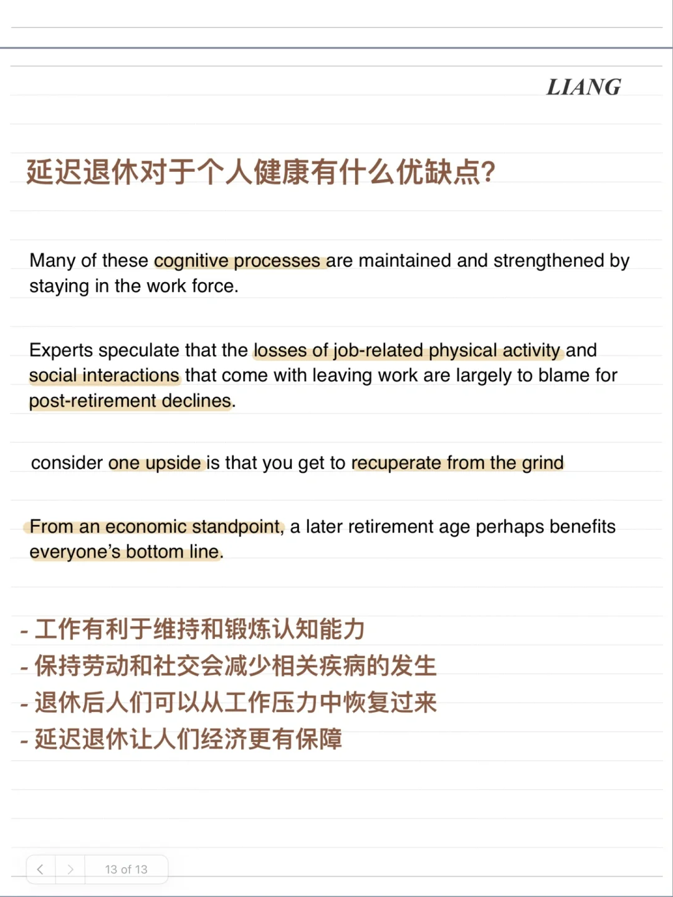
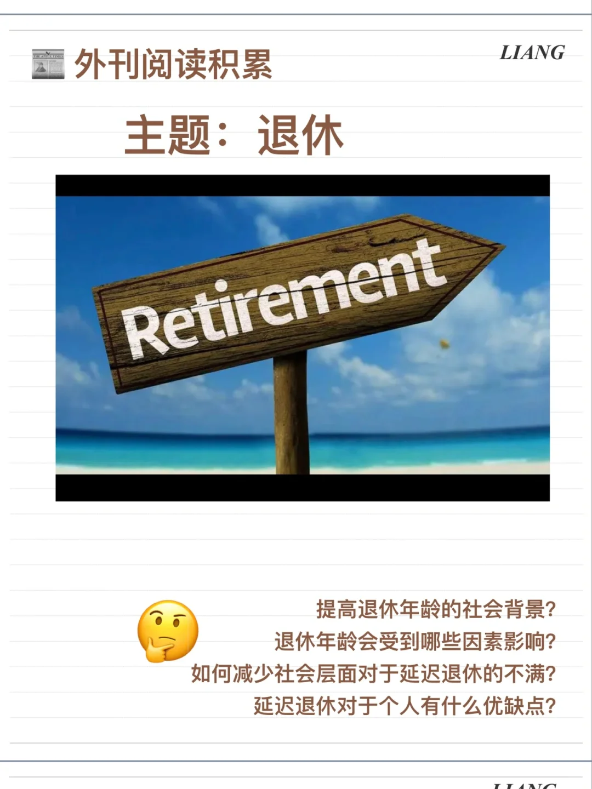
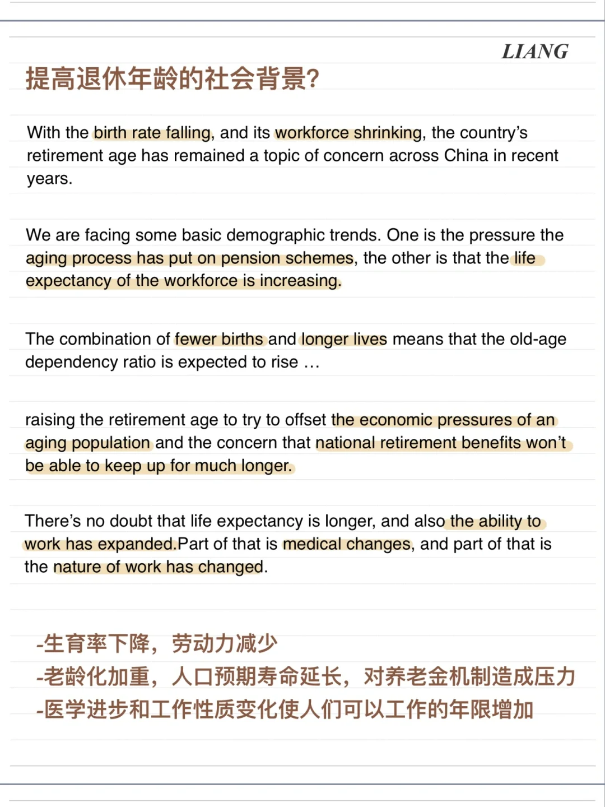
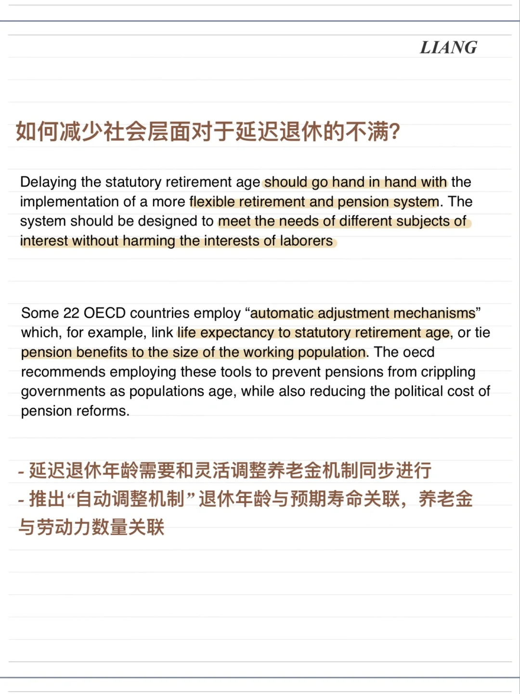

# 外刊阅读积累｜退休年龄

最近几篇关于讨论退休的文章
可以思考的角度：
提高退休年龄的社会背景？
退休年龄会受到哪些因素影响？
如何减少社会层面对于延迟退休的不满？
延迟退休对于个人有什么优缺点？
	
#外刊阅读 #英语泛读 #话题观点 #英语作文素材

## 图片
| 图1 | 图2 | 图3 | 图4 |
| --- | --- | --- | --- |
|  |  |  |  |
|  |   |   |   |

生成时间：2025-11-15 02:23:48