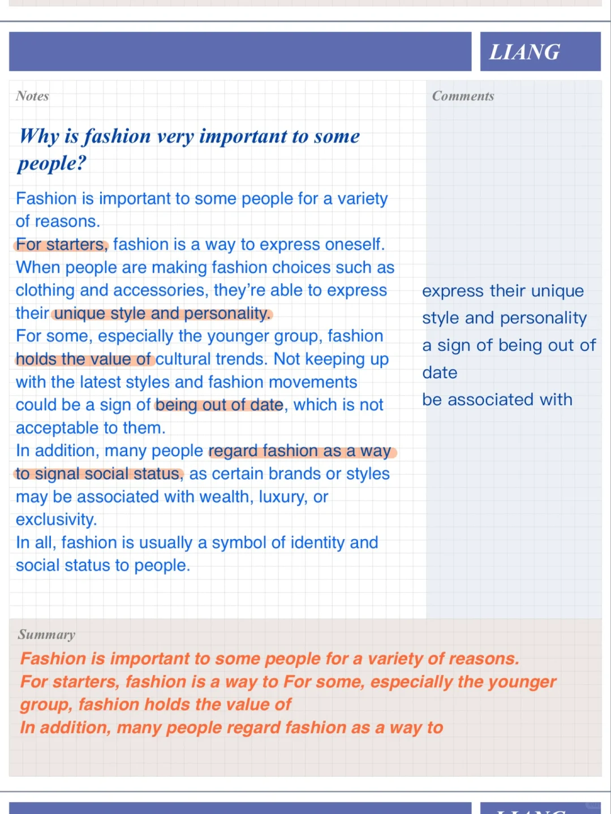
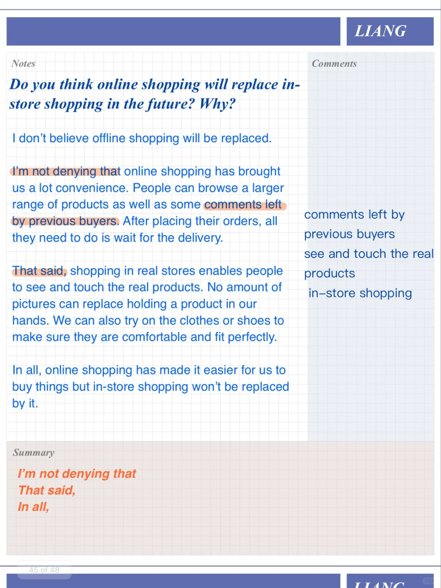
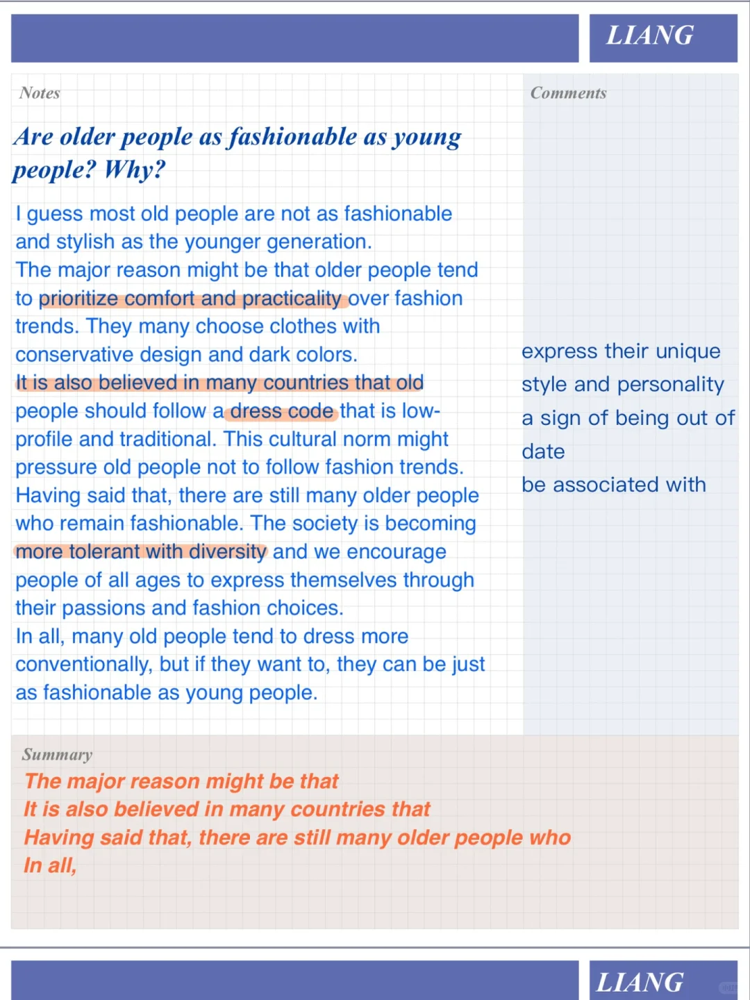

# 雅思口语高分答案｜时尚的人Part3

今天的话题与part2: a person who dresses fashionably or well 相关
讨论年轻人对比老年人，男生对比女生的话题注意分析总结#雅思口语 #屠雅思带7分雅思口语速成 #雅思备考 #雅思攻略 #雅思 #雅思考试 #英语口语 #雅思口语part3

## 图片
| 图1 | 图2 | 图3 | 图4 |
| --- | --- | --- | --- |
|  |  |  |  |

生成时间：2025-11-15 02:22:42