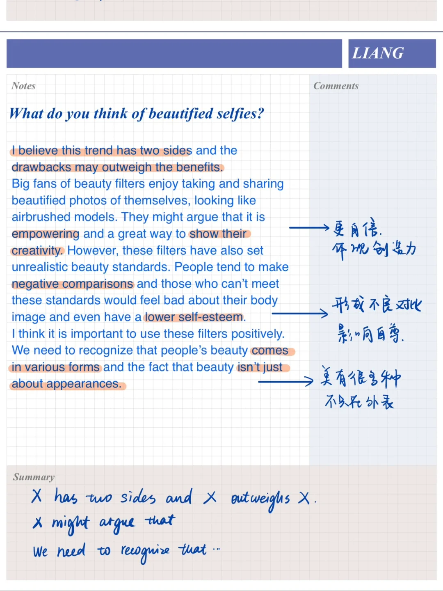
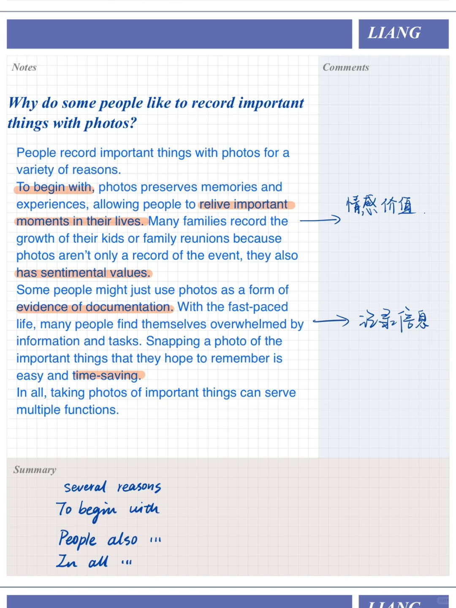
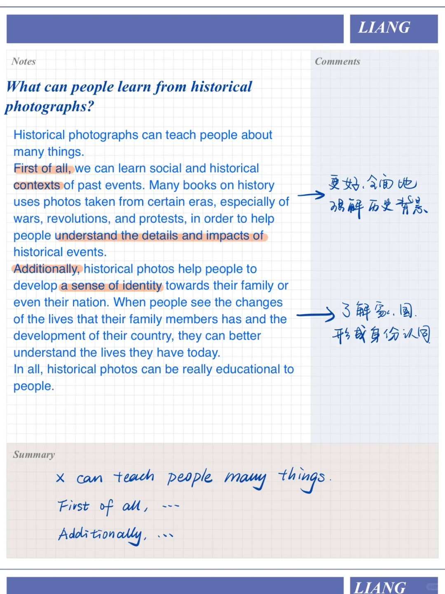
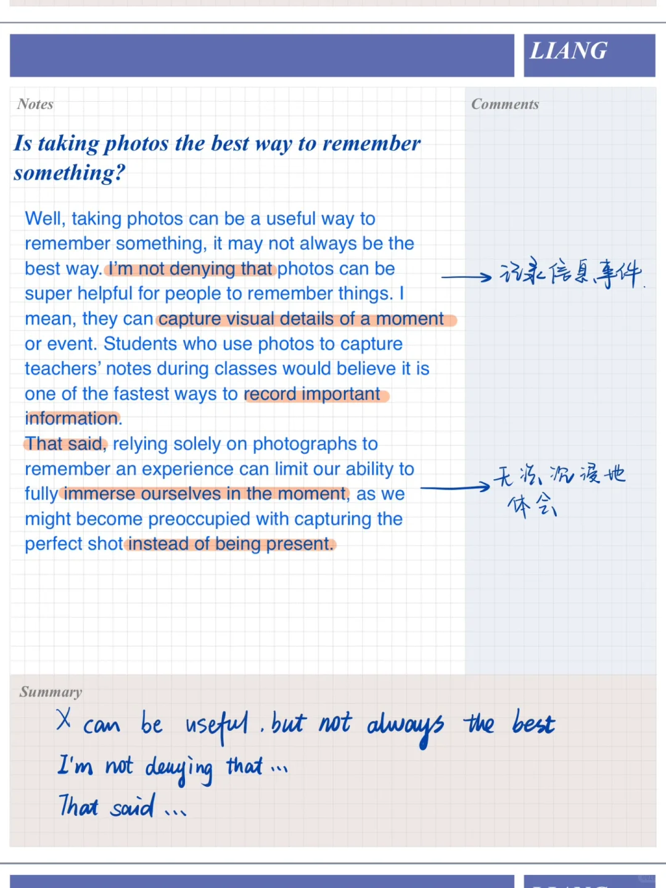

# 雅思口语高分答案｜自豪的照片Part3

今天对应的part2题目是:
part2: describe a photo that you took and felt proud
	
part3页围绕照片的作用展开
像美颜照片这样的事物，可以辩证来讨论，也可以补充自己认为合理的应对方式#雅思口语 #雅思攻略 #雅思备考 #屠雅思带7分雅思口语速成 #英语口语 #雅思口语part3

## 图片
| 图1 | 图2 | 图3 | 图4 |
| --- | --- | --- | --- |
|  |  |  |  |

生成时间：2025-11-15 02:20:32