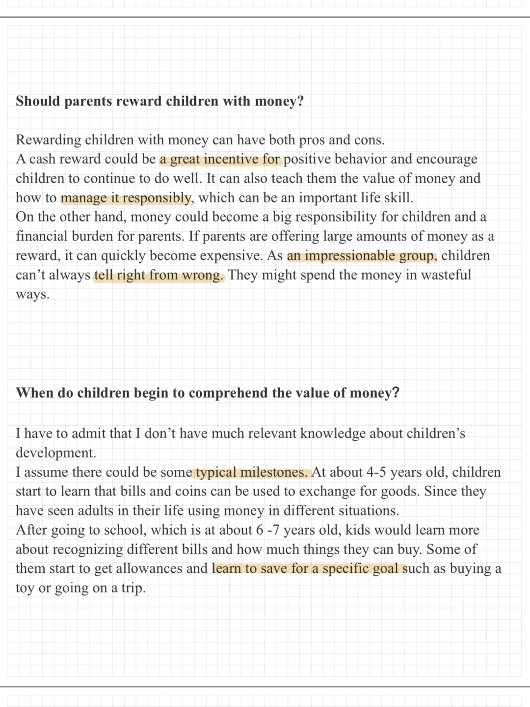
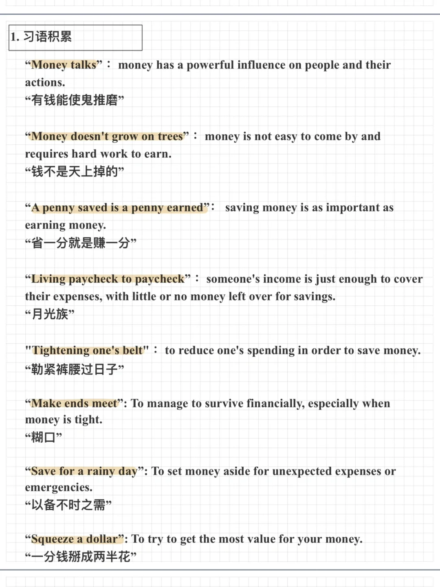
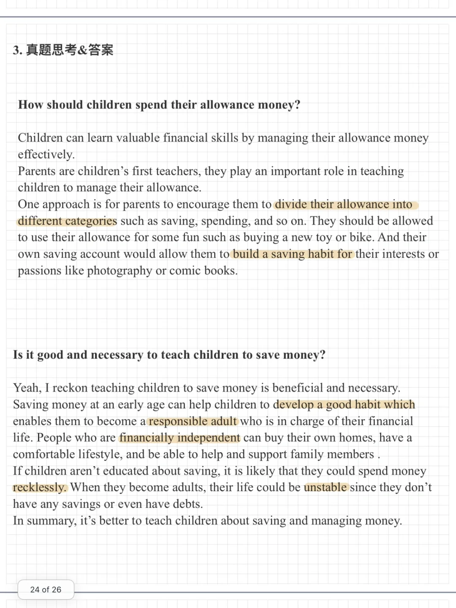

# 攒钱｜雅思语料积累

看到热门话题“月薪一万一年攒11万”，整理了一下与攒钱相关的口语地道表达，还有相关雅思真题与答案。
🤔你是a big spender 还是shrewd saver？👀
	
#雅思口语 #雅思攻略 #雅思备考 #雅思考试 #攒钱 #英语地道表达

## 图片
| 图1 | 图2 | 图3 | 图4 |
| --- | --- | --- | --- |
|  |  |  |  |
|  |   |   |   |

生成时间：2025-11-15 02:19:27