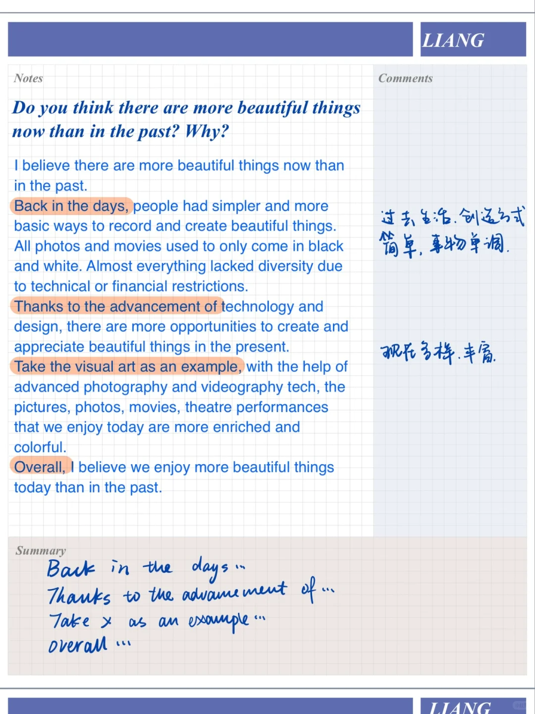
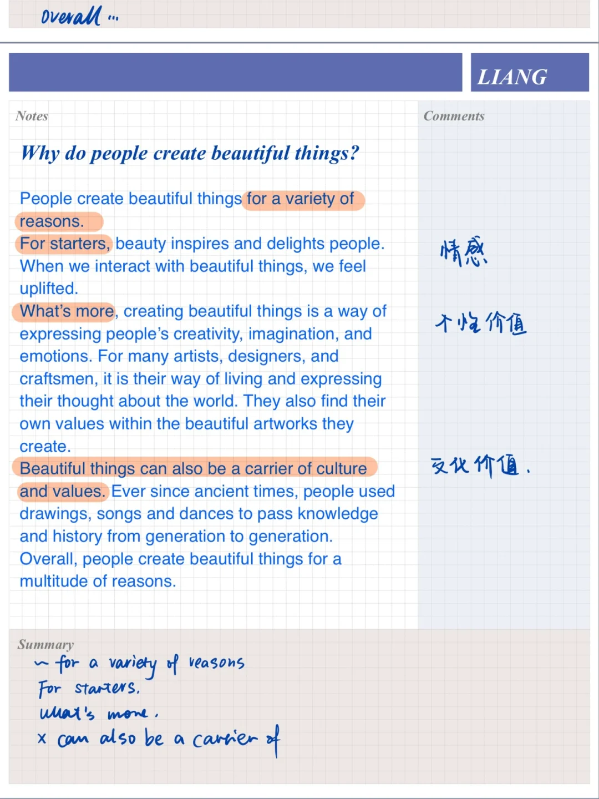
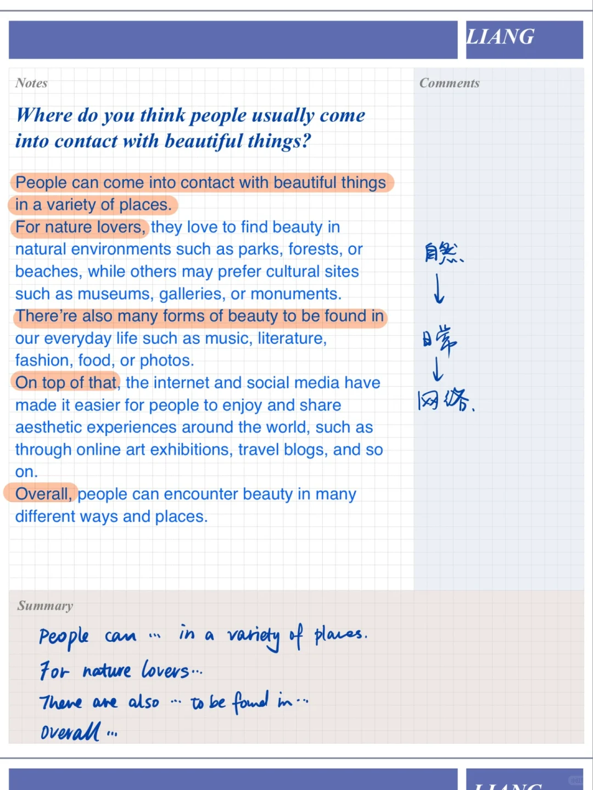

# 雅思口语高分答案｜漂亮的物品part3

Describe an object that you think is beautiful 漂亮的物品
	
part3:
Do you think there are more beautiful things now than in the past? Why?
What beautiful scenery spots are there in your country?
Where do you think people usually come into contact with beautiful things?
Why do people create beautiful things?
	
#雅思口语 #屠雅思带7分雅思口语速成 #雅思备考 #英语口语 #雅思口语part3

## 图片
| 图1 | 图2 | 图3 | 图4 |
| --- | --- | --- | --- |
|  |  |  |  |

生成时间：2025-11-15 02:16:09