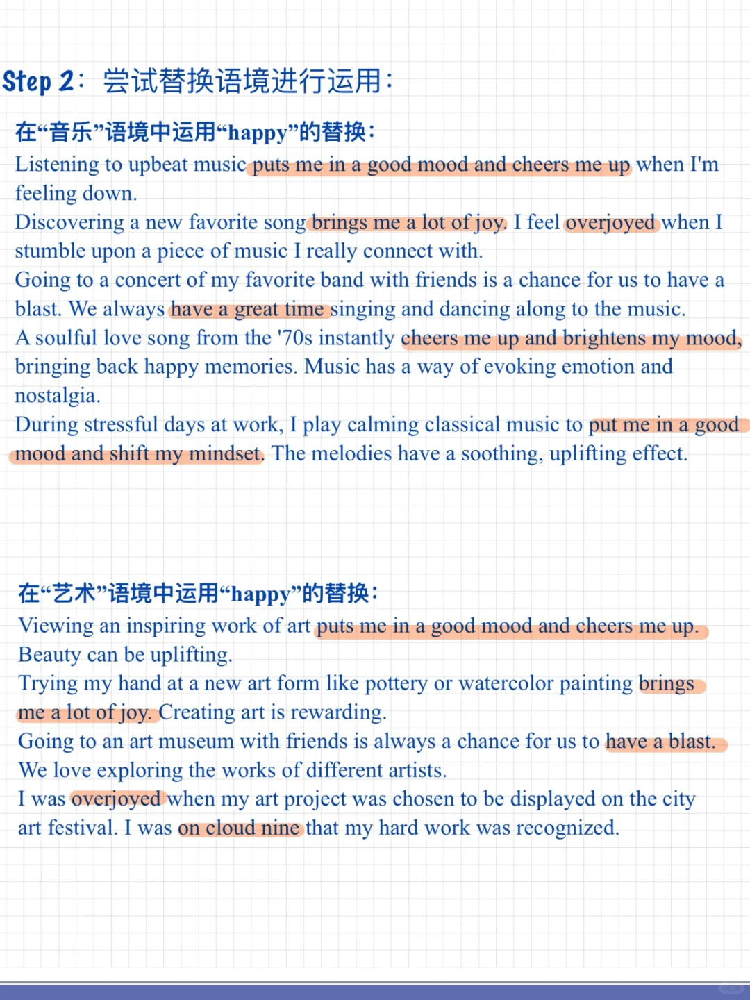
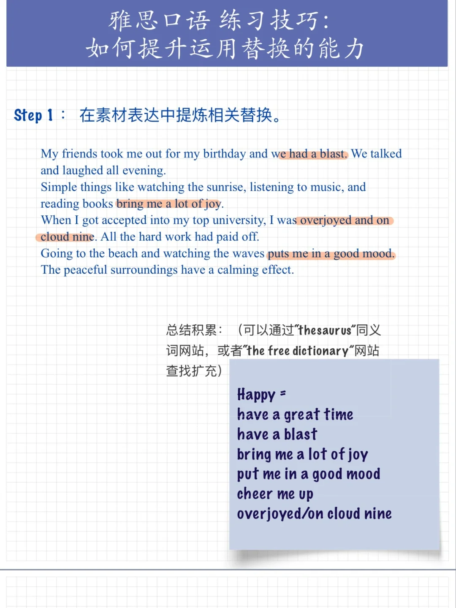

# 雅思口语练习技巧｜词汇替换能力

很多同学表示：“替换我认识，笔记本里也积累了，写作时也能用一些，但口语表达中，用不出来。”
大家可以尝试今天笔记中所展示的“换语境”方法。
经过思考的内容，才会更印象深刻。
#雅思口语 #雅思攻略 #雅思备考 #雅思词汇 #雅思 #英语口语

## 图片
| 图1 | 图2 | 图3 | 图4 |
| --- | --- | --- | --- |
|  |  |   |   |

生成时间：2025-11-15 02:15:04