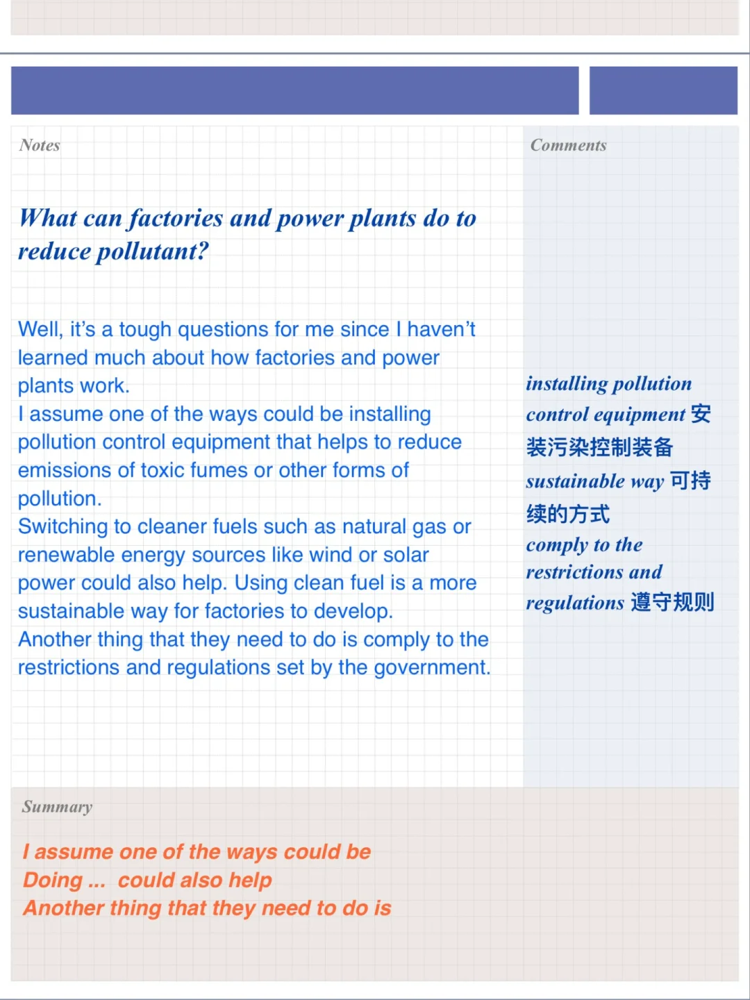
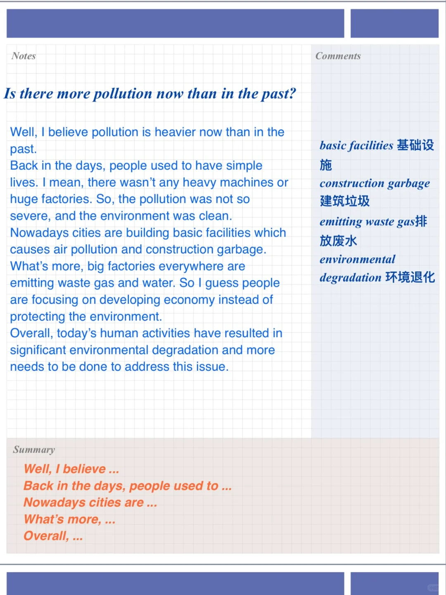
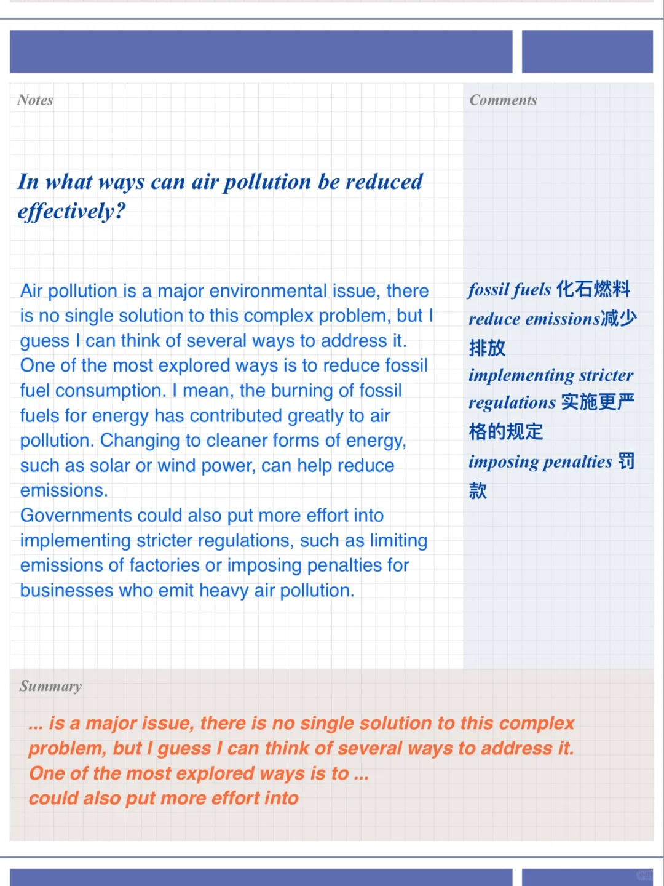
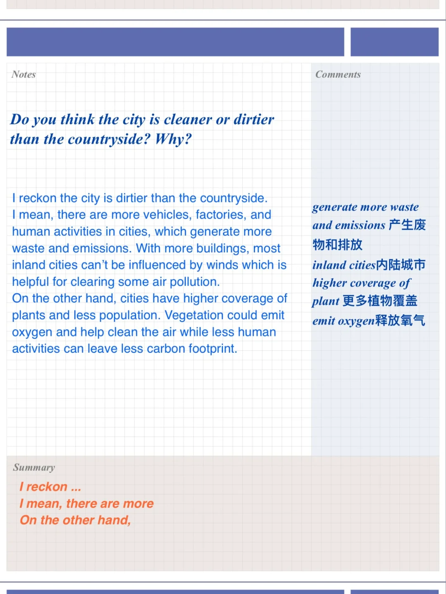

# 雅思口语高分答案｜空气污染part3

part2: 描述一个空气污染严重的地方
相对应第三部分会讨论到
	
过去现在，城市和乡村污染情况做对比
如何缓解空气污染？
工厂应该做什么？
	
一起来思考并尝试回答这些问题吧～
#雅思口语 #雅思攻略 #雅思备考 #屠雅思带7分雅思口语速成 #英语口语

## 图片
| 图1 | 图2 | 图3 | 图4 |
| --- | --- | --- | --- |
|  |  |  |  |

生成时间：2025-11-15 02:13:59