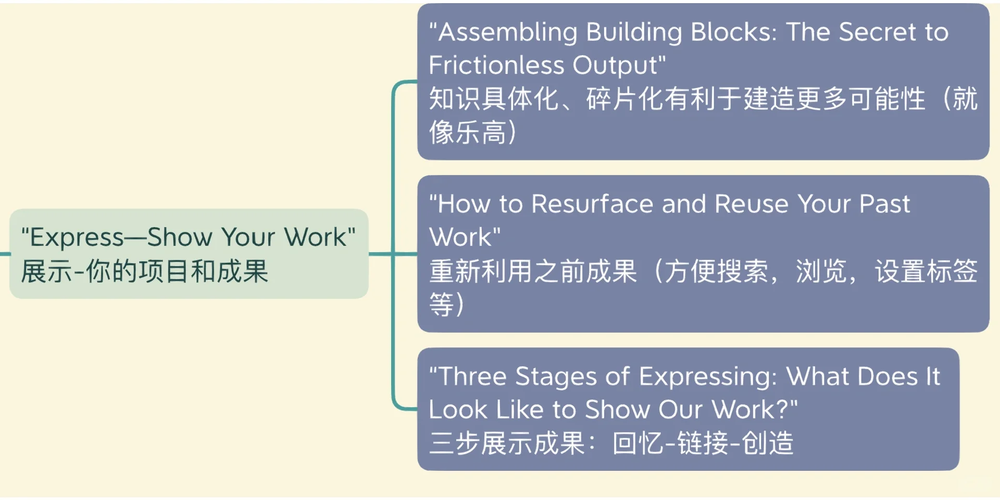
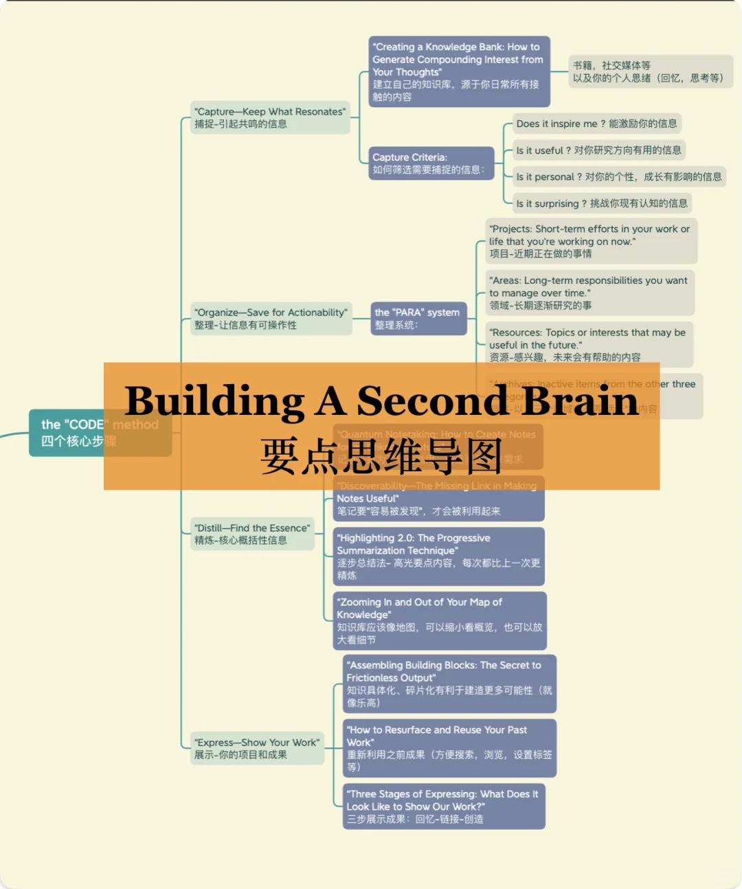
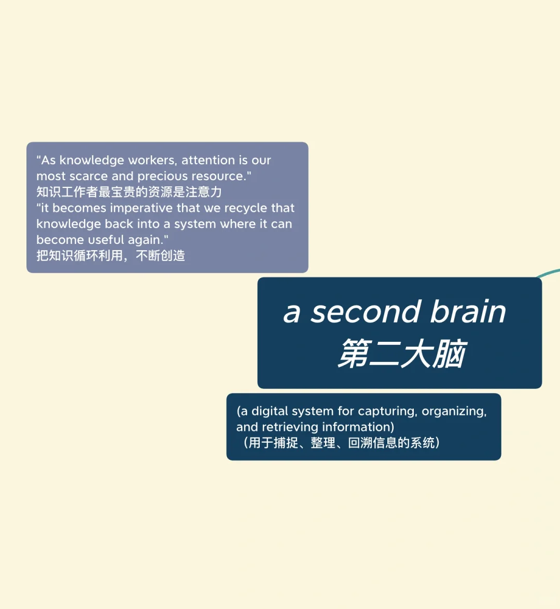
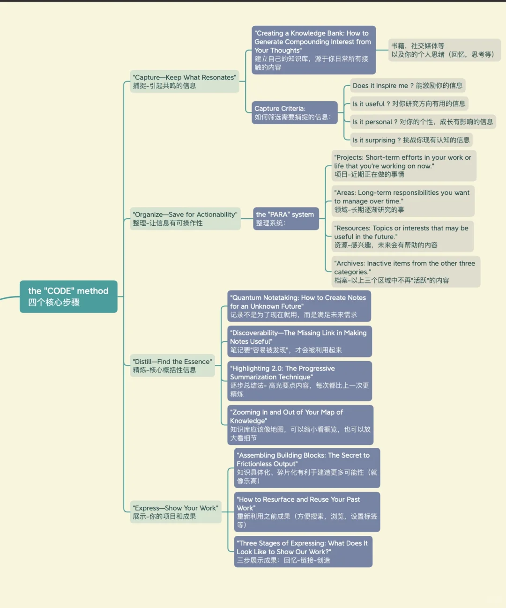
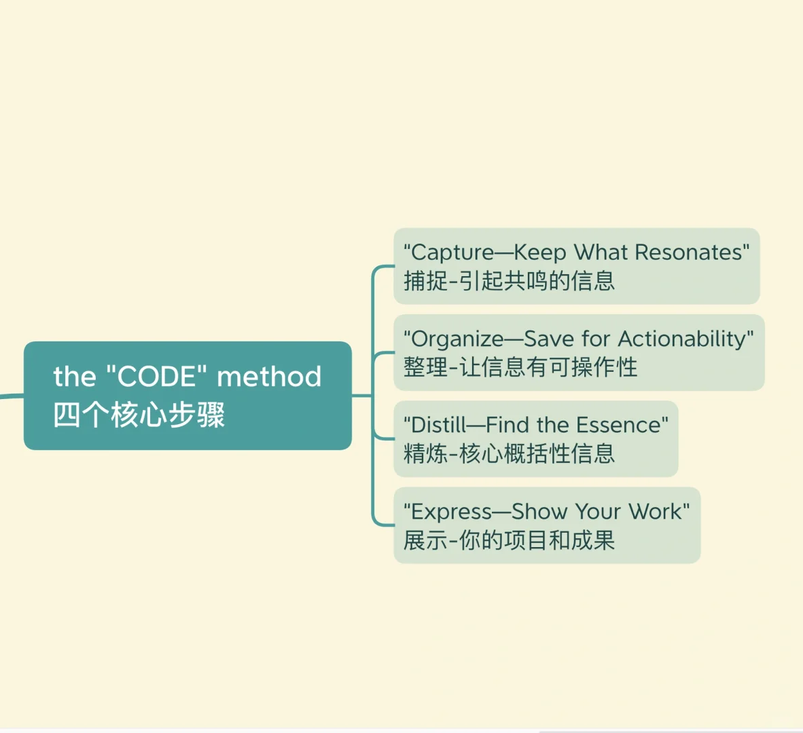
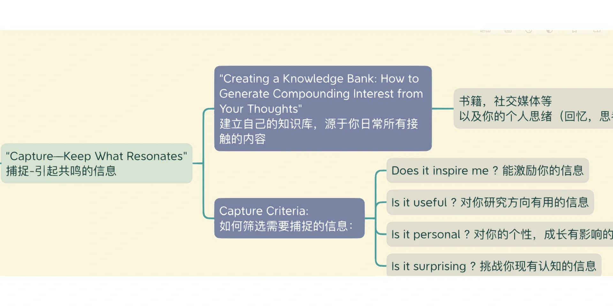
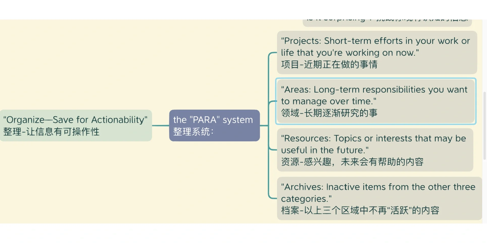
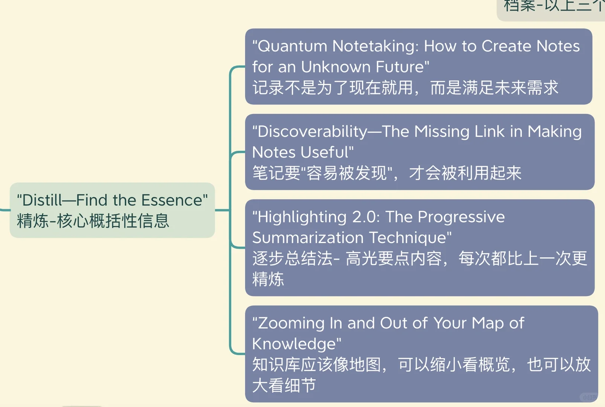

# 阅读分享｜“第二大脑”核心思维导图

每天接触的信息中，总有一些激发灵感
收藏夹里吃灰的信息如果不进行整理运用，可能永远没有价值
创作才是学习知识的最终目的
	
Building A Second Brain by Tiago Forte
讲解如何整理数字信息，开发知识储备的“第二大脑”
	
#思维导图 #干货分享 #读书 #英语原版书 #英语原版阅读

## 图片
| 图1 | 图2 | 图3 | 图4 |
| --- | --- | --- | --- |
|  |  |  |  |
|  |  |  |  |

生成时间：2025-11-15 02:10:43