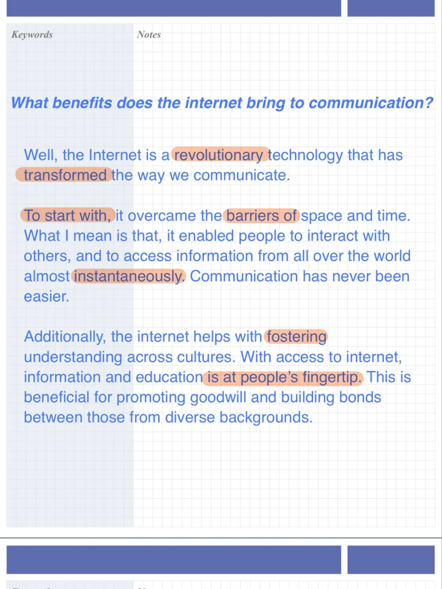
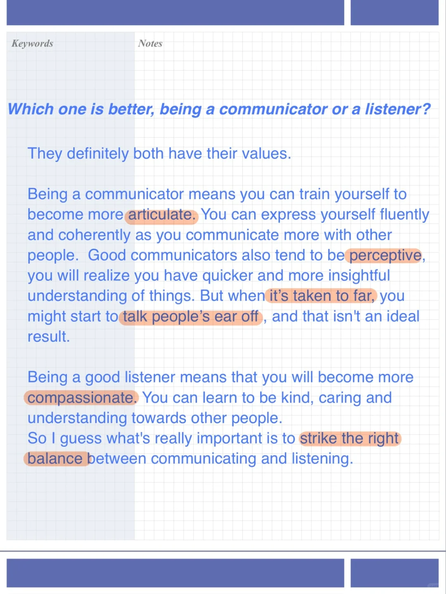

# 雅思口语新题高分参考答案｜演讲P3

新part2演讲经历
可以与 “挑战”“冒险”“困难”“成功”等经历类旧题关联
演讲内容可以考虑聊理想工作，串联新题“有趣的工作”
此处分享相关part3答案～
	
#雅思口语 #雅思攻略 #雅思备考 #屠雅思带7分雅思口语速成 #英语口语 #雅思换题 #雅思口语part3

## 图片
| 图1 | 图2 | 图3 | 图4 |
| --- | --- | --- | --- |
|  |  |  |   |

生成时间：2025-11-15 01:59:47