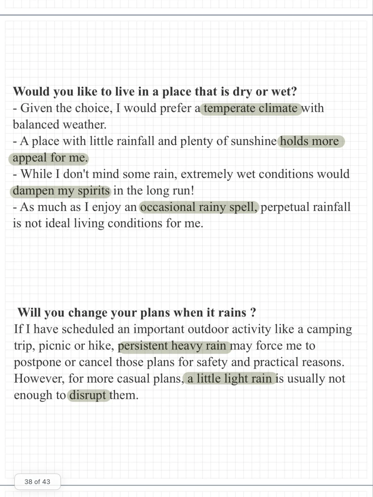
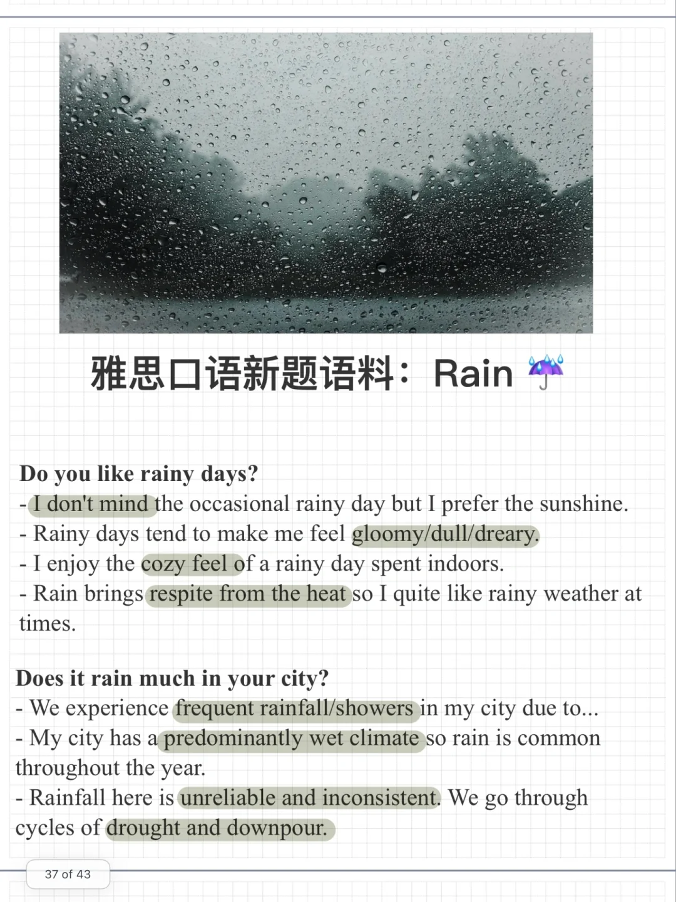

# 雅思口语新题素材｜Part1 Rain

一起来积累素材，思考回答下面的问题吧：
Rain
Do you like rainy days?
Does it rain much in your city?
Would you like to live in a place that is dry or wet?
Would you change your plans if it rained?
	
#雅思口语 #雅思攻略 #雅思备考 #雅思口语换题 #素材 #雅思

## 图片
| 图1 | 图2 | 图3 | 图4 |
| --- | --- | --- | --- |
|  |  |   |   |

生成时间：2025-11-15 01:51:06