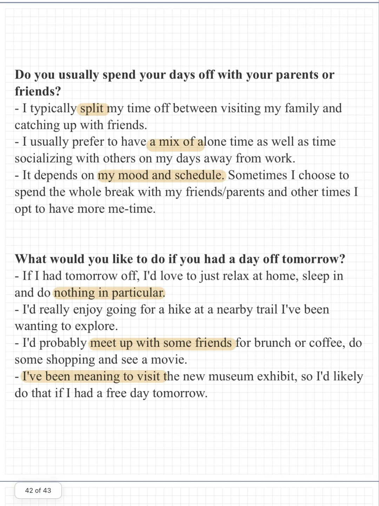
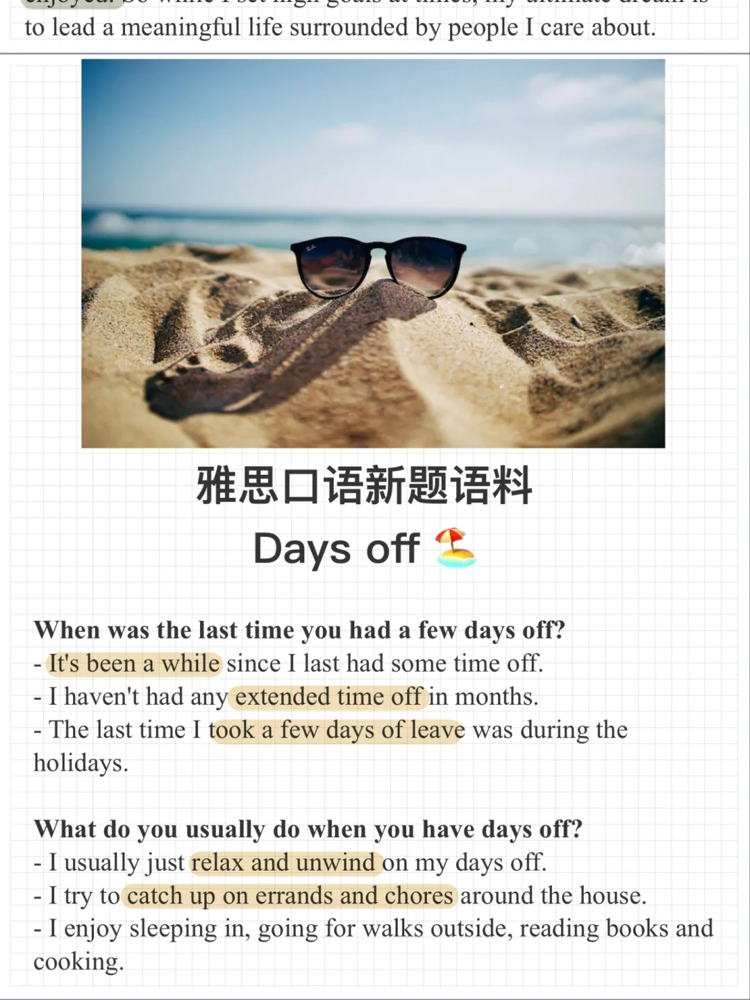

# 雅思口语新题素材｜part1 day off

一起来积累素材，思考回答下面的问题吧～
Day off
When was the last time you had a few days off?
What do you usually do when you have days off?
Do you usually spend your days off with your parents or with your friends?
What would you like to do if you had a day off tomorrow?
#雅思口语 #雅思攻略 #雅思备考 #雅思口语换题 #雅思 #雅思口语新题库

## 图片
| 图1 | 图2 | 图3 | 图4 |
| --- | --- | --- | --- |
|  |  |   |   |

生成时间：2025-11-15 02:09:36