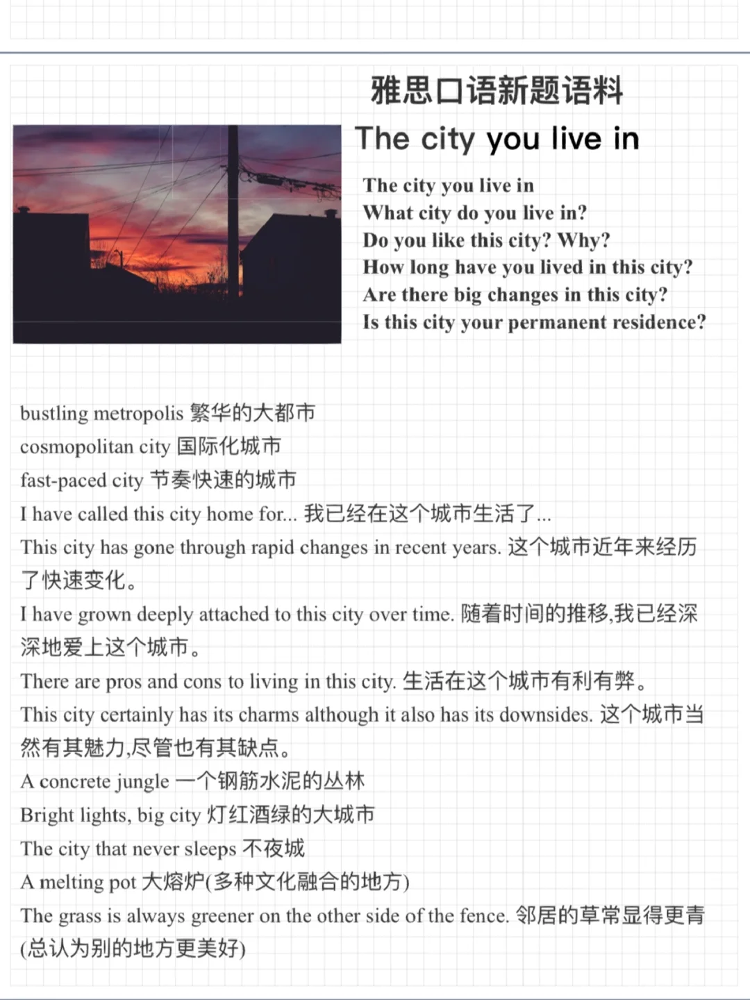

# 雅思口语新题素材｜the city you live in

一起来积累素材，思考回答下面的问题吧：
The city you live in
What city do you live in?
Do you like this city? Why?
How long have you lived in this city?
Are there big changes in this city?
Is this city your permanent residence?
	
#雅思口语 #雅思攻略 #雅思备考 #雅思口语素材 #雅思 #雅思口语Part1 #雅思口语新题库

## 图片
| 图1 | 图2 | 图3 | 图4 |
| --- | --- | --- | --- |
|  |   |   |   |

生成时间：2025-11-15 02:07:25