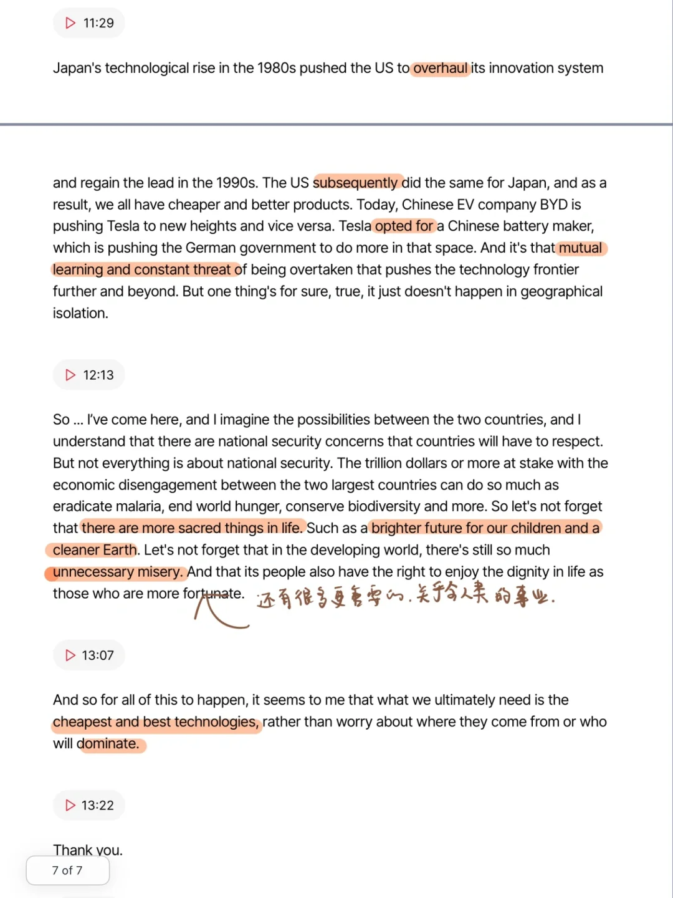
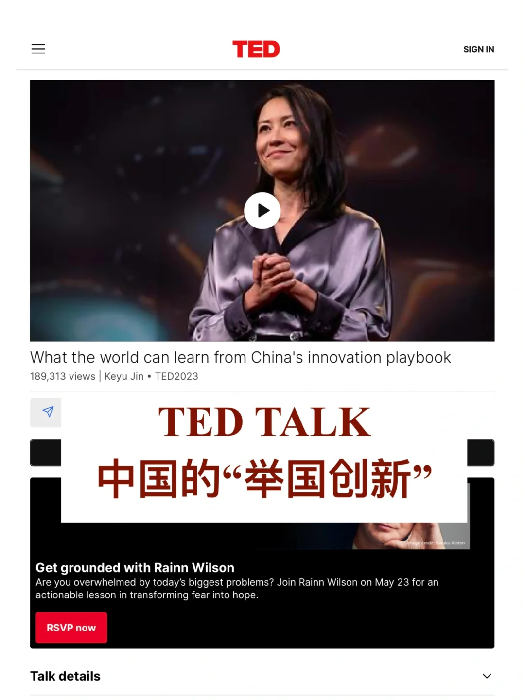
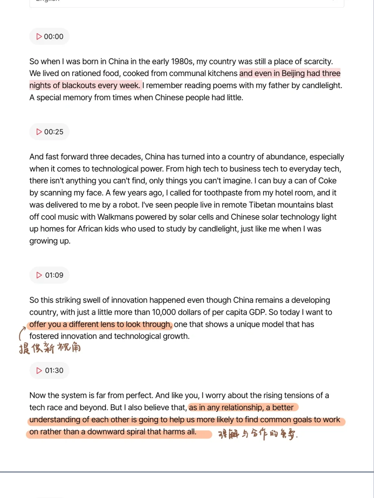
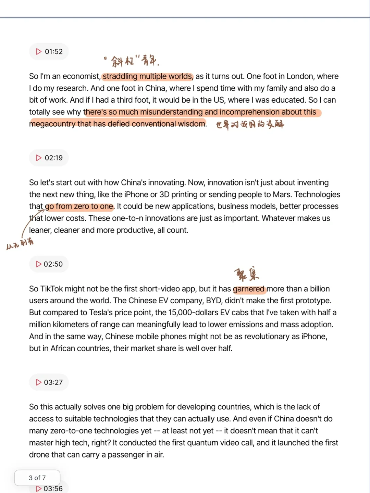
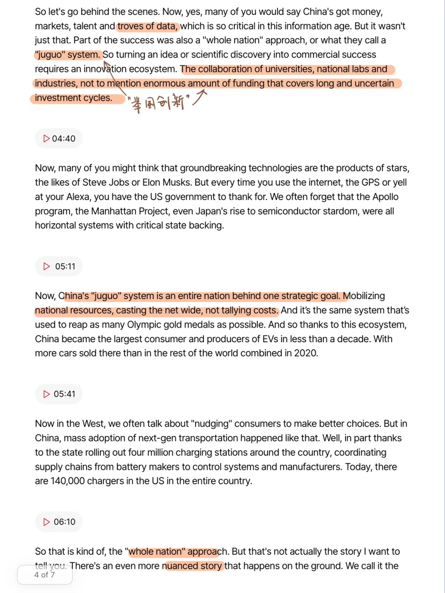
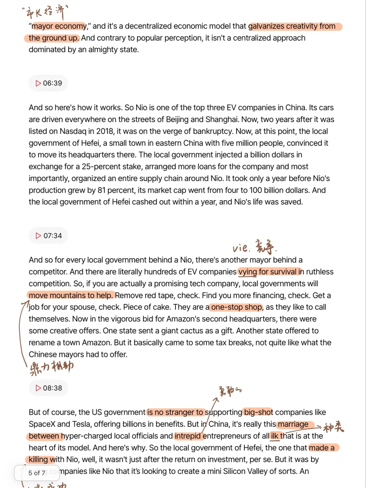
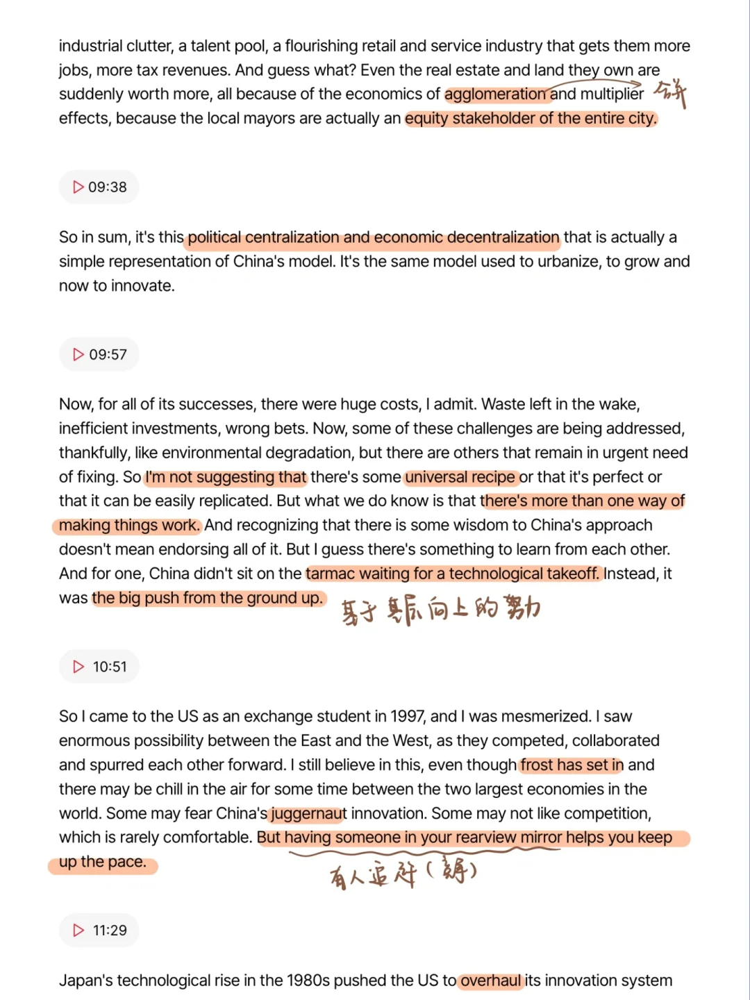

# TED TALK ｜中国的“举国创新”

为什么中国的创新发展速度惊人？
手机，新能源汽车，5G，电子支付…
演讲者向大家解释了中国的创新发展模式，其特点和值得借鉴之处
分享一下transcript，可以学习相关表达，也扩展相关知识
#TED演讲 #TED演讲 #学习打卡 #英语学习 #英语泛读 #创新

## 图片
| 图1 | 图2 | 图3 | 图4 |
| --- | --- | --- | --- |
|  |  |  |  |
|  |  |  |   |

生成时间：2025-11-15 02:05:14