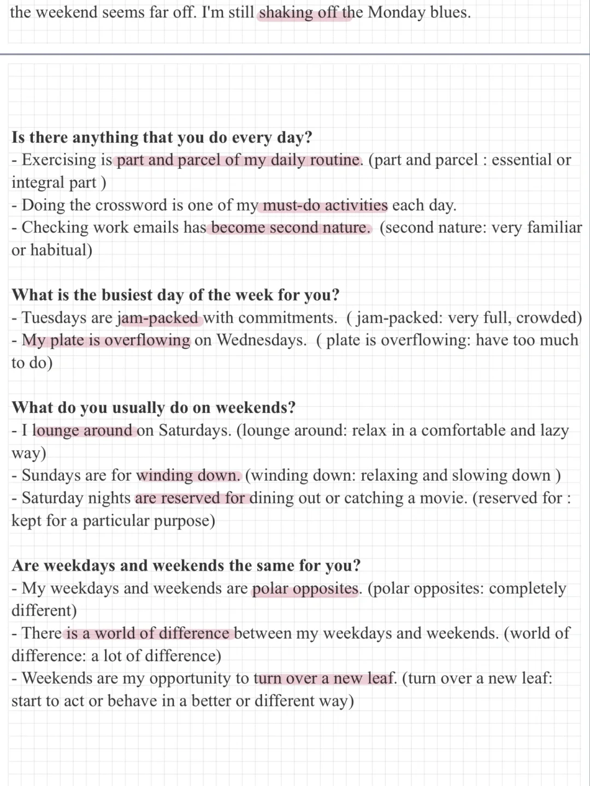
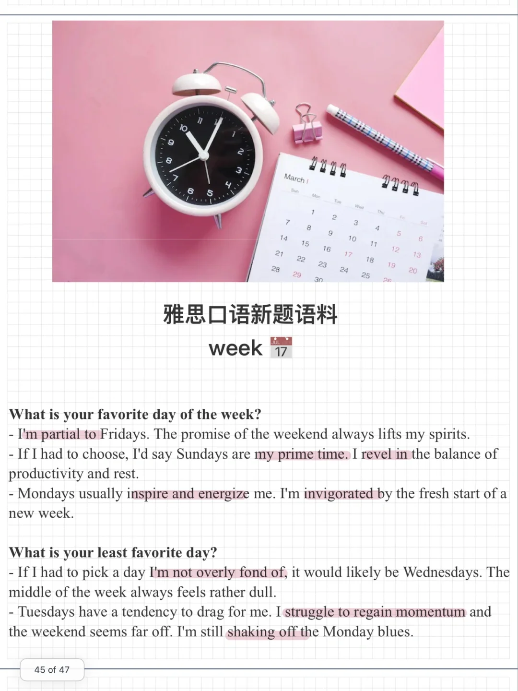

# 雅思口语新题语料｜week 每周常规

一起来学习优秀表达，回答下面问题吧：
Week
What is your favorite day of the week?
What is your least favorite day?
What is the busiest day of the week for you?
Is there anything that you do every day?
What do you usually do on weekends?
Are weekdays and weekends the same for you?
	
#雅思口语 #雅思攻略 #雅思备考 #雅思口语换题 #雅思 #雅思口语Part1

## 图片
| 图1 | 图2 | 图3 | 图4 |
| --- | --- | --- | --- |
|  |  |   |   |

生成时间：2025-11-15 02:03:01