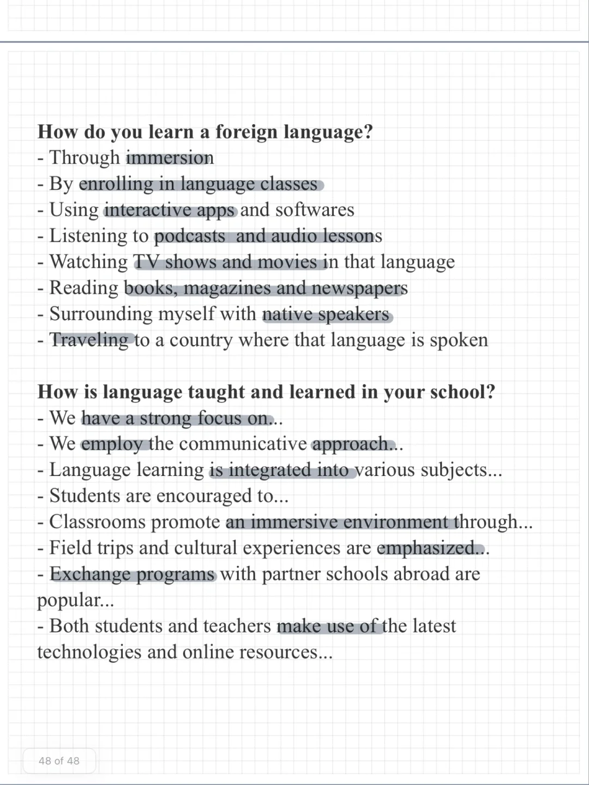
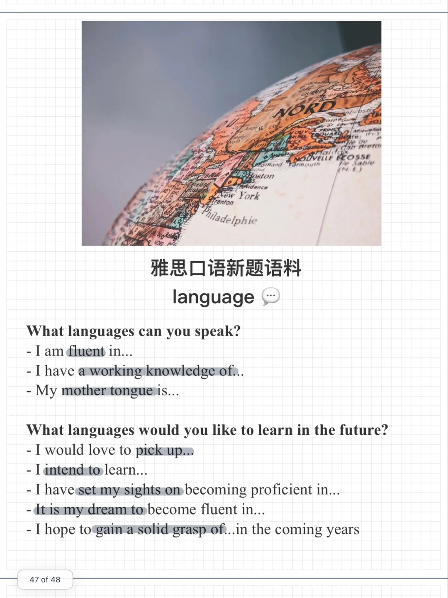

# 雅思口语新题素材｜language 语言学习

一起来积累关于语言学习的表达 思考回答下面的问题吧～
Language
What languages can you speak?
What languages would you like to learn in the future?
How do you learn a foreign language?
How is language taught and learned in your school?
#雅思口语 #雅思攻略 #雅思备考 #雅思口语换题 #口语素材 #雅思口语Part1

## 图片
| 图1 | 图2 | 图3 | 图4 |
| --- | --- | --- | --- |
|  |  |   |   |

生成时间：2025-11-15 02:00:52