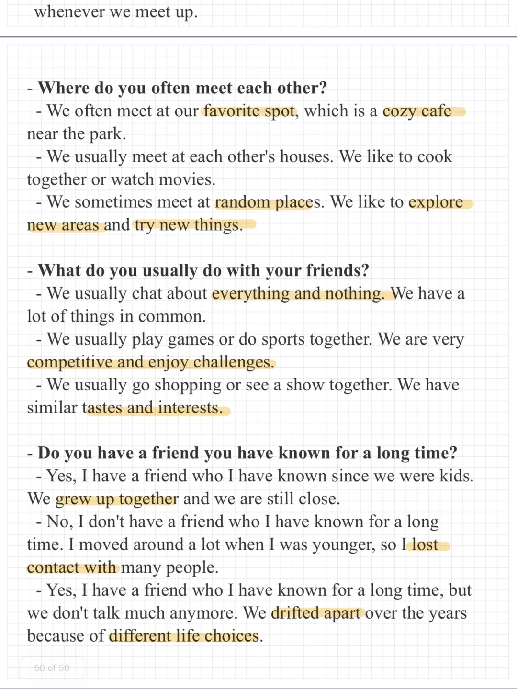
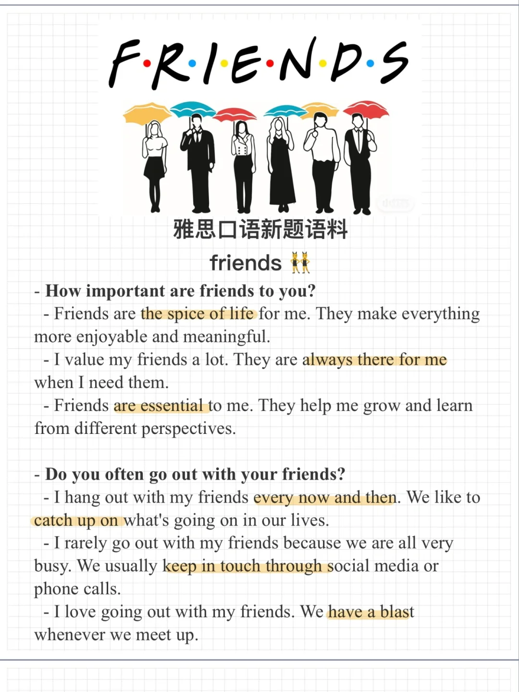

# 雅思口语新题｜friends 朋友

一起来积累素材思考回答下面的问题吧：
How important are friends to you?
Do you often go out with your friends?
Where do you often meet each other?
What do you usually do with your friends?
Do you have a friend you have known for a long time?
#雅思口语 #雅思攻略 #雅思备考 #雅思口语换题 #雅思 #英语口语 #分手吧雅思 #屠雅攻略

## 图片
| 图1 | 图2 | 图3 | 图4 |
| --- | --- | --- | --- |
|  |  |   |   |

生成时间：2025-11-15 01:58:42