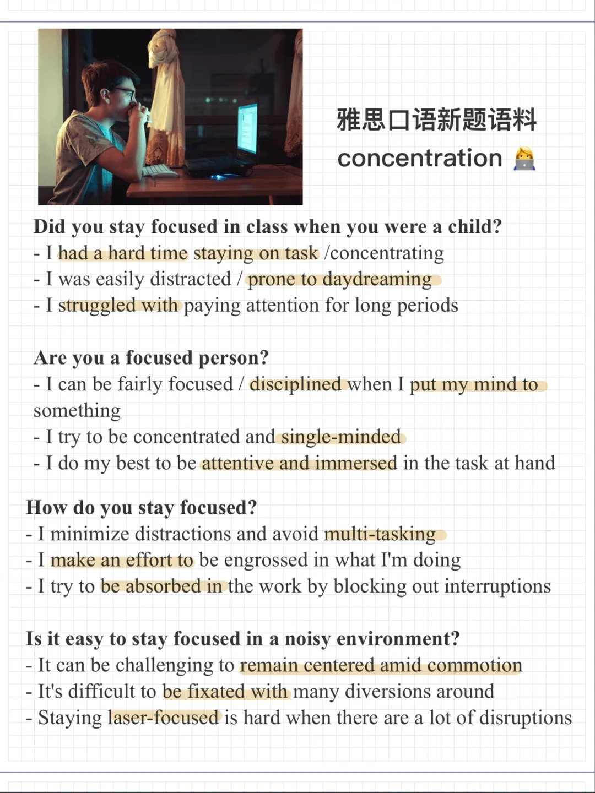

# 雅思口语新题素材｜concentration

一起来积累素材，思考回答下面的问题吧～
Did you stay focused in class when you were a child?
Are you a focused person?
How do you stay focused?
Is it easy to stay focused in a noisy environment?
#雅思口语 #雅思攻略 #雅思备考 #雅思口语素材 #雅思口语换题

## 图片
| 图1 | 图2 | 图3 | 图4 |
| --- | --- | --- | --- |
|  |   |   |   |

生成时间：2025-11-15 01:56:32