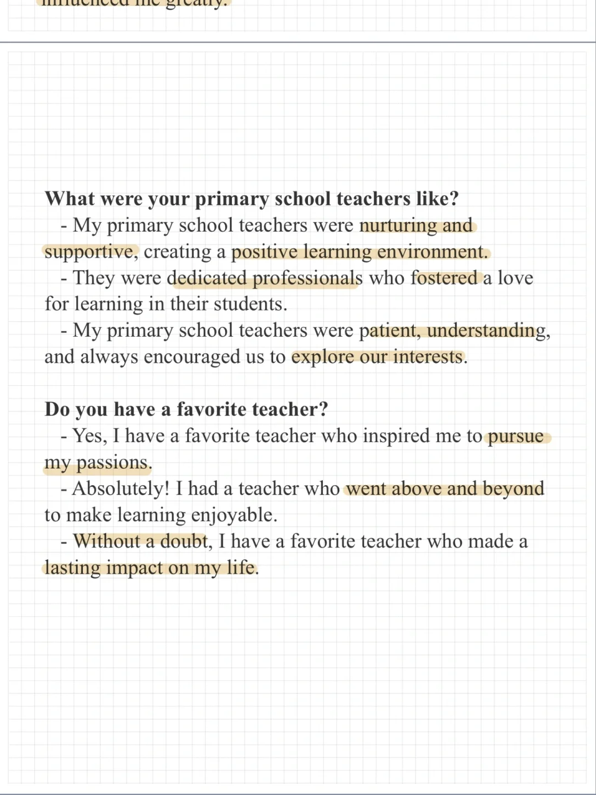
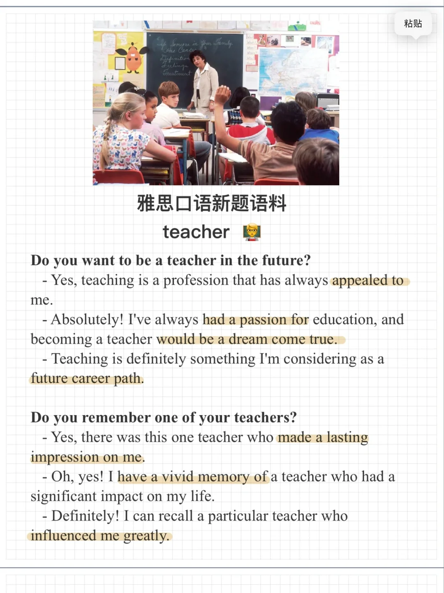

# 雅思口语新题语料：teachers

一起来积累素材思考回答下面的问题吧～
Teachers
Do you want to be a teacher in the future?
Do you remember one of your teachers?
What were your primary school teachers like?
Do you have a favorite teacher?
#雅思口语 #雅思攻略 #雅思备考 #雅思口语换题 #雅思口语素材 #雅思

## 图片
| 图1 | 图2 | 图3 | 图4 |
| --- | --- | --- | --- |
|  |  |   |   |

生成时间：2025-11-15 01:54:22