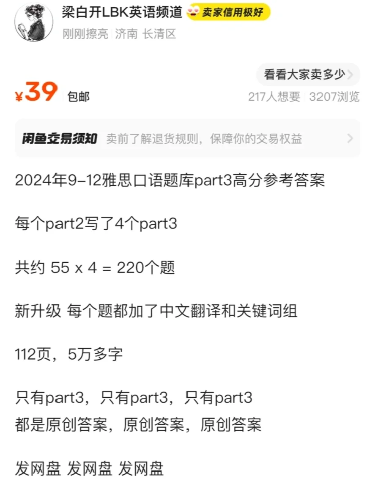
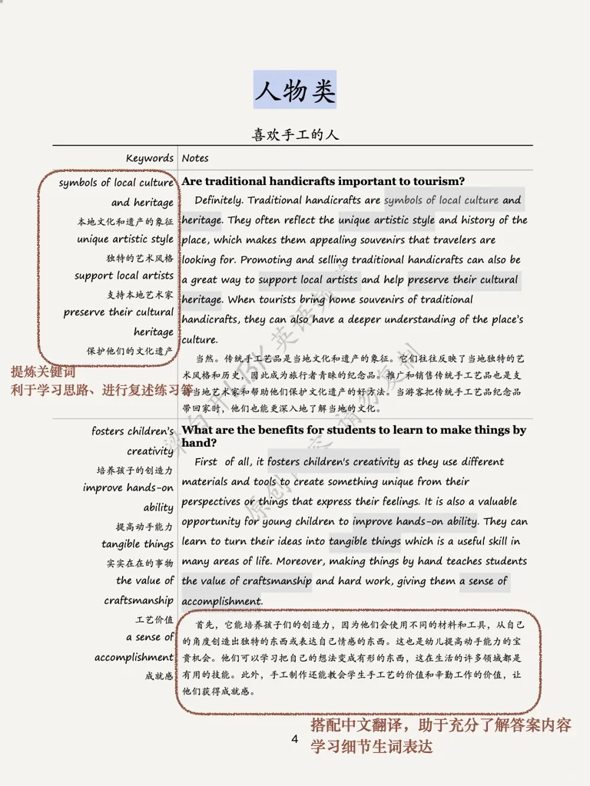
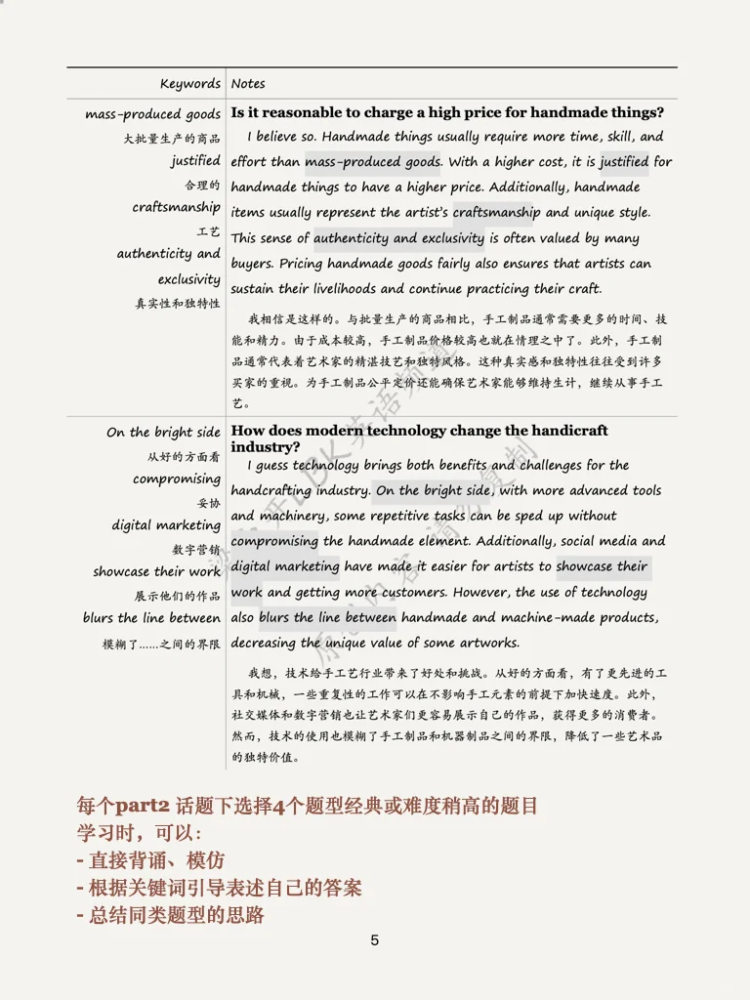
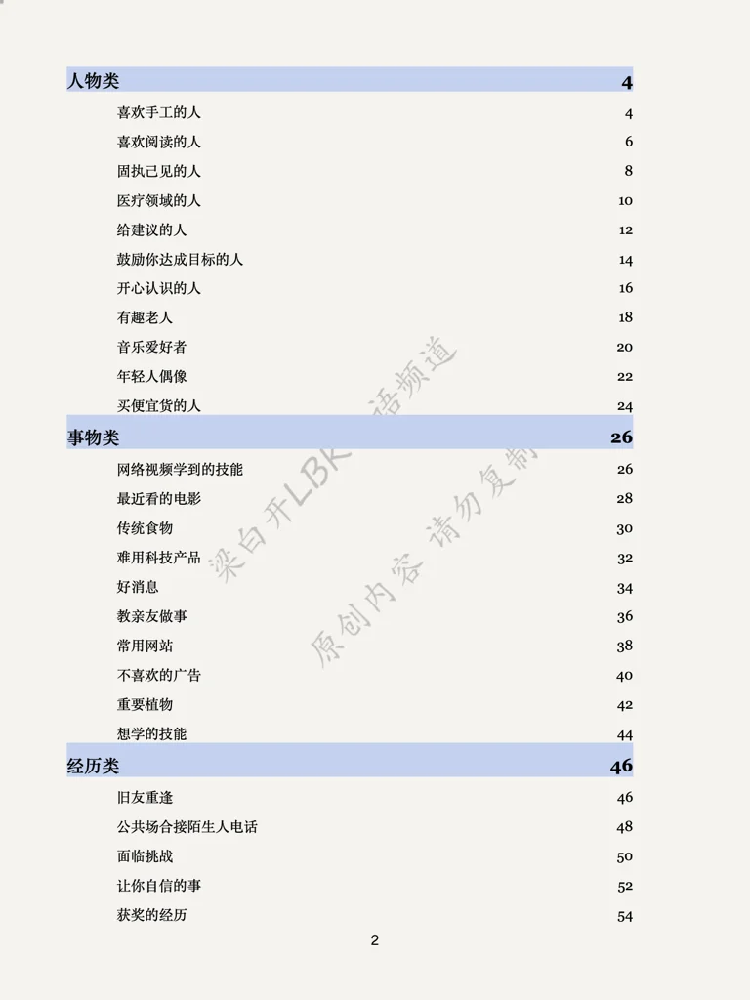

# 24年 9-12 雅思口语part3高分参考答案

本季度（2024 9-12月）题库中part2相对应的part3题目答案
共约 55 × 4=220个题
新升级 每个题都加了中文翻译和关键词组
112页，5万多字
难度可以参考平时的笔记
送备考资料 见截图
	
#雅思口语 #雅思口语高分示范 #雅思高分 #雅思攻略 #雅思备考 #雅思口语换题 #雅思 #雅思分手#雅思口语part3新题答案 #雅思口语part3高分答案

## 图片
| 图1 | 图2 | 图3 | 图4 |
| --- | --- | --- | --- |
|  |  |  |  |
|  |  |   |   |

生成时间：2025-11-15 01:52:12