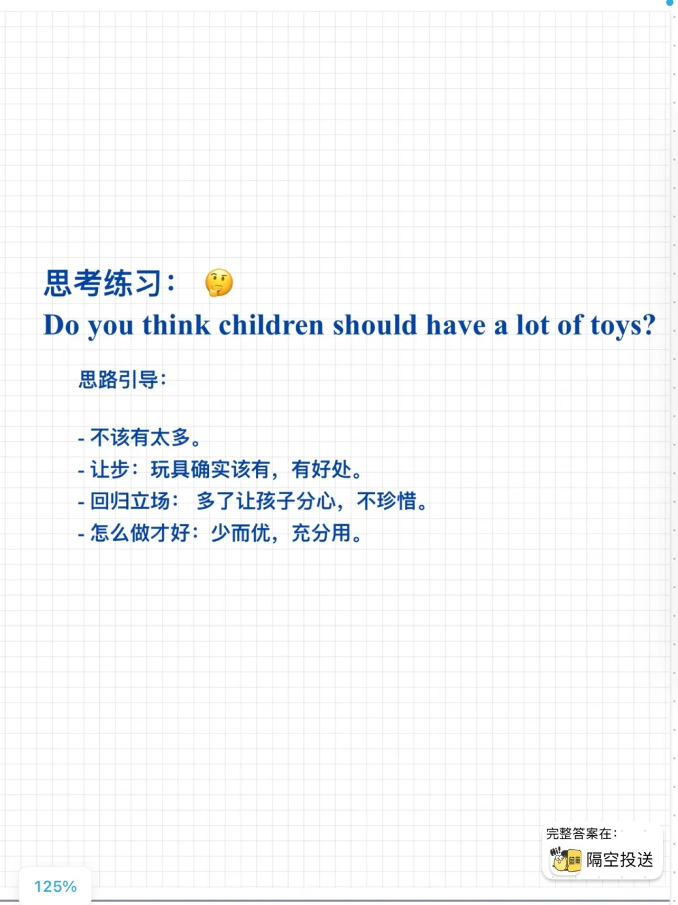

# 雅思口语part3答题思路: 学会让步

在回答part3更有深度，逻辑要求更高的问题时，可以尝试运用让步，让自己的答案更“辩证”一些。
你在用哪些part3的好思路和小技巧呢？
#雅思口语 #雅思攻略 #雅思备考 #雅思口语换题 #英语口语 #雅思口语part3逻辑

## 图片
| 图1 | 图2 | 图3 | 图4 |
| --- | --- | --- | --- |
|  |  |   |   |

生成时间：2025-11-15 01:50:01