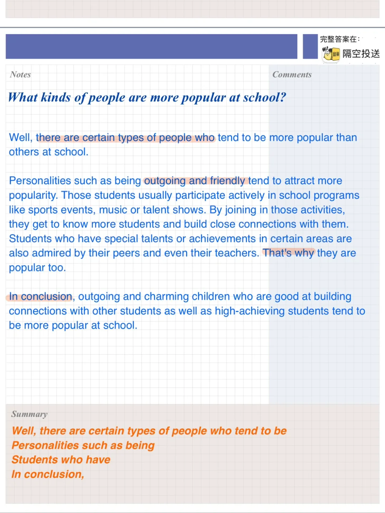
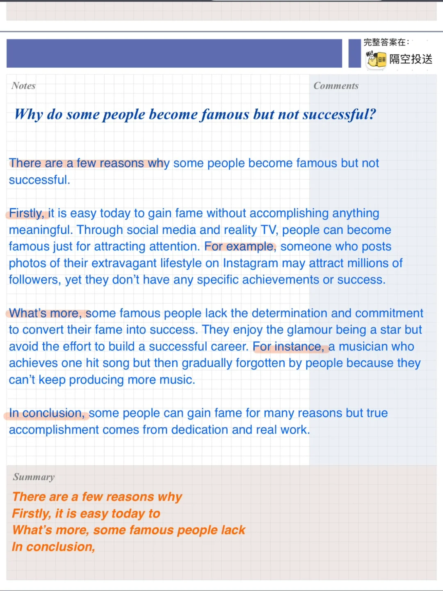
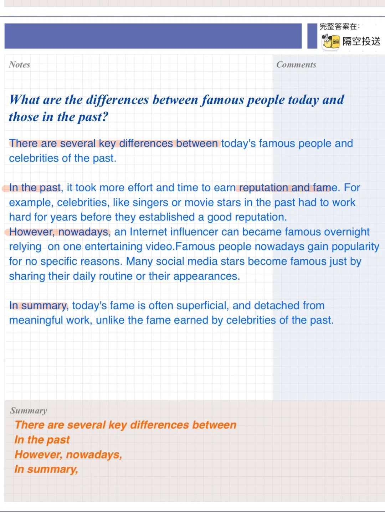

# 雅思口语高分答案｜ 感兴趣名人P3

part3 问题参考答案
对应part2: 近期的高频题“感兴趣的名人”
Do you think media is putting too much attention on famous people?
What are the differences between famous people today and those in the past?
Why do some people become famous but not successful?
What kinds of people are more popular at school?
对于观点类，过去现在对比类等常考问题大家可以多多思考，总结思路💪
#雅思口语 #雅思攻略 #雅思备考 #雅思口语换题 #雅思 #英语口语 #雅思高分 #雅思口语高分示范

## 图片
| 图1 | 图2 | 图3 | 图4 |
| --- | --- | --- | --- |
|  |  |  |  |

生成时间：2025-11-15 01:48:55