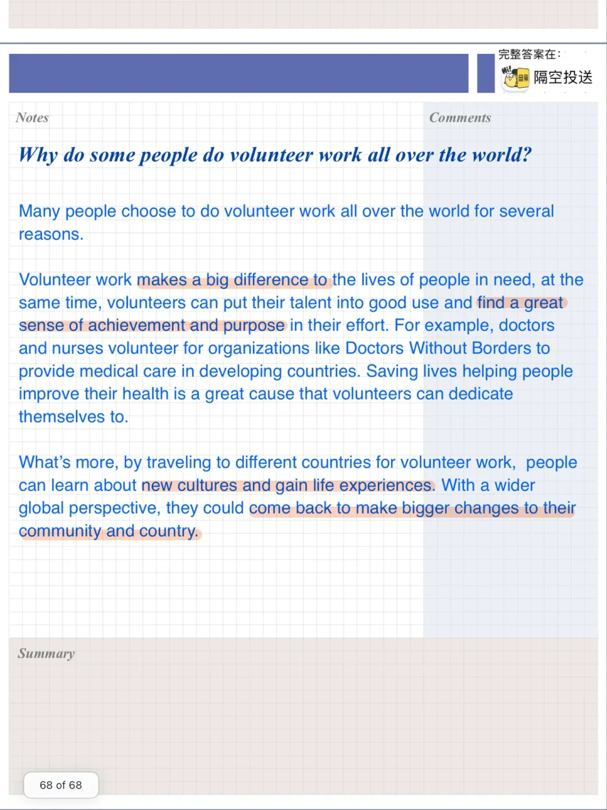
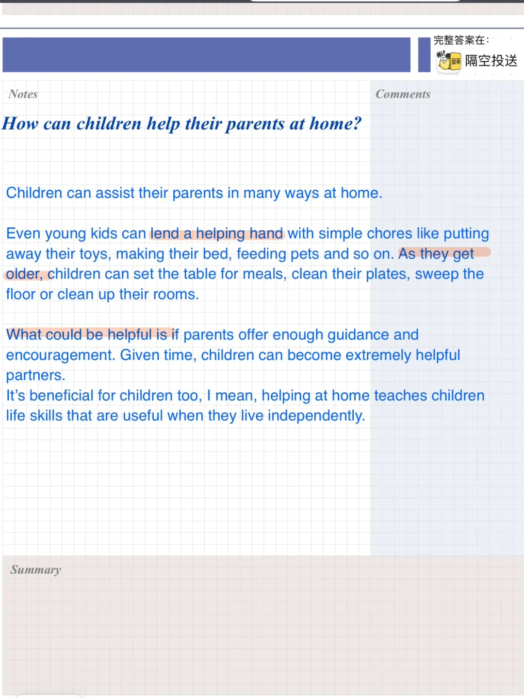
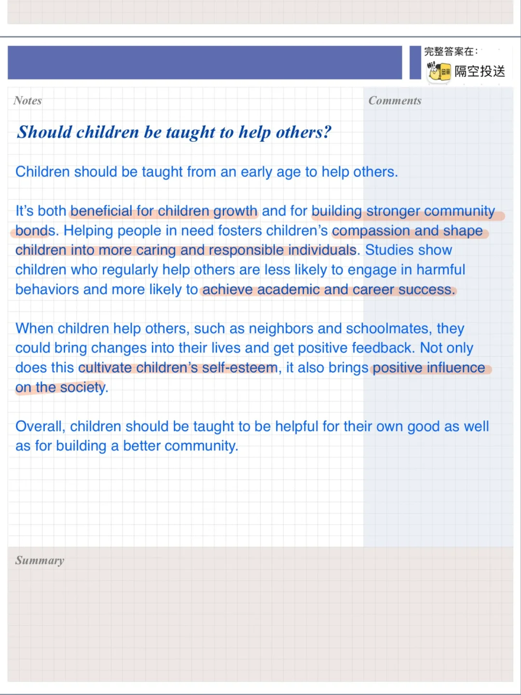
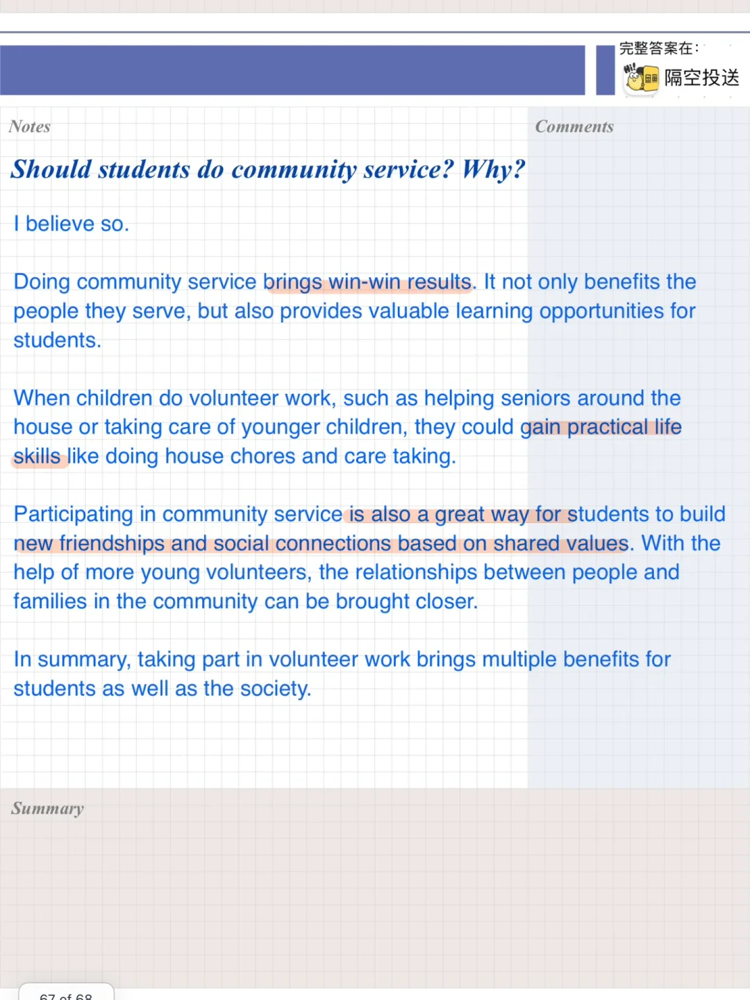

# 雅思口语P3高分参考答案｜帮助别人

part3 问题参考答案
对应part2: 帮助别人的人
#雅思口语 #雅思攻略 #雅思备考 #雅思口语换题 #雅思 #英语口语 #雅思口语高分示范 #雅思口语part3

## 图片
| 图1 | 图2 | 图3 | 图4 |
| --- | --- | --- | --- |
|  |  |  |  |

生成时间：2025-11-15 01:47:50