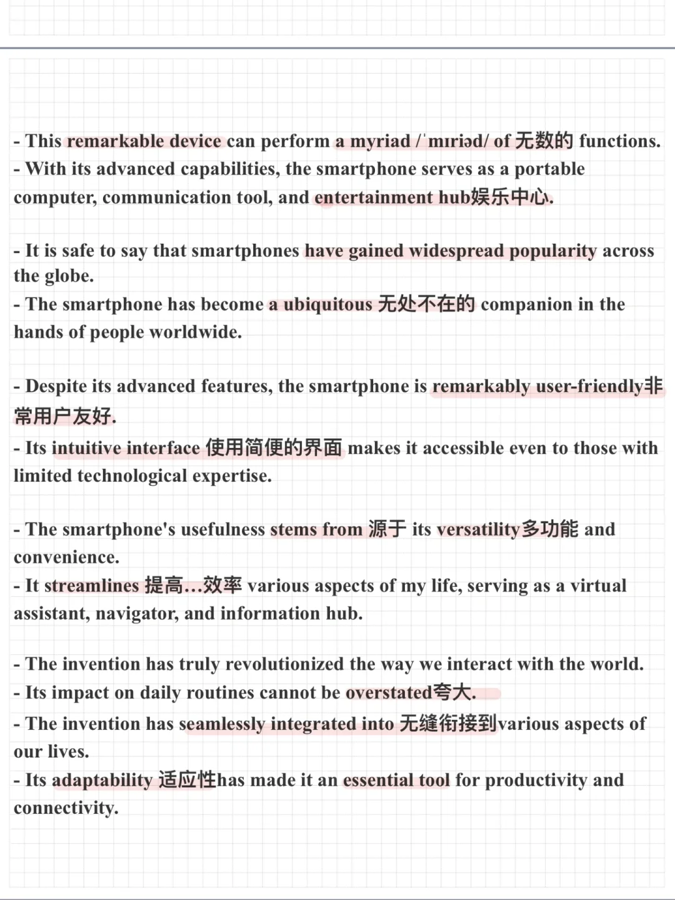
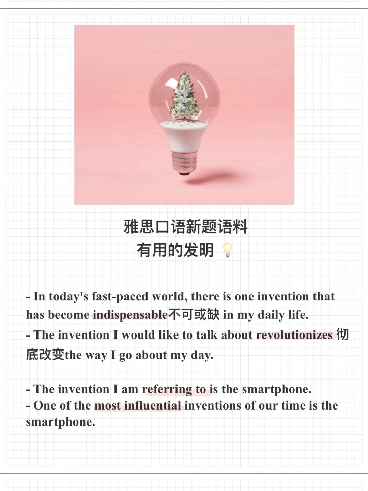

# 雅思新题语料｜P2有用的发明

一起来积累表达，思考回答下面的问题吧：
Describe an invention that is useful in your daily life
What the invention is
What it can do
How popular it is
Whether it is difficult or easy to use
And explain why it is useful
	
#雅思口语 #雅思攻略 #雅思备考 #雅思口语换题 #雅思考试 #雅思口语高分 #雅思口语part2

## 图片
| 图1 | 图2 | 图3 | 图4 |
| --- | --- | --- | --- |
|  |  |   |   |

生成时间：2025-11-15 01:46:45